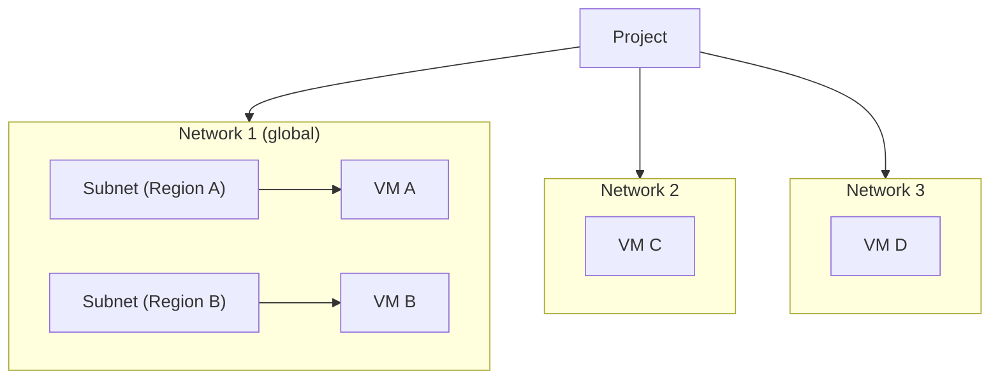

# 🧱 Projects, Networks, and Subnetworks (VPC)

Let's explore how Google Cloud structures Virtual Private Cloud (VPC) networking through **projects**, **networks**, and **subnetworks**.

---

## 📁 Projects  
- Projects are the **main organizer** of all infrastructure resources in GCP.
- They also **associate resources with billing**.
- Each project can contain **up to 15 networks** by default (can request quota increase).
- Networks inside a project can be:
  - **Shared** with other projects  
  - **Peered** with networks in different projects  
- Projects contain **entire VPC networks**—not just services.

---

## 🌐 VPC Networks  
- A VPC network is **global**, spanning all Google Cloud regions simultaneously.
- Networks do **not have IP ranges themselves**—IP ranges are defined inside subnetworks.
- VMs within the same network can communicate using **internal IPs**, even if they’re in different regions.

### 🧩 VPC Network Types  
#### 1. **Default Network**  
- Automatically created with each project.  
- Includes:
  - One **subnet per region**
  - Preconfigured **firewall rules**:
    - Allow **ICMP**, **RDP**, **SSH** from anywhere  
    - Allow all internal traffic within the network  

#### 2. **Auto Mode Network**  
- Automatically creates **one subnet per region**.  
- Uses predefined IP ranges with **/20 mask**, expandable to **/16**.  
- All subnets come from **10.128.0.0/9**.  
- New regions = new automatically-added subnets.

#### 3. **Custom Mode Network**  
- **No subnets created automatically**.  
- You choose:
  - Subnet regions  
  - IP ranges  
- IP ranges **must not overlap**.  
- You can convert **Auto → Custom**, but **not Custom → Auto**.

### 🌱 IPv6 Support  
- Supported in **custom mode networks**.  
- You can run **dual-stack** VMs (IPv4 + IPv6).

---

## 🗺️ Subnetworks (Subnets)

### 📍 Key Concepts  
- Subnets are **regional**, not global.  
- A subnet can span **multiple zones within the same region**.  
- They define the **IP ranges** used by resources in that region.

### 🔢 Reserved IP Addresses  
Every subnet has **4 reserved IP addresses**:
1. `.0` – Network address  
2. `.1` – Default gateway  
3. Second-to-last IP – Reserved  
4. Last IP – Broadcast address  

---

## 🌍 VM Communication Across Networks  
- **VMs in the same network**  
  → communicate using **internal IPs**, even across regions  
  → use Google’s private global fiber backbone  
- **VMs in different networks**  
  → must use **external IPs**, even if in the same region  
  → traffic stays on Google’s infrastructure via edge routers  

---

## 🔒 VPN Connectivity  
- Because VPCs support global private communication:  
  → A **single VPN** can connect an on-prem network to the entire VPC.  
- VMs in different regions can still communicate privately through the VPN.

---

## 🔧 Subnet Expansion  
GCP allows expanding subnets **without downtime**.

### ✔️ Rules for Expanding Subnets  
- New range must:
  - Be **larger** (prefix length decreases: e.g., /24 → /20)  
  - **Not overlap** with any subnet in the VPC  
  - Be a valid **regional IP range**  
- Cannot span:
  - Multiple RFC private ranges  
  - A private RFC range + a public-but-reserved range  
- Expansion is **one-way**  
  - You **cannot shrink** a subnet after expanding it  

### ⚠️ Auto Mode Subnets  
- Start at **/20**  
- Can expand to **/16** only  
- To expand further → convert the network to **custom mode** first  

### 🚫 Avoid Oversized Subnets  
Large subnets may cause:
- CIDR conflicts  
- Issues with:
  - Multiple NICs  
  - VPC Peering  
  - VPN connections  
- Recommendation: **allocate only what you need**

---

## 🖼️ Concept Summary Diagram (Text Version)

- VM A ↔ VM B: internal IP (same network)  
- VM C ↔ VM D: external IP (different network)  
