# Create a Virtual Machine

## Overview
Compute Engine lets you create virtual machines (VMs) running Linux (Debian, Ubuntu, Suse, Red Hat, CoreOS) or Windows Server on Google infrastructure.  
In this lab, you’ll create VM instances using the **Google Cloud console** and **gcloud CLI**, and connect an **NGINX web server**.

## Objectives
- Create a VM with Cloud console  
- Create a VM with gcloud CLI  
- Deploy and connect a web server  

## Prerequisites
- Basic knowledge of Linux editors (vim, emacs, nano)

---

## Setup and Requirements

### Before Starting
- Labs are timed and cannot be paused.  
- You’ll use temporary credentials for Google Cloud access.  
- Use **Chrome** in **Incognito mode** to avoid account conflicts.  
- Use only the provided **student account** to avoid charges.

---

### Start the Lab
1. Click **Start Lab**.  
2. In the **Lab Details** pane, review:
   - **Open Google Cloud console**
   - **Time remaining**
   - **Temporary credentials**
3. Click **Open Google Cloud console** (or right-click → *Open Link in Incognito Window*).  
4. On the **Sign in** page:
   - Click **Use Another Account**
   - Copy the provided **Username** and **Password** from the Lab Details pane  
   - Accept terms and conditions  
   - Skip recovery options and two-factor authentication  
   - Do **not** sign up for free trials  
5. The **Google Cloud console** will open after a few moments.  
6. To access products and services, use the **Navigation menu (☰)** or the **Search field** at the top.

---

### Activate Cloud Shell
Cloud Shell is a preloaded virtual machine with development tools and 5GB persistent storage.

1. Click **Activate Cloud Shell** on the top bar.  
2. Continue through prompts and authorize Cloud Shell to use your credentials.  
3. Wait until your session displays:
```nginx
Your Cloud Platform project in this session is set to "PROJECT_ID"
```

4. (Optional) List the active account:
```bash
gcloud auth list
```

Output:
```vbnet
ACTIVE: *
ACCOUNT: "ACCOUNT"
```

5. (Optional) List the project ID:
```bash
gcloud config list project
```

Output:
```ini
[core]
project = "PROJECT_ID"
```

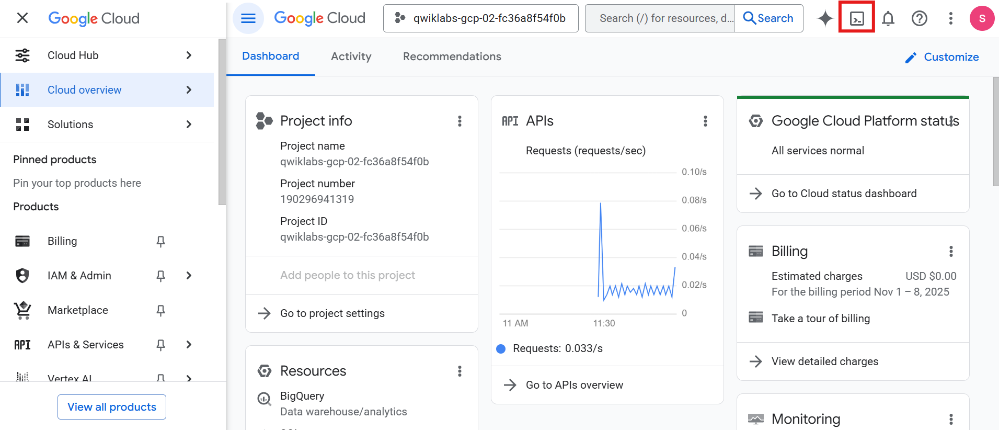


---

## Understanding Regions and Zones

Compute Engine resources are located in **regions** and **zones**.  
A **region** is a specific geographic area, and each region has multiple **zones**.

| Region | Zones |
|---------|--------|
| Western US | us-west1-a, us-west1-b |
| Central US | us-central1-a, us-central1-b, us-central1-d, us-central1-f |
| Eastern US | us-east1-b, us-east1-c, us-east1-d |
| Western Europe | europe-west1-b, europe-west1-c, europe-west1-d |
| Eastern Asia | asia-east1-a, asia-east1-b, asia-east1-c |

Zonal resources (like VM instances and persistent disks) must be in the same zone.  
Regional resources (like static IPs) must be in the same region.

---

## Set the Region and Zone

Set the default region and zone for this lab:

```bash
gcloud config set compute/region REGION
```

Create variables for the region and zone:
```bash
export REGION=REGION
export ZONE=Zone
```

> Note: In Cloud Shell, you need to set these for each new session.

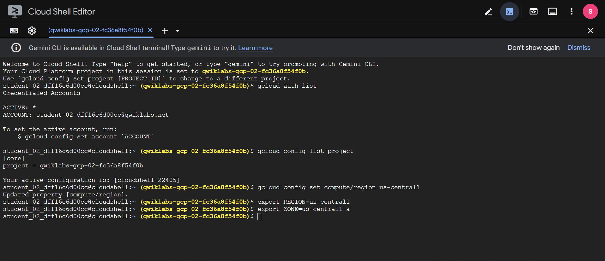

---

### Task 1: Create a New Instance from the Cloud Console
1. In the Cloud console, open
   Navigation menu (☰) → Compute Engine → VM Instances.
2. Click Create Instance.

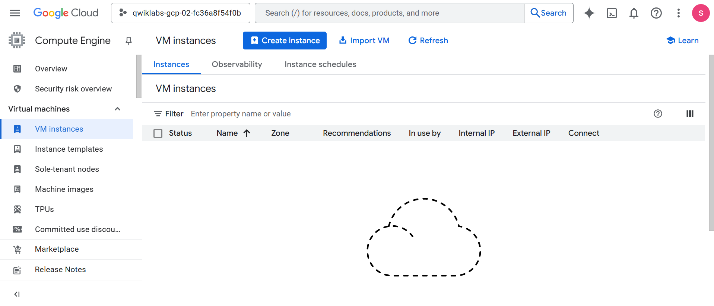

3. Configure machine settings:

| Field        | Value      | Notes              |
| ------------ | ---------- | ------------------ |
| Name         | gcelab     | VM name            |
| Region       | `<REGION>` | Choose your region |
| Zone         | `<ZONE>`   | Remember this zone |
| Series       | E2         |                    |
| Machine type | e2-medium  | 2 vCPUs, 4GB RAM   |

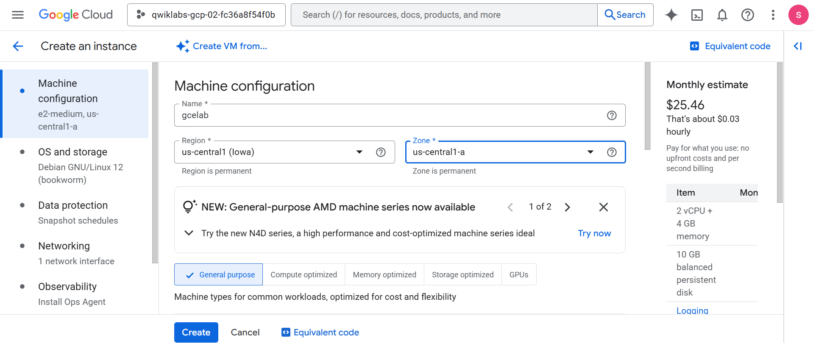
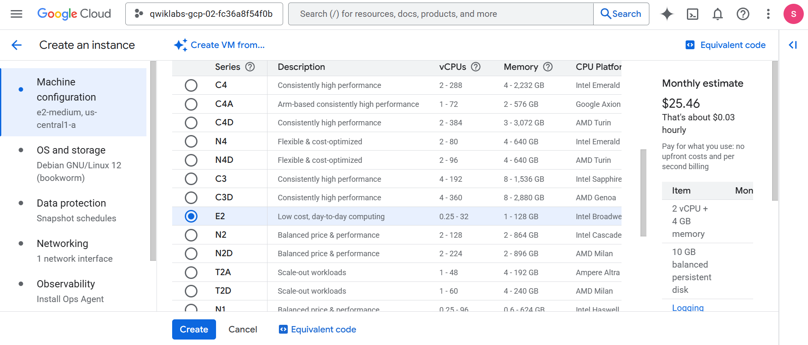
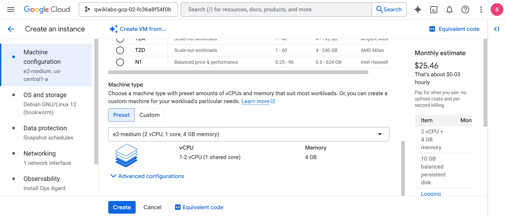

4. Configure OS and Storage:
  - Click Change
  - OS: Debian
  - Version: Debian GNU/Linux 12 (bookworm)
  - Boot disk type: Balanced persistent disk
  - Size: 10 GB

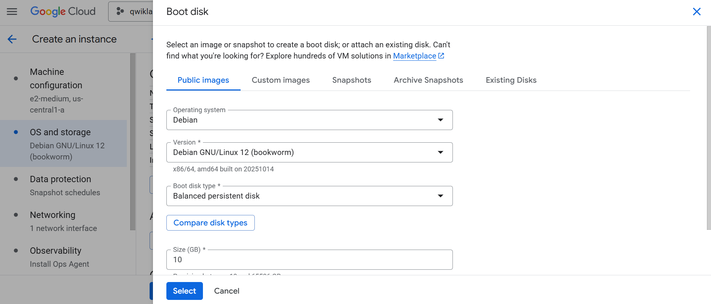

5. Configure Networking:
  - Under Firewall, select Allow HTTP traffic

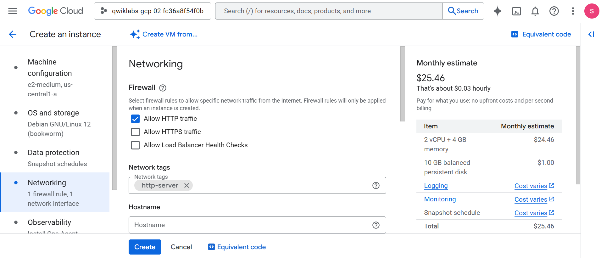

6. Click Create to launch the VM.
> Wait about a minute until the instance gcelab appears in the list.

7. Connect via SSH:
  - Click SSH next to `gcelab`
This opens an SSH client directly in your browser.

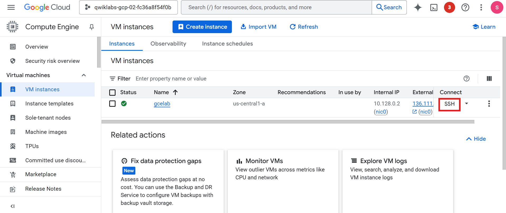
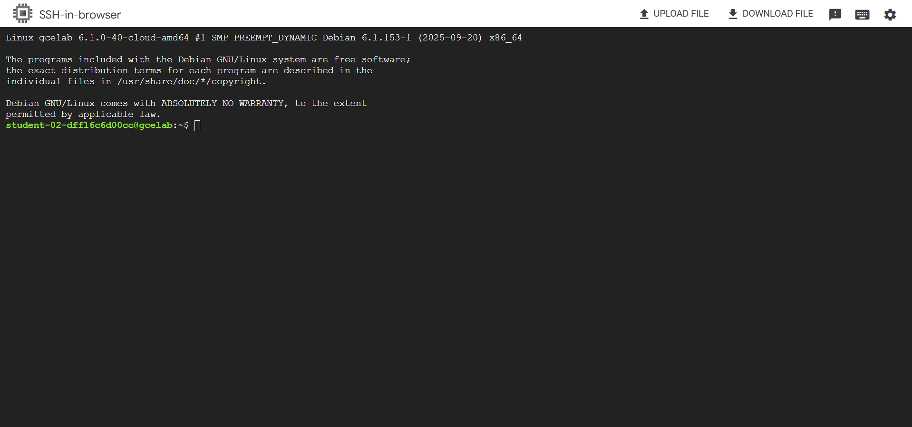

---

### Task 2: Install an NGINX Web Server

1. Update packages:
```bash
sudo apt-get update
```

Expected output:
```ini
Reading package lists... Done
```

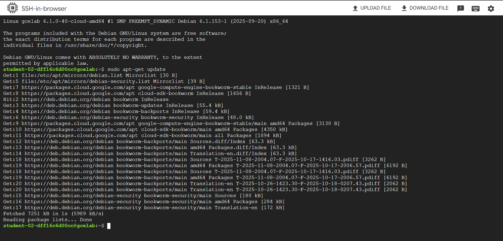

2. Install NGINX:
```bash
sudo apt-get install -y nginx
```

Expected output:
```ini
The following NEW packages will be installed: ...
```

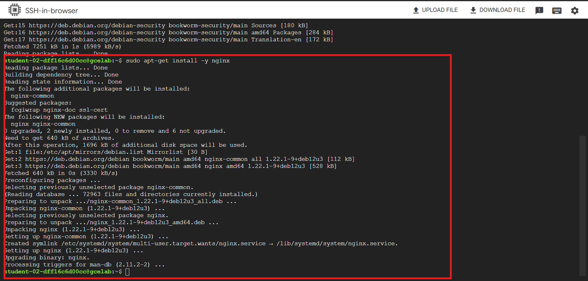

3. Confirm NGINX is running:
```bash
ps auwx | grep nginx
```

expected output: 
```ini
root      2330  ... nginx: master process ...
www-data  2331  ... nginx: worker process
```

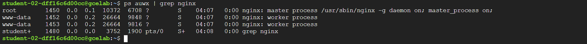


4. In the Cloud console, click the External IP of your instance or open
   http://EXTERNAL_IP/ in a browser.
   > Use the assigned external IP
   > You should see “Welcome to nginx!”

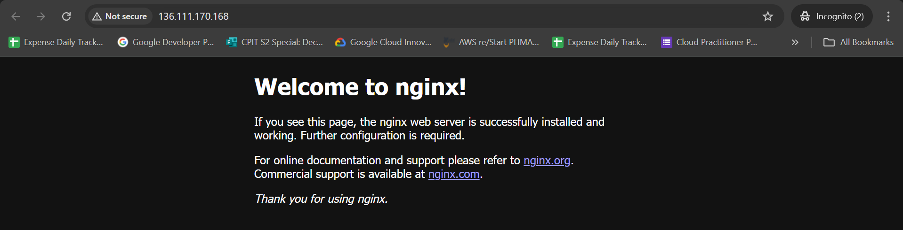

--- 

Task 3: Create a New Instance with gcloud
Use Cloud Shell to create another VM from the command line:
```bash
gcloud compute instances create gcelab2 --machine-type e2-medium --zone=$ZONE
```

Expected output:
```makefile
Created [...gcelab2].
NAME: gcelab2
ZONE: Zone
MACHINE_TYPE: e2-medium
INTERNAL_IP: 10.128.0.3
EXTERNAL_IP: 34.136.51.150
STATUS: RUNNING
```

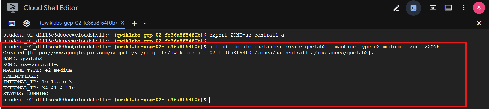

Defaults:
- OS: Debian GNU/Linux 12 (bookworm)
- Machine type: e2-medium
- A root persistent disk attached automatically

To see all defaults:
```bash
gcloud compute instances create --help
```
- Press CTRL+C to exit.

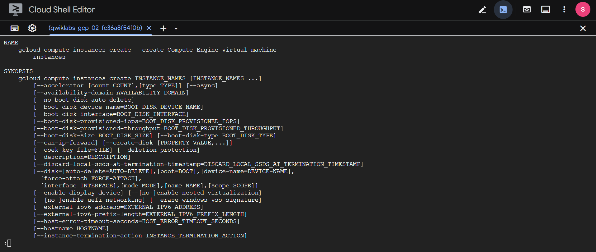

Set default zone and region (optional):
```bash
gcloud config set compute/zone ...
gcloud config set compute/region ...
```

In the Cloud console, go to
Navigation menu → Compute Engine → VM instances
or refresh the VM page. Both instances (gcelab, gcelab2) should appear.

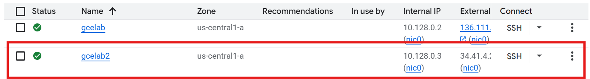

Connect via SSH:
```bash
gcloud compute ssh gcelab2 --zone=$ZONE
```
Enter Y to continue and press Enter through the passphrase prompts.

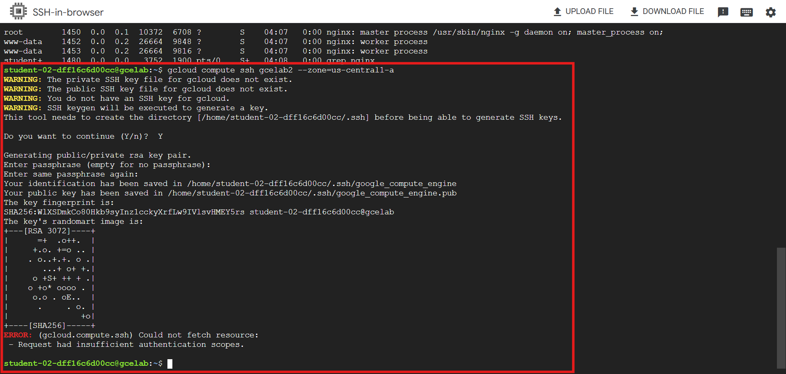

Disconnect:
```bash
exit
```

---

## Task Completed
- Created VMs using Cloud Console and gcloud CLI
- Deployed and accessed an NGINX web server

