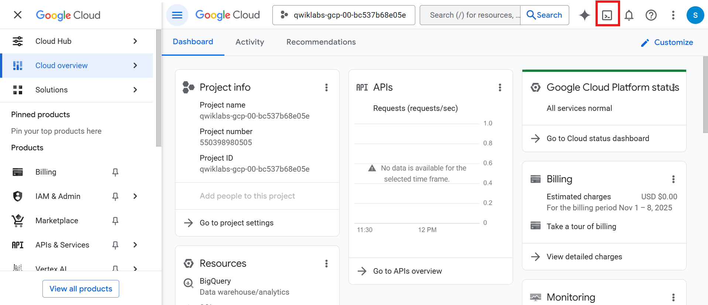
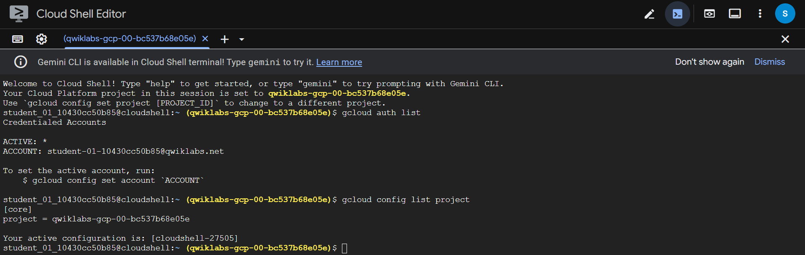
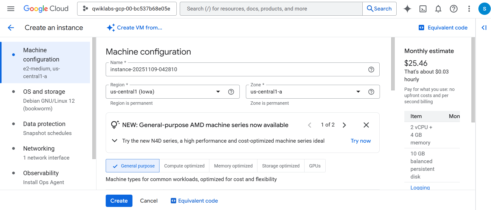
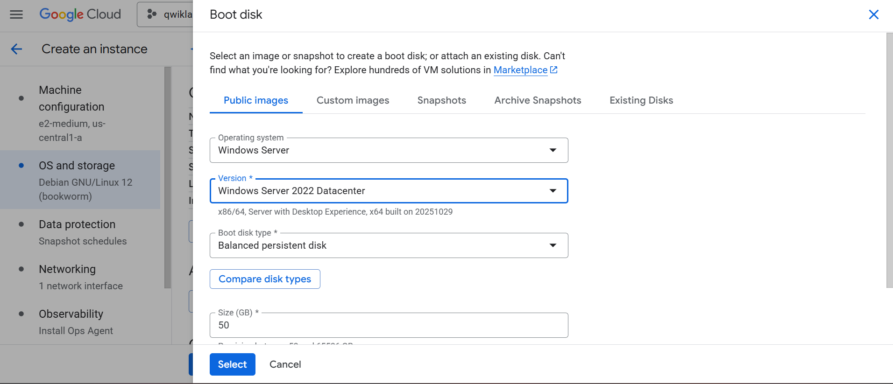
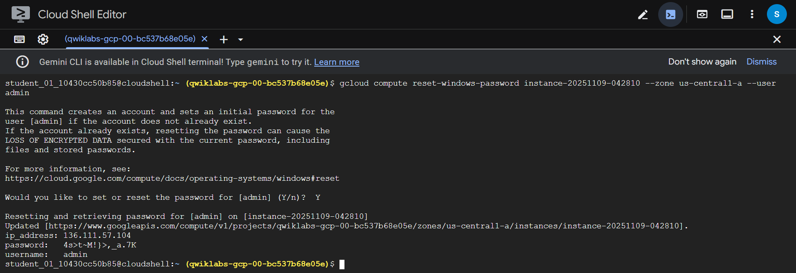
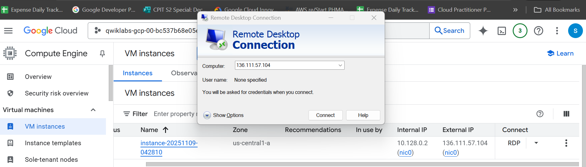
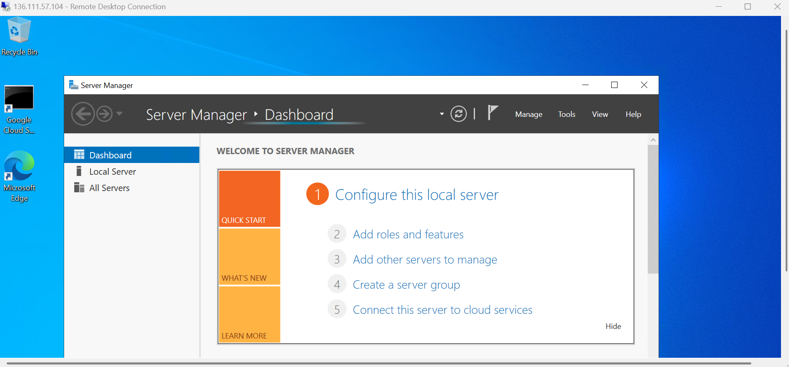

# 🖥️ Compute Engine: Qwik Start – Windows

## 🌐 Overview

Google Compute Engine lets you create and run Windows virtual machines (VMs) on Google Cloud infrastructure.  
You’ll launch a **Windows Server instance** and connect via **Remote Desktop Protocol (RDP)**.

---

## ⚙️ Setup and Requirements

### Before You Start
- Use an **Incognito** or **Private** browser window.  
- Use only the **temporary student account** to avoid charges.  
- Once started, lab time **cannot be paused**.

### Starting the Lab
1. Click **Start Lab**.  
2. In the **Lab Details** pane, click **Open Google Cloud Console** (preferably in Incognito).  
3. On the **Sign in** page:  
   - Click **Use Another Account**.  
   - Enter the provided **Username** → `Next`  
   - Enter the provided **Password** → `Next`
4. Accept all terms, skip recovery options, and don’t sign up for free trials.  
5. Wait for the **Google Cloud Console** to load.

---

## 🧰 Activate Cloud Shell

1. Click **Activate Cloud Shell** (💻 icon in top bar).  
2. Click **Continue**, then **Authorize**.  
3. Cloud Shell initializes automatically:
```text
Your Cloud Platform project in this session is set to "PROJECT_ID"
```

### Useful Commands
Check the active account:
```bash
gcloud auth list
```

Output:
```vbnet
ACTIVE: *
ACCOUNT: "ACCOUNT"
```

Check the active project:
```bash
gcloud config list project
```

Output:
```ini
[core]
project = "PROJECT_ID"
```




---

## 🏗️ Create a Windows VM Instance
1. In Console: Navigation menu → Compute Engine → VM Instances → Create Instance
2. Configure machine settings:

| Property   | Value      |
| ---------- | ---------- |
| **Region** | `<REGION>` |
| **Zone**   | `<ZONE>`   |
| **Series** | E2         |




3. Under Boot disk → Change:
  - Operating system: Windows Server
  - Version: Windows Server 2022 Datacenter
  - Click Select



4. Click Create to launch the instance.
> ✅ Check progress: “Create a virtual machine instance.”


---

## 🔎 Test Windows Startup

When the VM shows 🟢 Running, it may still be initializing.
Check if it’s ready for RDP:
```bash
gcloud compute instances get-serial-port-output [instance] --zone=ZONE
```

If prompted, type N and press Enter.
Repeat until you see:
```markdown
------------------------------------------------------------
Instance setup finished. instance is ready to use.
------------------------------------------------------------
```

---

## 🔐 Set RDP Credentials

Create/reset the Windows password:
```bash
gcloud compute reset-windows-password [instance] --zone=ZONE --user=admin
```

When prompted:
```pgsql
Would you like to set or reset the password for [admin] (Y/n)? → Y
```
- 💾 Record the generated password for later login.
> ✅ Check progress: “RDP into the Windows Server.”



---

## 🪟 Connect via Remote Desktop (RDP)
💻 Chromebook
If an RDP app is installed, open it → enter your VM External IP → connect with:
  - Username: admin
  - Password: (from previous step)

🌐 Chrome Browser
Install Spark View (RDP) Chrome extension → Launch App
  - Domain: VM External IP
  - Username: admin
  - Password: (from previous step)
  - Click Connect.

🍎 macOS
Install any free RDP client (e.g., CoRD) → connect to External IP
  - Username: admin
  - Password: (generated
  - Ignore the Domain field.

> Once connected, you’ll see the Windows desktop 🎉



---

## 📋 Copy and Paste Tips (RDP Client)
- To paste: CTRL + V (not CMD + V)
- In PowerShell, click the window before pasting.
- In PuTTY, paste with Right-click.



---

## Task Completed
- Created a Windows VM in Compute Engine
- Connected to it via RDP
