# ☁️ Getting Started with Cloud Shell and gcloud

## 🌐 Overview

Cloud Shell provides command-line access to Google Cloud resources.  
It’s a **Debian VM** with a **persistent 5GB home directory** and pre-installed **gcloud** tools.  

In this lab, you will:
- Practice gcloud commands  
- Connect to compute services  

---

## ⚙️ Setup and Requirements

### Before You Start
- Use **Incognito/Private** window  
- Use **temporary student account** only  
- Lab **cannot be paused**  

### Starting the Lab
1. Click **Start Lab → Open Google Cloud Console**  
2. Sign in with the provided **Username** & **Password**  
3. Accept terms, skip recovery options, and avoid free trials  

---

## 🧰 Activate Cloud Shell

1. Click **Activate Cloud Shell** (💻 icon)  
2. Continue and **Authorize** credentials  

**Check Project ID:**
```bash
gcloud config list project
```

Output:
```ini
[core]
project = "PROJECT_ID"
```

Optional Commands:
```bash
gcloud auth list
```

Output:
```vbnet
ACTIVE: *
ACCOUNT: "ACCOUNT"
```

```bash
gcloud config set account `ACCOUNT`
```

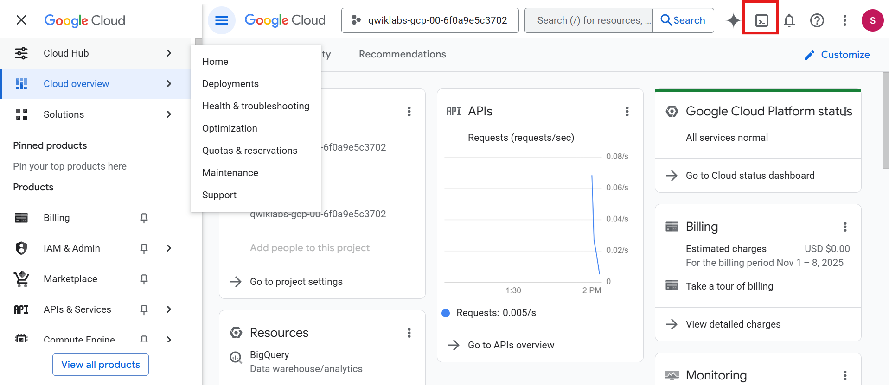
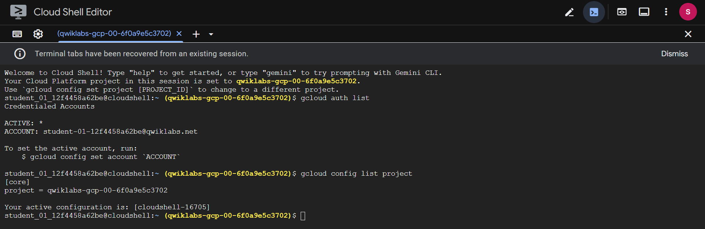

---

### 🏗️ Task 1: Configuring Your Environment
1. Set Region & Zone
```bash
gcloud config set compute/region REGION
gcloud config set compute/zone ZONE
```

2.  Check settings
```bash
gcloud config get-value compute/region
gcloud config get-value compute/zone
```

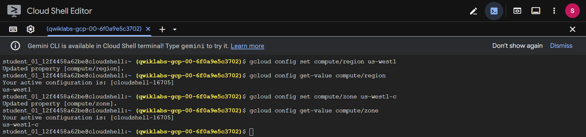

3. Project Information:
```bash
gcloud config get-value project
gcloud compute project-info describe --project $(gcloud config get-value project)
```

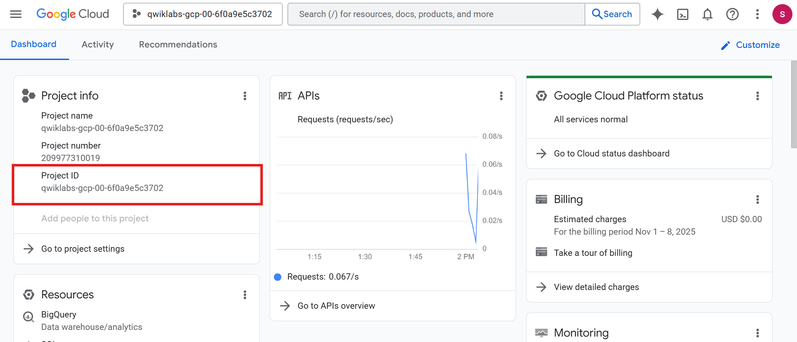
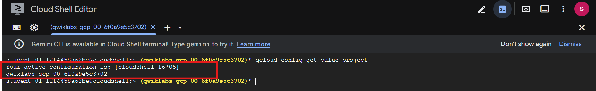
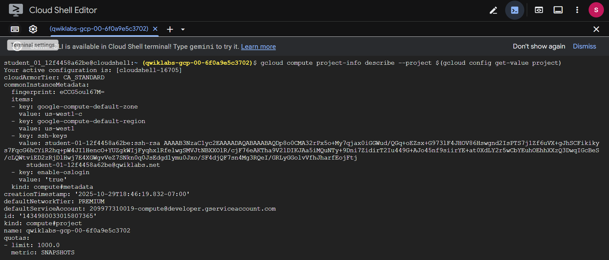

4. Environment Variables
```bash
export PROJECT_ID=$(gcloud config get-value project)
export ZONE=$(gcloud config get-value compute/zone)
echo -e "PROJECT ID: $PROJECT_ID\nZONE: $ZONE"
```

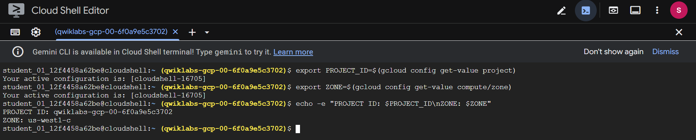

---

### 🖥️ Task 2: Creating a VM
```bash
gcloud compute instances create gcelab2 --machine-type e2-medium --zone $ZONE
```

Output Example:
```nginx
NAME     ZONE   MACHINE_TYPE  INTERNAL_IP  EXTERNAL_IP   STATUS
gcelab2  ZONE   e2-medium     10.128.0.2   34.67.152.90 RUNNING
```

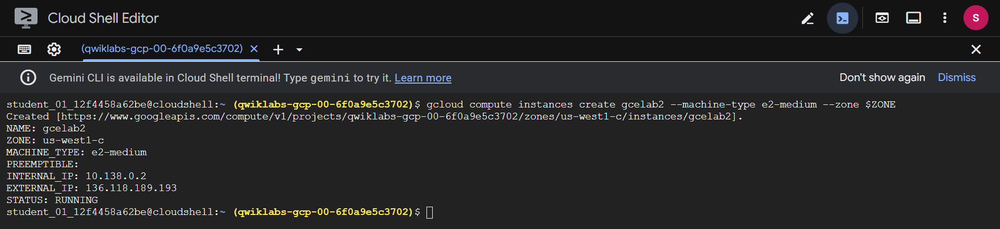

Help & Info:
```bash
gcloud compute instances create --help
```

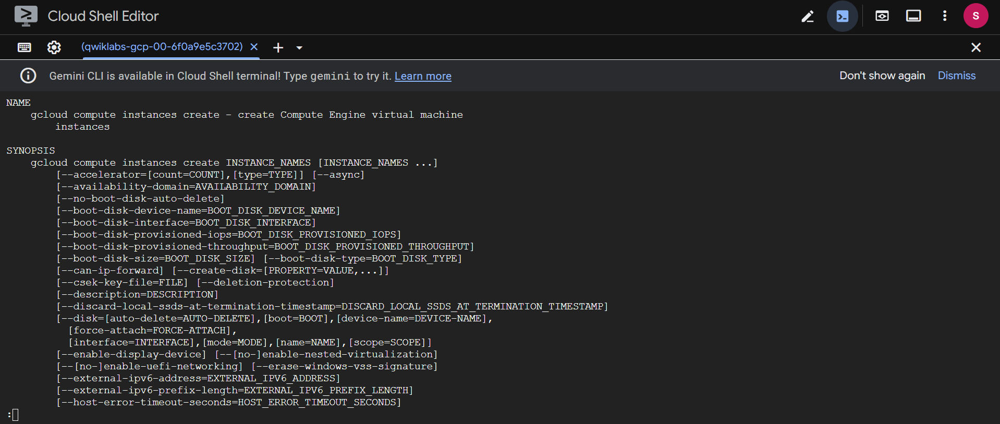

```bash
gcloud -h
```

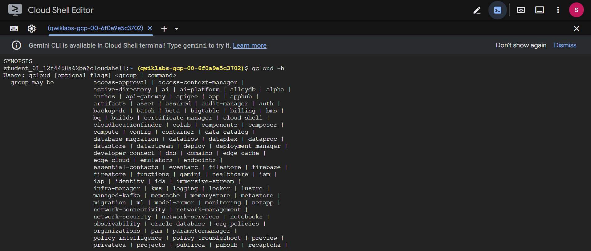
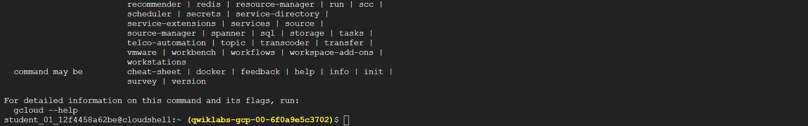

```bash
gcloud config --help
```

```bash
gcloud help config
```

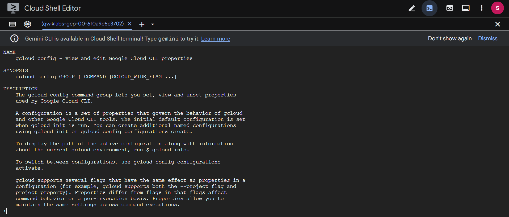

```bash  
gcloud config list
```


```bash
gcloud config list --all
```

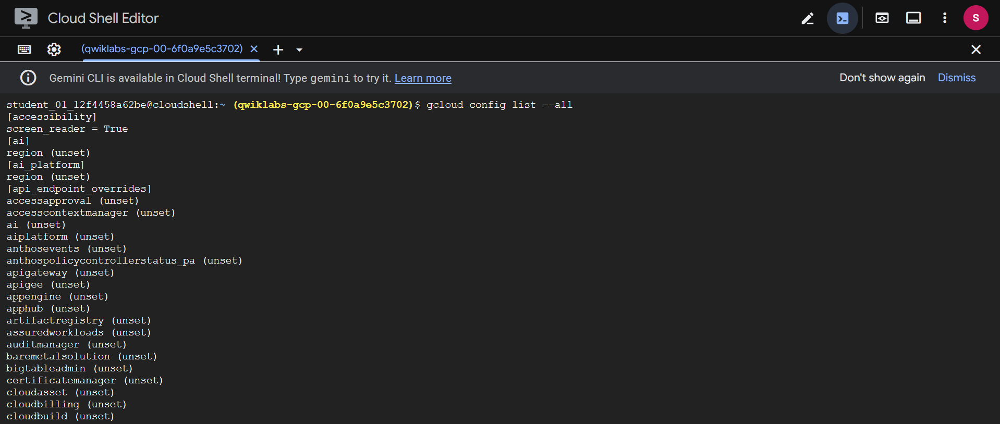

```bash
gcloud components list
```

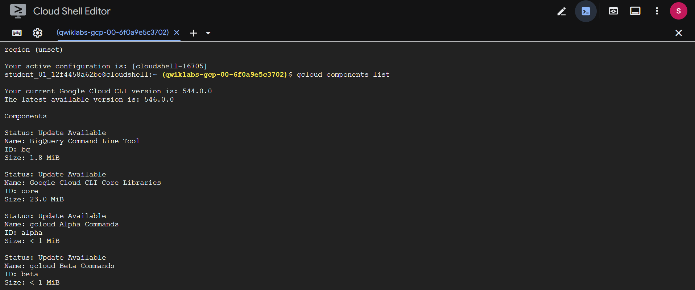

---

### 🔍 Task 3: Filtering Output
1. List all instances:
```bash
gcloud compute instances list
```

2. Filter by name:
```bash
gcloud compute instances list --filter="name=('gcelab2')"
```

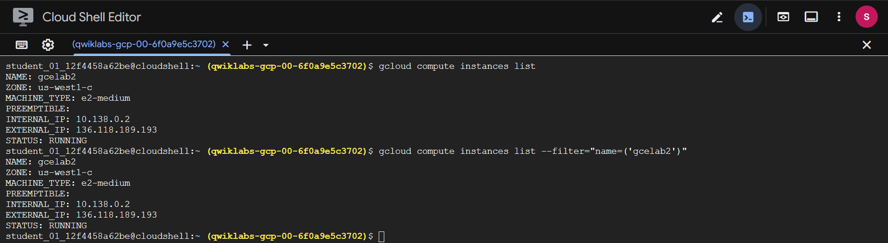

3. List firewall rules:
```bash
gcloud compute firewall-rules list
```

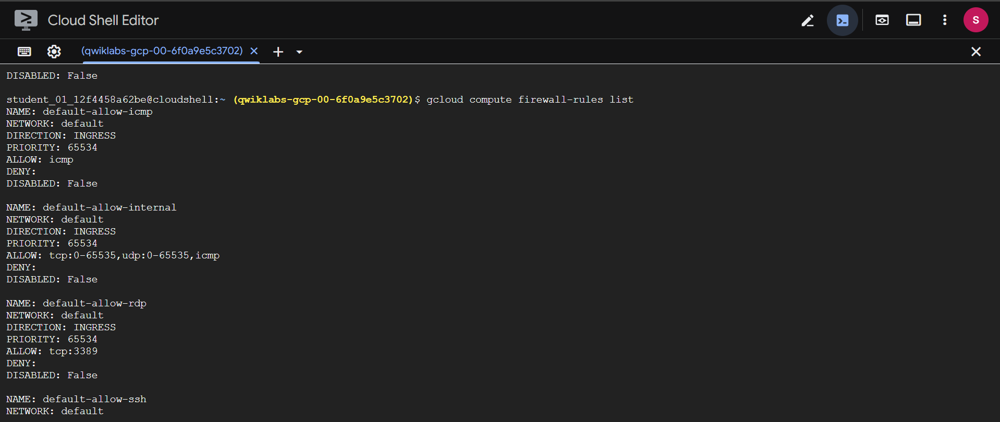
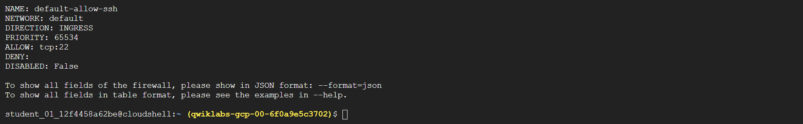

```bash
gcloud compute firewall-rules list --filter="network='default'"
```

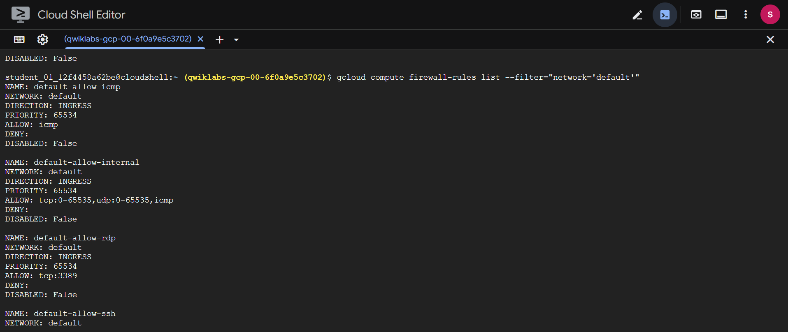
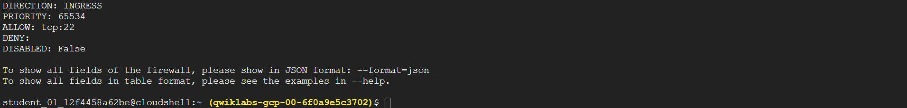

```bash
gcloud compute firewall-rules list --filter="NETWORK:'default' AND ALLOW:'icmp'"
```

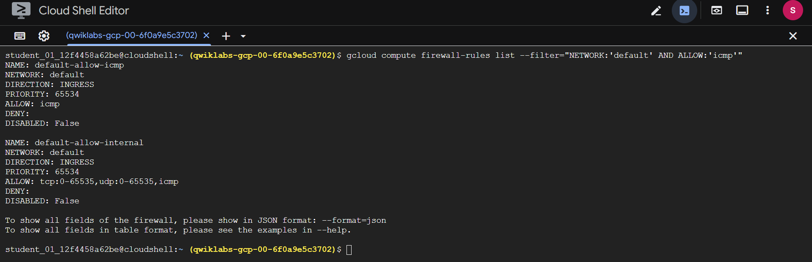

---

### 🔐 Task 4: Connect to VM & Install Nginx
SSH to VM:
```bash
gcloud compute ssh gcelab2 --zone $ZONE
```

Follow prompts to generate SSH keys.

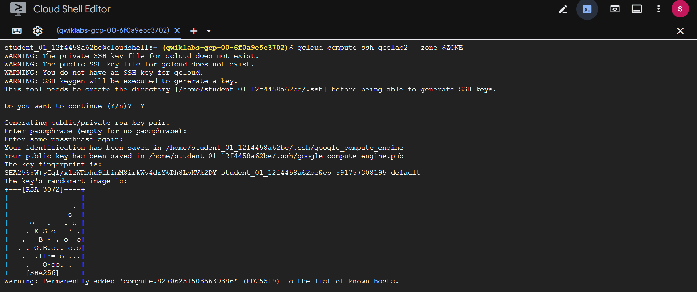
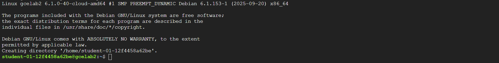

Install nginx:
```bash
sudo apt update && sudo apt install -y nginx
```

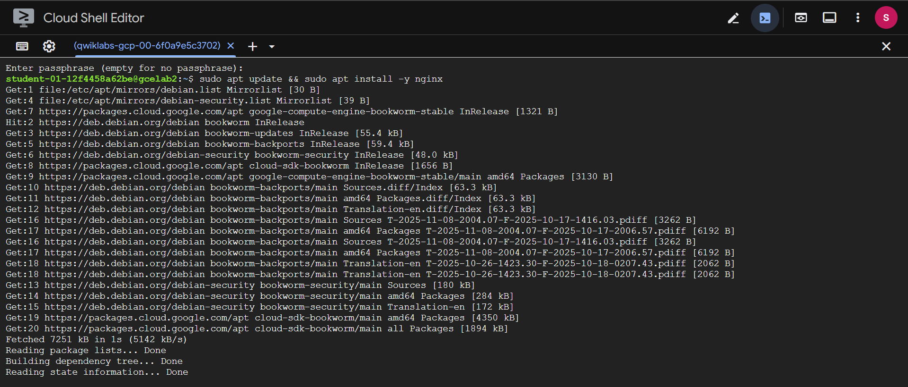


Exit SSH:
```bash
exit
```

---

### 🔥 Task 5: Update Firewall

Add VM tags:
```bash
gcloud compute instances add-tags gcelab2 --tags http-server,https-server
```

Allow HTTP traffic:
```bash
gcloud compute firewall-rules create default-allow-http --direction=INGRESS --priority=1000 --network=default --action=ALLOW --rules=tcp:80 --source-ranges=0.0.0.0/0 --target-tags=http-server
```

Verify HTTP firewall rule:
```bash
gcloud compute firewall-rules list --filter=ALLOW:'80'
```

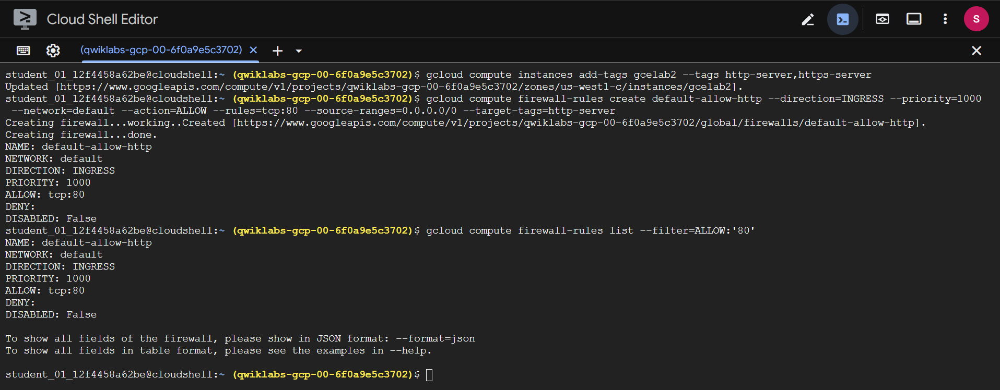

Test HTTP access:
```bash
curl http://$(gcloud compute instances list --filter=name:gcelab2 --format='value(EXTERNAL_IP)')
```

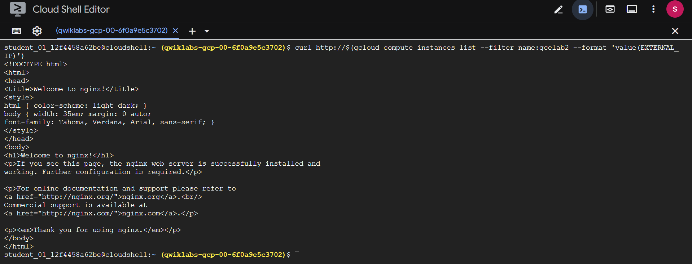

---

### 📄 Task 6: Viewing System Logs
List available logs:
```bash
gcloud logging logs list
gcloud logging logs list --filter="compute"
```

Read logs:
```bash
gcloud logging read "resource.type=gce_instance" --limit 5
gcloud logging read "resource.type=gce_instance AND labels.instance_name='gcelab2'" --limit 5
```

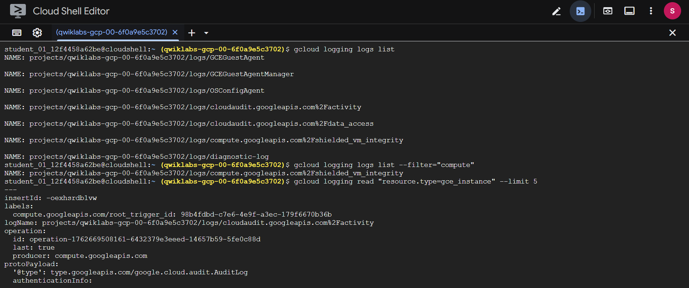

---

## Task Completed
- Launch Cloud Shell
- Run gcloud commands
- Create and manage VMs
- Configure firewall rules
- View logs
