# 4. Set Up Network Load Balancers

## Overview
In this lab, you will set up a **passthrough Network Load Balancer (NLB)** using Compute Engine VMs.  
An L4 NLB handles traffic by IP/port without inspecting packet content.

**You will:**
- Configure region/zone
- Create web servers
- Configure load balancing
- Create forwarding rule to distribute traffic

---

## Setup
- Use the **temporary student account** provided.  
- Open the **Google Cloud Console → Activate Cloud Shell**.  
- Confirm active account and project:
```bash
gcloud auth list
gcloud config list project
```

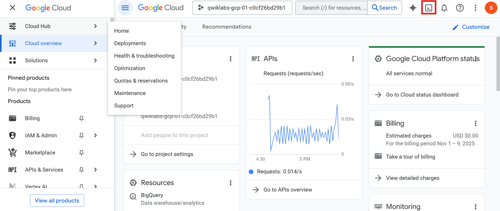
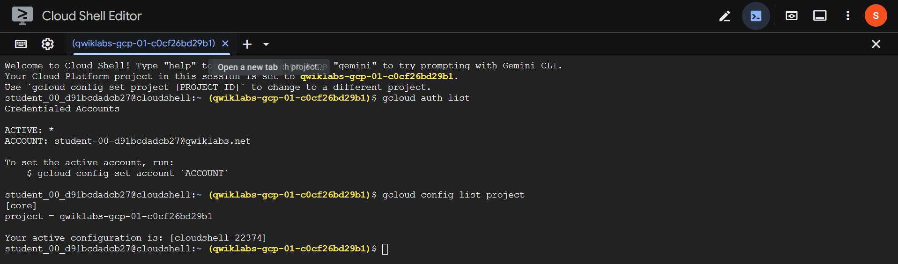

---

### Task 1. Set Default Region and Zone
```bash
gcloud config set compute/region REGION
gcloud config set compute/zone ZONE
```

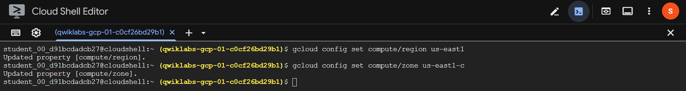

---

### Task 2. Create Multiple Web Servers

1. Create 3 instances with Apache installed.
a. www1
  ```bash
  gcloud compute instances create www1 \
  --zone=ZONE --tags=network-lb-tag --machine-type=e2-small \
  --image-family=debian-11 --image-project=debian-cloud \
  --metadata=startup-script='#!/bin/bash
    apt-get update
    apt-get install apache2 -y
    service apache2 restart
    echo "<h3>Web Server: www1</h3>" > /var/www/html/index.html'
  ```


b. www2
  ```bash
  gcloud compute instances create www2 \
  --zone=ZONE --tags=network-lb-tag --machine-type=e2-small \
  --image-family=debian-11 --image-project=debian-cloud \
  --metadata=startup-script='#!/bin/bash
    apt-get update
    apt-get install apache2 -y
    service apache2 restart
    echo "<h3>Web Server: www2</h3>" > /var/www/html/index.html'
  ```

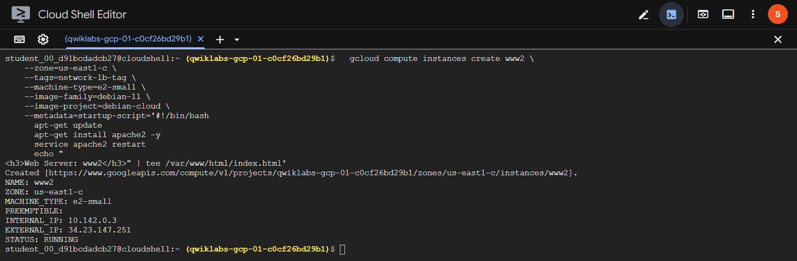

c. ww3
  ```bash
  gcloud compute instances create www3 \
  --zone=ZONE --tags=network-lb-tag --machine-type=e2-small \
  --image-family=debian-11 --image-project=debian-cloud \
  --metadata=startup-script='#!/bin/bash
    apt-get update
    apt-get install apache2 -y
    service apache2 restart
    echo "<h3>Web Server: www3</h3>" > /var/www/html/index.html'
  ```

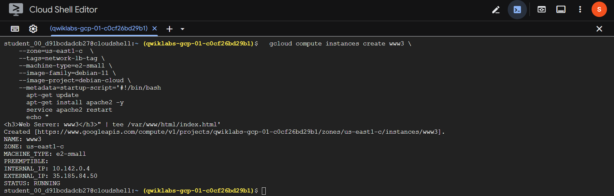

Allow HTTP traffic
```bash
gcloud compute firewall-rules create www-firewall-network-lb \
  --target-tags network-lb-tag --allow tcp:80
```

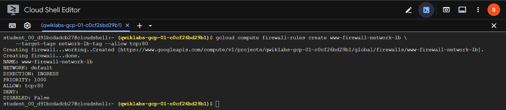

Verify instances
```bash
gcloud compute instances list
curl http://[EXTERNAL_IP]
```

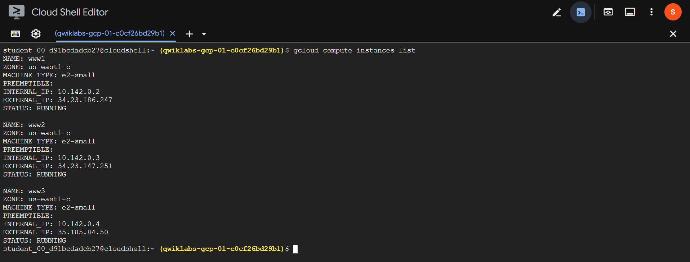
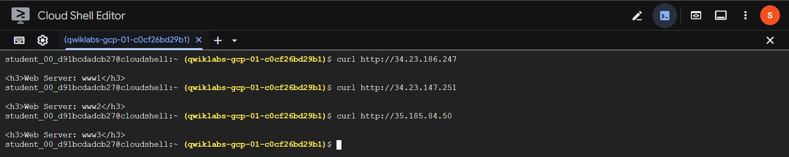

---

### Task 3. Configure Load Balancer

Create static IP
```bash
gcloud compute addresses create network-lb-ip-1 --region REGION
```

Create health check
```bash
gcloud compute http-health-checks create basic-check
```

---

### Task 4. Create Target Pool and Forwarding Rule

Create target pool
```bash
gcloud compute target-pools create www-pool \
  --region REGION --http-health-check basic-check
```

Add instances
```bash
gcloud compute target-pools add-instances www-pool \
  --instances www1,www2,www3
```

Create forwarding rule
```bash
gcloud compute forwarding-rules create www-rule \
  --region REGION --ports 80 \
  --address network-lb-ip-1 \
  --target-pool www-pool
```

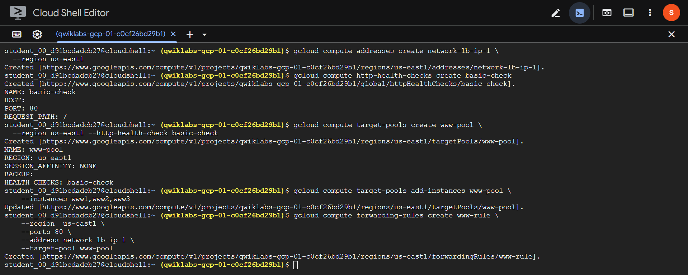

---

### Task 5. Test Load Balancer

Get external IP
```bash
gcloud compute forwarding-rules describe www-rule --region REGION
```

Save and show IP
```bash
IPADDRESS=$(gcloud compute forwarding-rules describe www-rule --region REGION --format="json" | jq -r .IPAddress)
echo $IPADDRESS
```

Send traffic
```bash
while true; do curl -m1 $IPADDRESS; done
```
- The responses alternate among `www1`, `www2`, and `www3`.
- Press Ctrl + C to stop.

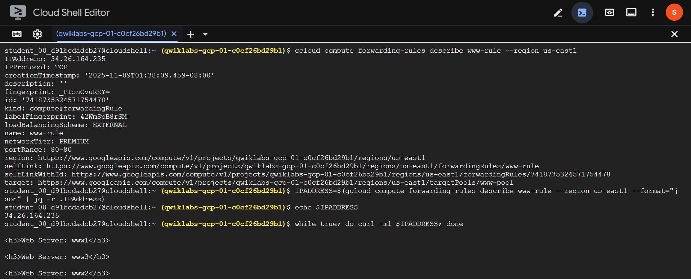
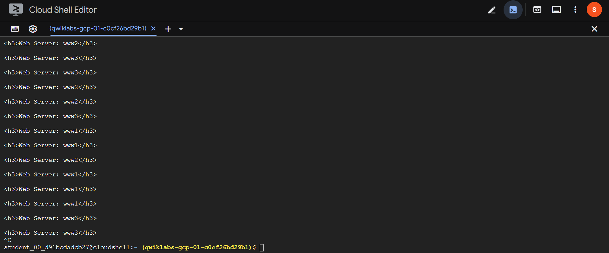

---

## Task Completed
- Created 3 Apache web servers
- Configured a Network Load Balancer
- Verified load distribution using a forwarding rule
