# 🧪 Set Up Application Load Balancers

## 🌐 Overview

In this hands-on lab, you will learn how to set up a **Layer 7 (L7) Application Load Balancer** on Compute Engine virtual machines (VMs).  
L7 load balancers can understand HTTP(S) protocols, allowing them to make routing decisions based on parameters like URLs, headers, cookies, and request content — improving application performance and responsiveness.

This lab demonstrates:

- 🌍 Application Load Balancer setup  

---

## 🎯 Objectives

By the end of this lab, you will be able to:

1. ⚙️ Configure the default region and zone for your resources.  
2. ⚖️ Create an Application Load Balancer.  
3. 🧩 Test traffic to your instances.

---

## 🧰 Setup and Requirements

### 📝 Before You Click “Start Lab”

- Labs are **timed** and **cannot be paused**.  
- You’ll get **temporary credentials** to access Google Cloud resources in a **real environment**.

You will need:
- 🌐 A standard web browser (Google Chrome recommended).  
- 🕶️ Use **Incognito/Private mode** to avoid conflicts with your personal account.  
- ⏳ Enough time to complete the lab in one session.  
- ⚠️ Use **only** the provided student account — **do not** use your own Google Cloud account to avoid charges.

---

## 🚀 How to Start Your Lab and Sign in to Google Cloud Console

1. Click **Start Lab**.  
   - If prompted for payment, choose your method.  
   - The **Lab Details** pane will show:
     - Open Google Cloud console button  
     - Time remaining  
     - Temporary credentials  
     - Other required info  

2. Click **Open Google Cloud console** (or right-click → *Open Link in Incognito Window*).  
3. If you see **Choose an account**, click **Use Another Account**.  
4. Copy the **Username** and **Password** from the Lab Details pane.  
5. Sign in using those credentials.  

⚠️ Do **not** use your own credentials. Avoid setting recovery options or 2FA. Skip free trial signup.

After login, the **Google Cloud Console** opens.  
Use the **Navigation menu** or **Search bar** to access services.

---

## 💻 Activate Cloud Shell

Cloud Shell is a VM preloaded with developer tools, offering:
- 5GB persistent home directory  
- Command-line access to Google Cloud  

### Steps:

1. Click **Activate Cloud Shell** ▶️ (top-right corner).  
2. Continue through prompts and **Authorize** access.  
3. Once connected, your project will auto-set to your **Project_ID**.

Example output:
```text
Your Cloud Platform project in this session is set to "PROJECT_ID"
```

You can list the active account:
```bash
gcloud auth list
```

Output:
```vbnet
ACTIVE: *
ACCOUNT: "ACCOUNT"
```

To check or set your project:
```bash
gcloud config list project
```

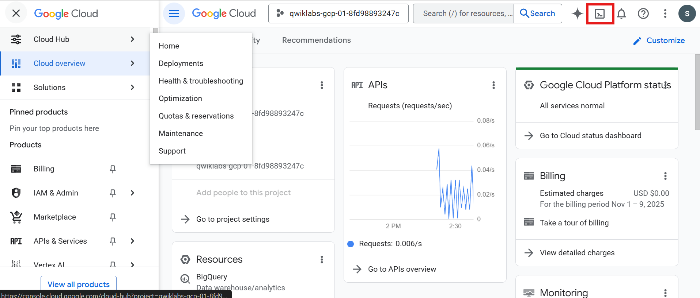
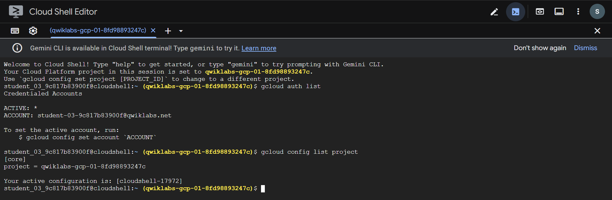

---

### 🧩 Task 1: Set the Default Region and Zone

1. Set default region:
```bash
gcloud config set compute/region REGION
```

2. Set default zone:
```bash
gcloud config set compute/zone ZONE
```

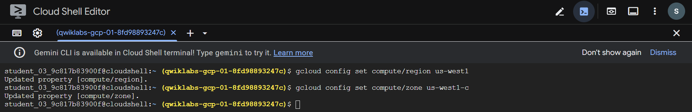

---

### 🖥️ Task 2: Create Multiple Web Server Instances

1. You’ll create three VM instances with Apache and allow HTTP traffic.

- Create VM: www1
```bash
gcloud compute instances create www1 \
  --zone=ZONE \
  --tags=network-lb-tag \
  --machine-type=e2-small \
  --image-family=debian-11 \
  --image-project=debian-cloud \
  --metadata=startup-script='#!/bin/bash
    apt-get update
    apt-get install apache2 -y
    service apache2 restart
    echo "<h3>Web Server: www1</h3>" | tee /var/www/html/index.html'
```


- Create VM: www2
```bash
gcloud compute instances create www2 \
  --zone=ZONE \
  --tags=network-lb-tag \
  --machine-type=e2-small \
  --image-family=debian-11 \
  --image-project=debian-cloud \
  --metadata=startup-script='#!/bin/bash
    apt-get update
    apt-get install apache2 -y
    service apache2 restart
    echo "<h3>Web Server: www2</h3>" | tee /var/www/html/index.html'
```

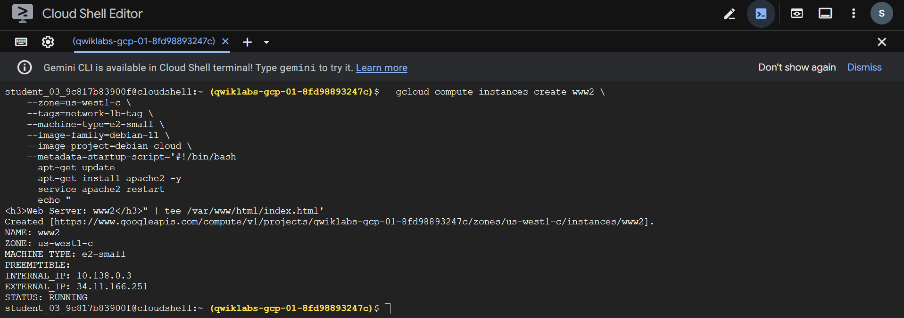

- Create VM: www3
```bash
gcloud compute instances create www3 \
  --zone=ZONE \
  --tags=network-lb-tag \
  --machine-type=e2-small \
  --image-family=debian-11 \
  --image-project=debian-cloud \
  --metadata=startup-script='#!/bin/bash
    apt-get update
    apt-get install apache2 -y
    service apache2 restart
    echo "<h3>Web Server: www3</h3>" | tee /var/www/html/index.html'
```

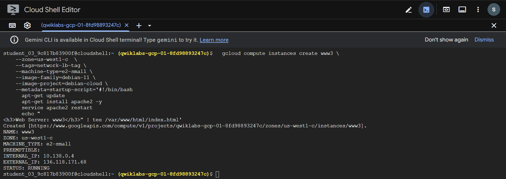

2. Create Firewall Rule
```bash
gcloud compute firewall-rules create www-firewall-network-lb \
  --target-tags network-lb-tag --allow tcp:80
```

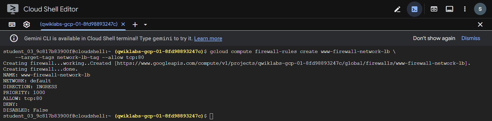

3. Verify Instances
```bash
gcloud compute instances list
```

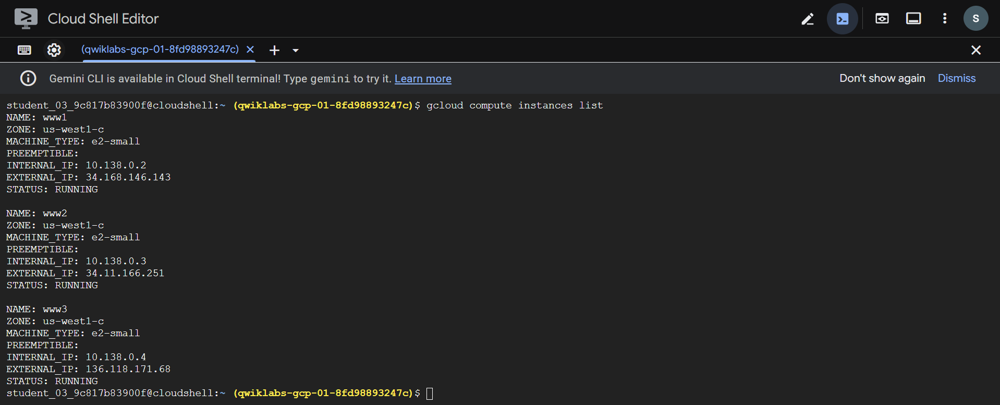

4. Test Each Instance
```bash
curl http://[EXTERNAL_IP_ADDRESS]
```

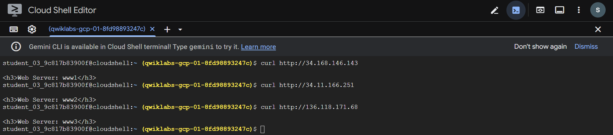

---

### ⚖️ Task 3: Create an Application Load Balancer

Google’s Global Front End (GFE) handles Application Load Balancing using Google’s network backbone.

1. Create Load Balancer Template
```bash
gcloud compute instance-templates create lb-backend-template \
  --region=REGION \
  --network=default \
  --subnet=default \
  --tags=allow-health-check \
  --machine-type=e2-medium \
  --image-family=debian-11 \
  --image-project=debian-cloud \
  --metadata=startup-script='#!/bin/bash
    apt-get update
    apt-get install apache2 -y
    a2ensite default-ssl
    a2enmod ssl
    vm_hostname="$(curl -H "Metadata-Flavor:Google" \
    http://169.254.169.254/computeMetadata/v1/instance/name)"
    echo "Page served from: $vm_hostname" | tee /var/www/html/index.html
    systemctl restart apache2'
```

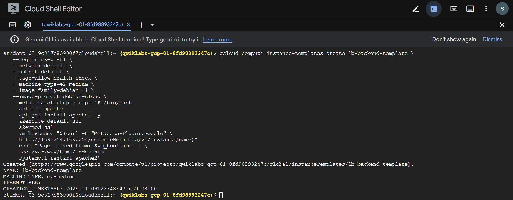

2. Create Managed Instance Group (MIG)
```bash
gcloud compute instance-groups managed create lb-backend-group \
  --template=lb-backend-template --size=2 --zone=ZONE
```

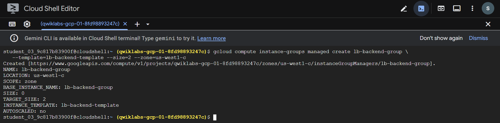

3. Create Health Check Firewall Rule
```bash
gcloud compute firewall-rules create fw-allow-health-check \
  --network=default \
  --action=allow \
  --direction=ingress \
  --source-ranges=130.211.0.0/22,35.191.0.0/16 \
  --target-tags=allow-health-check \
  --rules=tcp:80
```

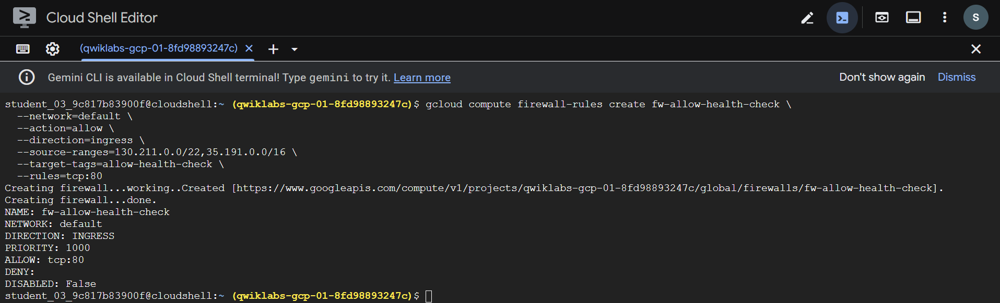

4. Reserve Global Static IP
```bash
gcloud compute addresses create lb-ipv4-1 \
  --ip-version=IPV4 \
  --global
```

5. View the IP:
```bash
gcloud compute addresses describe lb-ipv4-1 \
  --format="get(address)" \
  --global
```

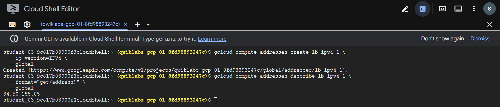

6. Create Health Check
```bash
gcloud compute health-checks create http http-basic-check \
  --port 80
```

7. Create Backend Service
```bash
gcloud compute backend-services create web-backend-service \
  --protocol=HTTP \
  --port-name=http \
  --health-checks=http-basic-check \
  --global
```

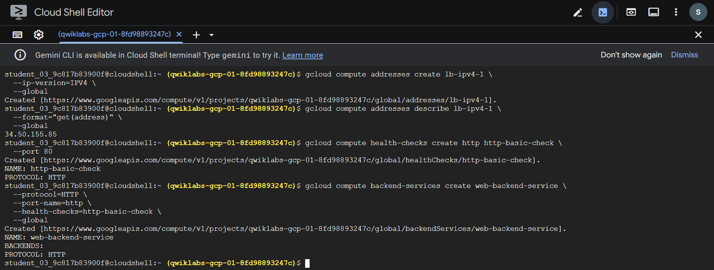

8. Add Instance Group as Backend
```bash
gcloud compute backend-services add-backend web-backend-service \
  --instance-group=lb-backend-group \
  --instance-group-zone=ZONE \
  --global
```

9. Create URL Map
```bash
gcloud compute url-maps create web-map-http \
  --default-service web-backend-service
```

10. Create Target HTTP Proxy
```bash
gcloud compute target-http-proxies create http-lb-proxy \
  --url-map web-map-http
```

11. Create Global Forwarding Rule
```bash
gcloud compute forwarding-rules create http-content-rule \
  --address=lb-ipv4-1 \
  --global \
  --target-http-proxy=http-lb-proxy \
  --ports=80
```

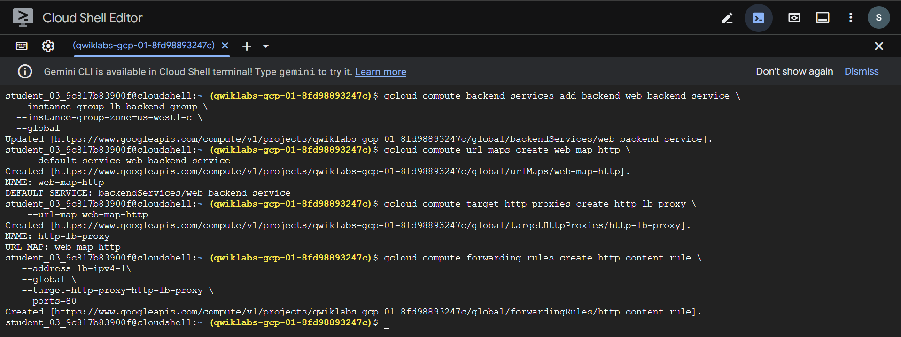
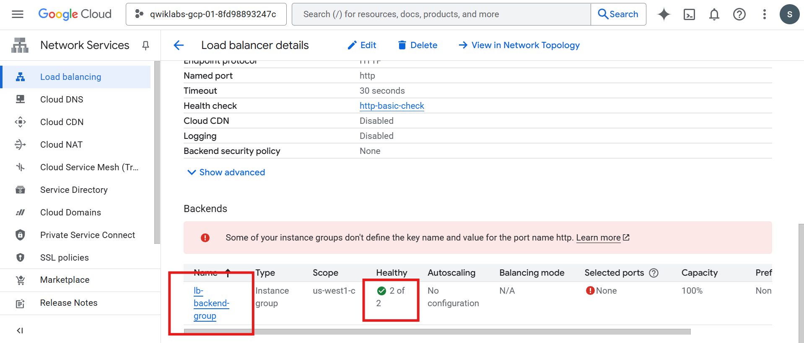

---

### 🌍 Task 4: Test Traffic Sent to Your Instances
- In the console search bar, type Load balancing → select it.
- Click the load balancer named web-map-http.
- In Backend, ensure all VMs show Healthy status.
- Open your browser and visit:
  ```bash
  http://[LOAD_BALANCER_IP]/
  ```
  - (Replace [LOAD_BALANCER_IP] with your reserved IP.)
> 🕒 Wait 3–5 minutes if not immediately available.


---

### Task Completed

Successfully built a Google Cloud Application Load Balancer, using:
- 🧱 Instance Templates
- 🧩 Managed Instance Groups
- 🌐 Global Load Balancer Configuration


