# 🧪 Use an Internal Application Load Balancer

## 🌐 Overview

The **Internal Application Load Balancer** is essential for building robust, secure, and easily manageable internal applications that power your business operations.  
This lab explores how to distribute network traffic **within your private cloud network** without exposing your virtual machines (VMs) directly to the public internet — keeping your services secure and efficient.

### 🧩 In this lab, you will build:

- A **Web Tier** (public-facing website) that requests help from another internal service.  
- An **Internal Service Tier** (a *prime number calculator*) that performs specific tasks and is distributed across multiple machines.  

This setup ensures that even if one internal service gets busy or goes down, the system keeps running smoothly — the load balancer automatically directs requests to healthy machines.

---

## 🎯 What You’ll Do

In this lab, you will:

1. 🔍 Learn about the components of an Internal Load Balancer.  
2. 🧱 Create a group of backend machines (prime number calculator).  
3. ⚙️ Set up the internal load balancer to direct internal traffic.  
4. 🧪 Test the internal load balancer from another internal machine.  
5. 🌍 Set up a public-facing web server that uses the internal load balancer.

---

## 📘 Prerequisites

You should be familiar with:

- 💡 **Compute Engine basics:** What a VM instance is.  
- 🌐 **Networking:** What an IP address is.  
- 💻 **Unix/Linux command line:** Typing commands in a terminal.  
- ☁️ **VPCs:** Understanding that resources live in a private network.

---

## 🧰 Setup and Requirements

### ⚠️ Before You Click “Start Lab”

- Labs are **timed** and **cannot be paused**.  
- You’ll use **temporary credentials** (student account).  
- Use **Incognito mode** to avoid account conflicts.  
- You cannot pause once started.  
- Do **not** use your own Google Cloud account to prevent charges.

---

## 🚀 Start Your Lab and Sign In to Google Cloud Console

1. Click **Start Lab**.  
   - Select payment method if required.  
   - The **Lab Details** pane shows:
     - Open Google Cloud console button  
     - Time remaining  
     - Temporary credentials  
     - Other info  

2. Click **Open Google Cloud Console** (or open in *Incognito Window*).  
3. If prompted, choose **Use Another Account**.  
4. Copy the **Username** and **Password** from the Lab Details pane.  
5. Log in using these credentials.  

> ⚠️ Do **not** use your personal account credentials or enable recovery options / 2FA.  
> Skip “Free Trial” signup prompts.

Once logged in, the **Google Cloud Console** opens.  
Use the **Navigation menu** or **Search bar** to find services.

---

## 💻 Activate Cloud Shell

Cloud Shell provides a ready-to-use environment with tools pre-installed.

1. Click **Activate Cloud Shell** ▶️ in the top-right.  
2. Authorize access when prompted.  
3. The project auto-sets to your **Project_ID**.

Output example:
```text
Your Cloud Platform project in this session is set to "PROJECT_ID"
```


List your account:
```bash
gcloud auth list
```

Output:
```vbnet
ACTIVE: *
ACCOUNT: "ACCOUNT"
```

List your project:
```bash
gcloud config list project
```


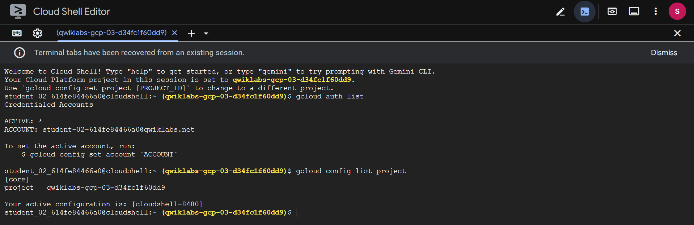

---

### 🌍 Set the Region and Zone

Set your region and zone for this lab:
```bash
gcloud config set compute/region REGION
gcloud config set compute/zone ZONE
```

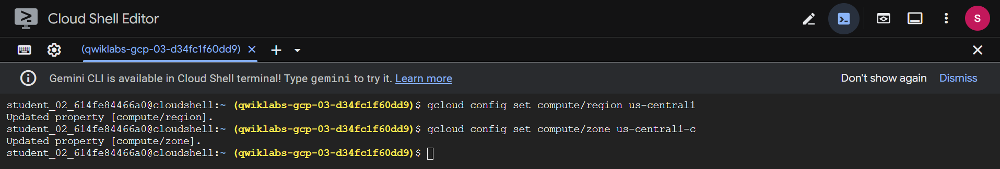

---

### 🧱 Task 1: Create a Virtual Environment

Python virtual environments isolate dependencies and keep your project tidy.

Install and Activate Environment
```bash
sudo apt-get install -y virtualenv
python3 -m venv venv
source venv/bin/activate
```

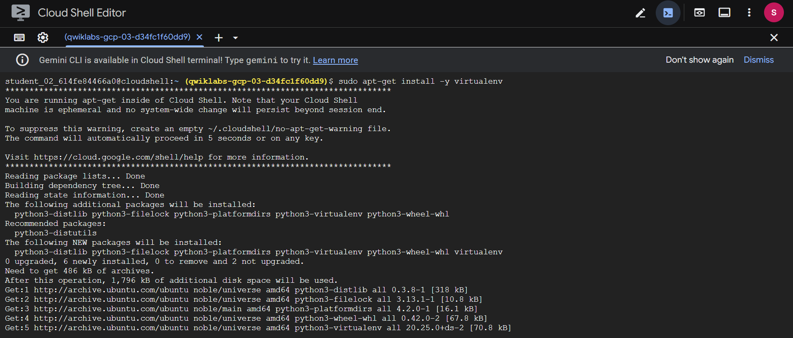
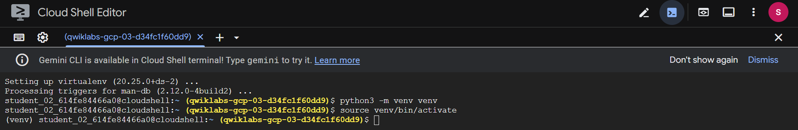

---

### 🤖 Enable Gemini Code Assist in Cloud Shell IDE

Enable Gemini for Google Cloud API:
```bash
gcloud services enable cloudaicompanion.googleapis.com
```

Then:
- Click Open Editor in the Cloud Shell toolbar.
- Open Settings → search for Gemini Code Assist.
- ✅ Ensure Gemini Code Assist: Enable is checked.
- Confirm the correct Project ID is selected in the Cloud Code status bar.

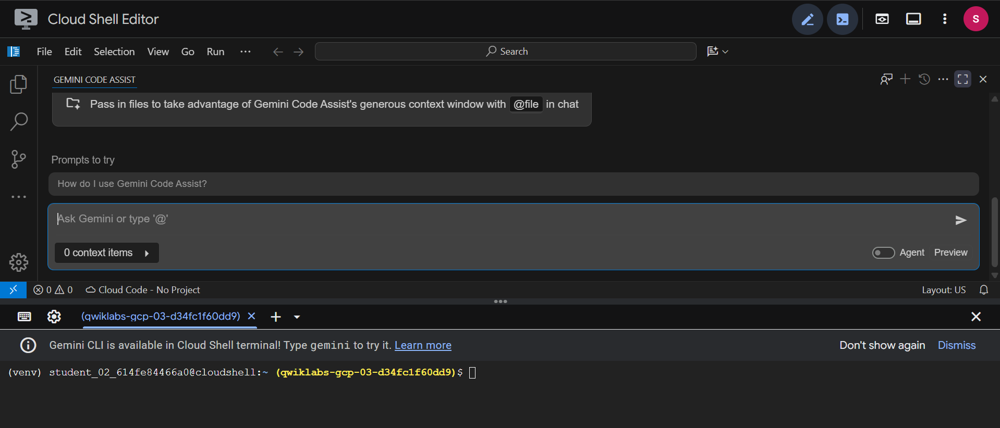
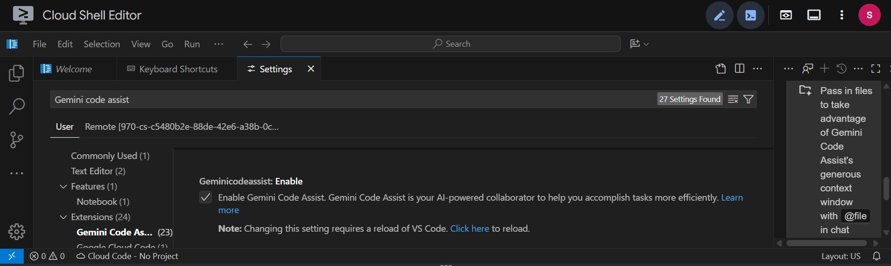
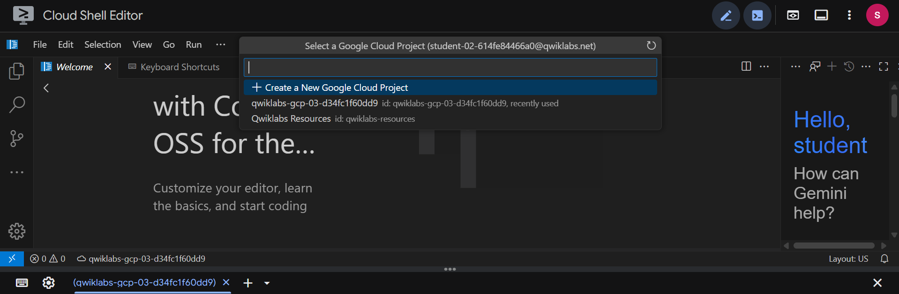

---

### ⚙️ Task 2: Create a Backend Managed Instance Group

A Managed Instance Group (MIG) automatically creates identical service copies for reliability.

1. Create the Startup Script
Create the script file:
```bash
touch ~/backend.sh
```

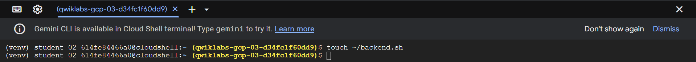

2. Open the Editor, select `backend.sh`, and paste:
```bash
sudo chmod -R 777 /usr/local/sbin/
sudo cat << EOF > /usr/local/sbin/serveprimes.py
import http.server

def is_prime(a): return a!=1 and all(a % i for i in range(2,int(a**0.5)+1))

class myHandler(http.server.BaseHTTPRequestHandler):
  def do_GET(s):
    s.send_response(200)
    s.send_header("Content-type", "text/plain")
    s.end_headers()
    s.wfile.write(bytes(str(is_prime(int(s.path[1:]))).encode('utf-8')))

http.server.HTTPServer(("",80),myHandler).serve_forever()
EOF
nohup python3 /usr/local/sbin/serveprimes.py >/dev/null 2>&1 &
```

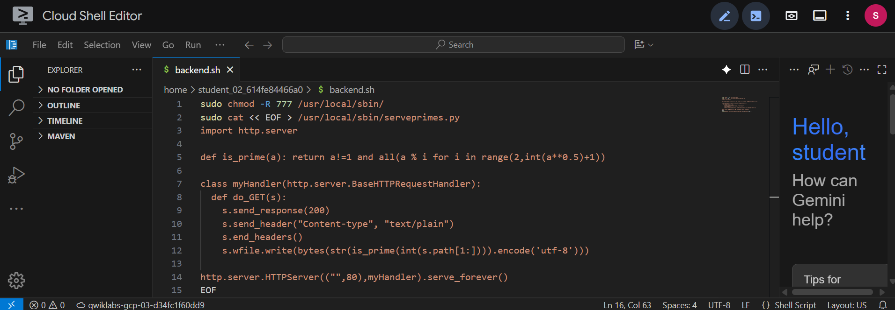

3. Save the file.
You can use Gemini Code Assist to explain or document the script if desired.

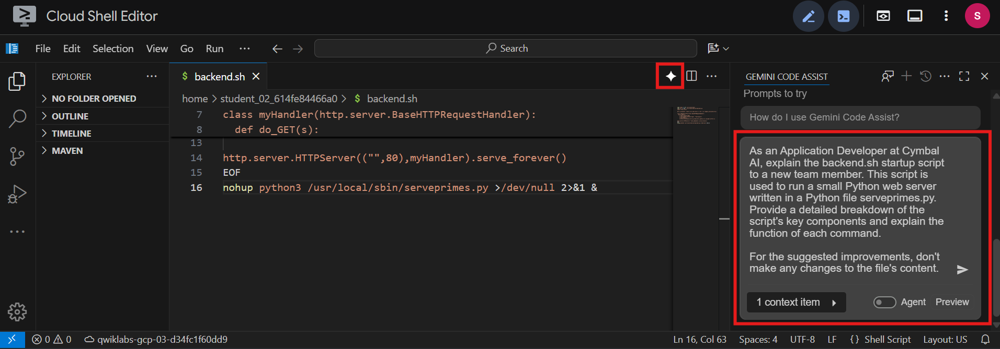

5. Create the Instance Template
```bash
gcloud compute instance-templates create primecalc \
--metadata-from-file startup-script=backend.sh \
--no-address --tags backend --machine-type=e2-medium
```

5. Open the Firewall (Port 80)
```bash
gcloud compute firewall-rules create http --network default \
--allow=tcp:80 --source-ranges IP --target-tags backend
```

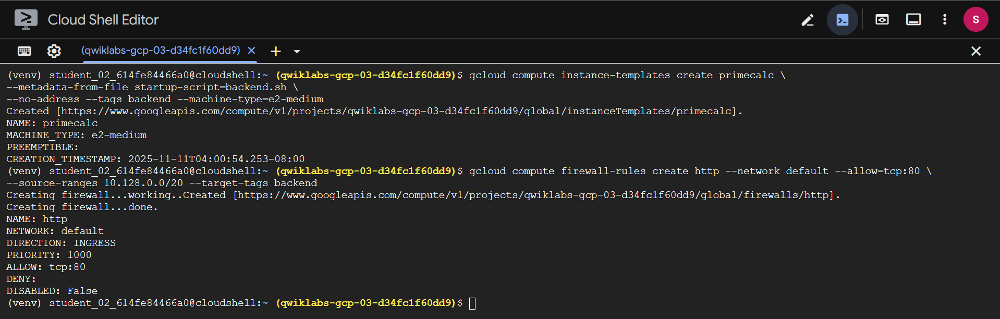

6. Create the Managed Instance Group
```bash
gcloud compute instance-groups managed create backend \
--size 3 --template primecalc --zone ZONE
```
> Check in Compute Engine → VM Instances to confirm the 3 backends.

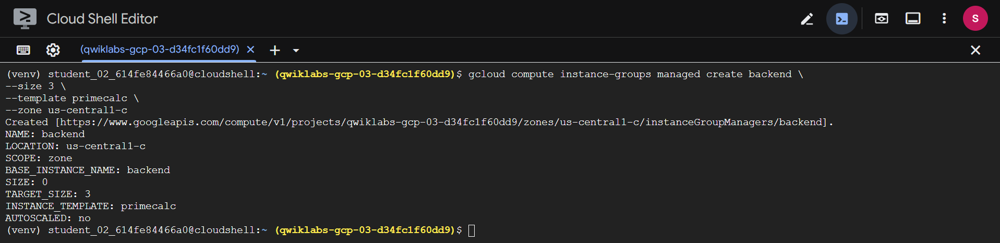

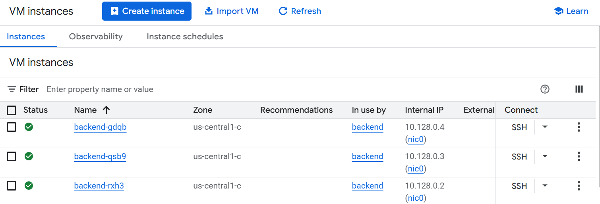

---

### ⚖️ Task 3: Set Up the Internal Load Balancer
An Internal Load Balancer consists of:
- Forwarding Rule — the private IP address entry point.
- Backend Service — distributes traffic to VMs.
- Health Check — monitors VM health.


1. Create Health Check
```bash
gcloud compute health-checks create http ilb-health --request-path /2
```

2. Create Backend Service
```bash
gcloud compute backend-services create prime-service \
--load-balancing-scheme internal --region=REGION \
--protocol tcp --health-checks ilb-health
```

3. Add Instance Group to Backend Service
```bash
gcloud compute backend-services add-backend prime-service \
--instance-group backend --instance-group-zone=ZONE \
--region=REGION
```

4. Create Forwarding Rule
```bash
gcloud compute forwarding-rules create prime-lb \
--load-balancing-scheme internal \
--ports 80 --network default \
--region=REGION --address IP \
--backend-service prime-service
```
> ✅ Your internal prime number calculation service is now ready!

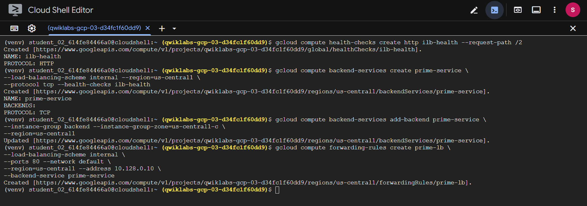

---

### 🧪 Task 4: Test the Load Balancer
1. Create a Test Instance
```bash
gcloud compute instances create testinstance \
--machine-type=e2-standard-2 --zone ZONE
```

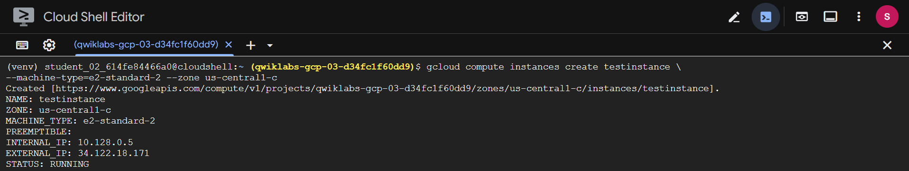

2. SSH into it:
```bash
gcloud compute ssh testinstance --zone ZONE
```

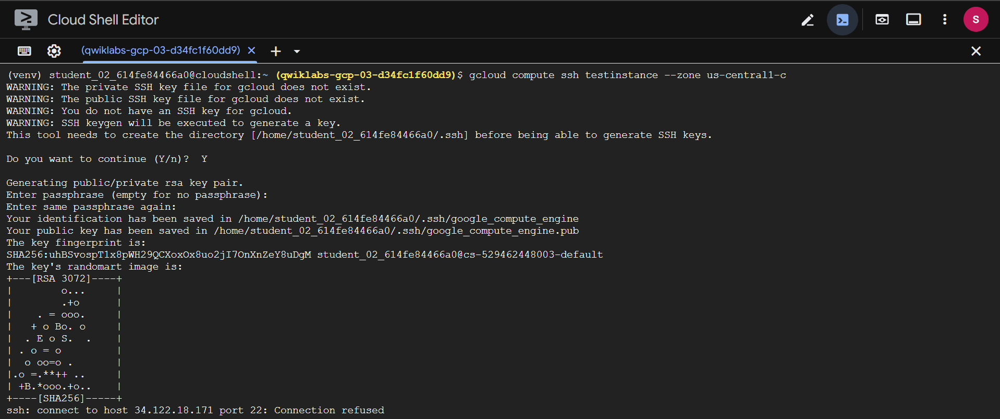

3. Run:
```bash
curl IP/2
curl IP/4
curl IP/5
```

4. Output example:
```
True
False
True
```

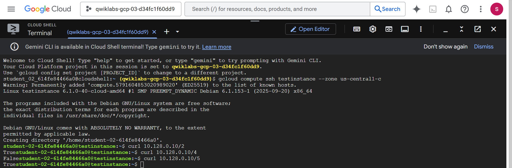

5. Exit and delete the test instance:
```bash
exit
gcloud compute instances delete testinstance --zone=ZONE
```

---

### 🌍 Task 5: Create a Public-Facing Web Server

Now you’ll create a frontend that queries your internal load balancer.
1. Create Frontend Script
```bash
touch ~/frontend.sh
```

2. Open in Editor and paste:
```bash
sudo chmod -R 777 /usr/local/sbin/
sudo cat << EOF > /usr/local/sbin/getprimes.py
import urllib.request
from multiprocessing.dummy import Pool as ThreadPool
import http.server
PREFIX="http://IP/"
def get_url(number):
    return urllib.request.urlopen(PREFIX+str(number)).read().decode('utf-8')
class myHandler(http.server.BaseHTTPRequestHandler):
  def do_GET(s):
    s.send_response(200)
    s.send_header("Content-type", "text/html")
    s.end_headers()
    i = int(s.path[1:]) if (len(s.path)>1) else 1
    s.wfile.write("<html><body><table>".encode('utf-8'))
    pool = ThreadPool(10)
    results = pool.map(get_url,range(i,i+100))
    for x in range(0,100):
      if not (x % 10): s.wfile.write("<tr>".encode('utf-8'))
      if results[x]=="True":
        s.wfile.write("<td bgcolor='#00ff00'>".encode('utf-8'))
      else:
        s.wfile.write("<td bgcolor='#ff0000'>".encode('utf-8'))
      s.wfile.write(str(x+i).encode('utf-8')+"</td> ".encode('utf-8'))
      if not ((x+1) % 10): s.wfile.write("</tr>".encode('utf-8'))
    s.wfile.write("</table></body></html>".encode('utf-8'))
http.server.HTTPServer(("",80),myHandler).serve_forever()
EOF
nohup python3 /usr/local/sbin/getprimes.py >/dev/null 2>&1 &
```

3. Save and close.

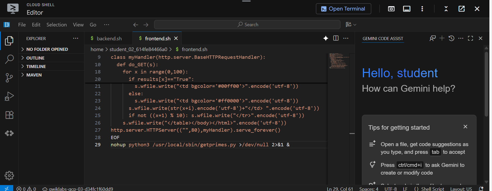

4. Create Frontend Instance
```bash
gcloud compute instances create frontend --zone=ZONE \
--metadata-from-file startup-script=frontend.sh \
--tags frontend --machine-type=e2-standard-2
```

5. Open Firewall for Frontend (Public Access)
```bash
gcloud compute firewall-rules create http2 --network default \
--allow=tcp:80 --source-ranges 0.0.0.0/0 --target-tags frontend
```

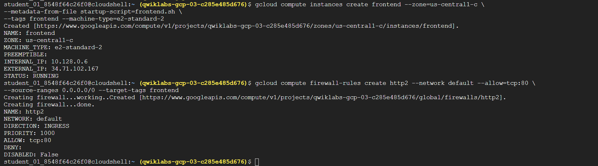

Go to Compute Engine → VM Instances, copy the External IP of `frontend`, and open:
```cpp
http://[FRONTEND_EXTERNAL_IP]/
```
> ✅ You’ll see a colorful matrix showing prime numbers in green.

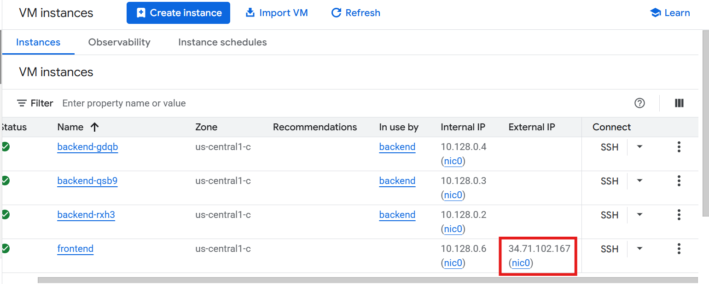

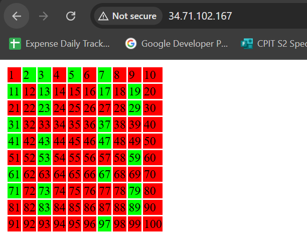

Try visiting:
```cpp
http://[FRONTEND_EXTERNAL_IP]/10000
```

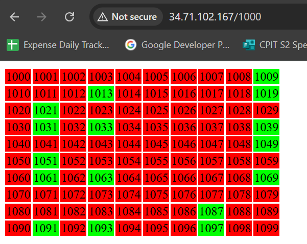

---

## Task Completed
Successfully built a secure, reliable internal service using Google Cloud’s Internal Application Load Balancer
— with help from Gemini Code Assist — and demonstrated how a public-facing app can securely access it.
