# 🌥️ Cloud Monitoring: Qwik Start  

## 📘 Overview
Cloud Monitoring provides visibility into the performance, uptime, and overall health of cloud-powered applications. It collects metrics, events, and metadata from Google Cloud, AWS, hosted uptime probes, application instrumentation, and many common components including Cassandra, Nginx, Apache, Elasticsearch, and more.

In this lab, you'll install monitoring and logging agents to collect information from your instance, including metrics and logs from 3rd-party apps.

---

## 🎯 Objectives
In this lab, you learn how to:

- 🔍 Monitor a Compute Engine VM instance with Cloud Monitoring  
- 📡 Install monitoring and logging agents for your VM  

---

## 🧰 Setup and Requirements

### ⚠️ Before you click **Start Lab**
- Labs are timed and cannot be paused.  
- You will be given **temporary credentials** to sign in.  
- Use **Incognito / Private window** to avoid account conflicts.  
- Use **only the student account** to avoid charges.

---

## 🚀 How to Start Your Lab and Sign In

1. Click **Start Lab**.  
2. Review the Lab Details pane:
   - ▶️ Open Google Cloud console  
   - ⏳ Time remaining  
   - 👤 Username / Password  
3. Click **Open Google Cloud console**  
4. If prompted, click **Use Another Account**.  
5. Copy/paste the **Username → Next**  
6. Copy/paste the **Password → Next**  
7. Accept terms  
8. Do **not** add recovery methods or 2FA  
9. Do **not** sign up for free trials  
10. Google Cloud console opens

To access products, use the **Navigation menu** or **Search bar**.

---

## 💻 Activate Cloud Shell

Cloud Shell gives command-line access to Google Cloud with 5GB persistent storage.

1. Click **Activate Cloud Shell**  


2. Continue through prompts  
3. Authorize Cloud Shell  

Check active account:
```bash
gcloud auth list
```

Check project:
```bash
gcloud config list project
```

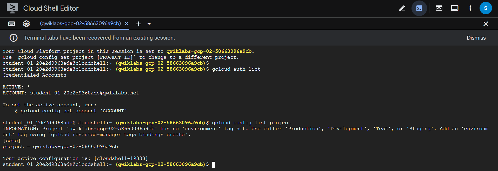

---

## 🌍 Set Your Region and Zone

Run the following:
```bash
gcloud config set compute/zone "ZONE"
export ZONE=$(gcloud config get compute/zone)

gcloud config set compute/region "REGION"
export REGION=$(gcloud config get compute/region)
```

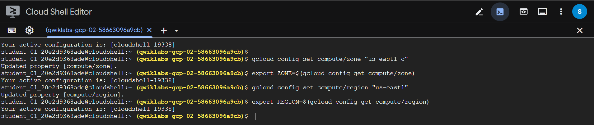

---

## 🏗️ Task 1: Create a Compute Engine Instance

1. Navigation menu → Compute Engine > VM Instances → Create Instance


2. Fill in:

| Field   | Value       |
| ------- | ----------- |
| Name    | `lamp-1-vm` |
| Region  | `<REGION>`  |
| Zone    | `<ZONE>`    |
| Series  | E2          |
| Machine | e2-medium   |


  Boot Disk
  - Debian GNU/Linux 12 (bookworm)


  
  Firewall
  - Allow HTTP traffic

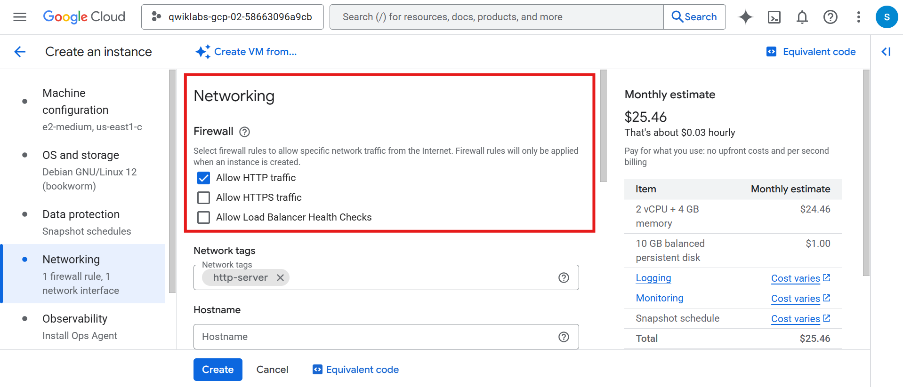

Click Create.

Wait for instance to launch (green check).

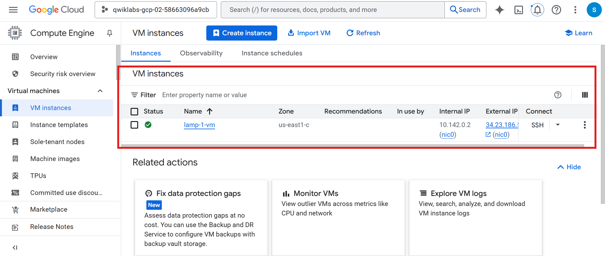

---

## 🔧 Task 2: Add Apache2 HTTP Server

1. Click SSH next to lamp-1-vm

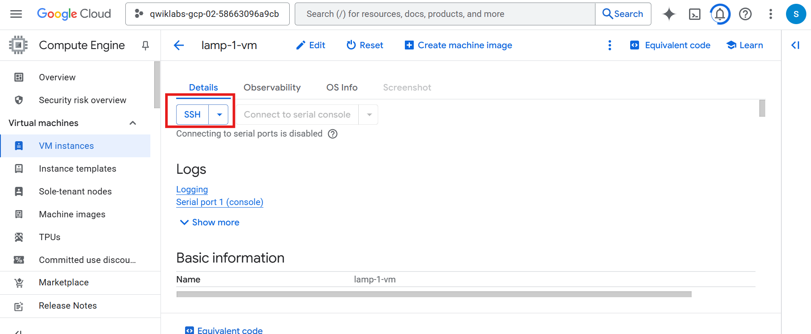

2. Run:
```bash
sudo apt-get update
sudo apt-get install apache2 php7.0
```

If php7.0 fails:
```bash
sudo apt-get install php5
```

Restart:
```bash
sudo service apache2 restart
```


3. Return to VM page → click External IP to view Apache default page.

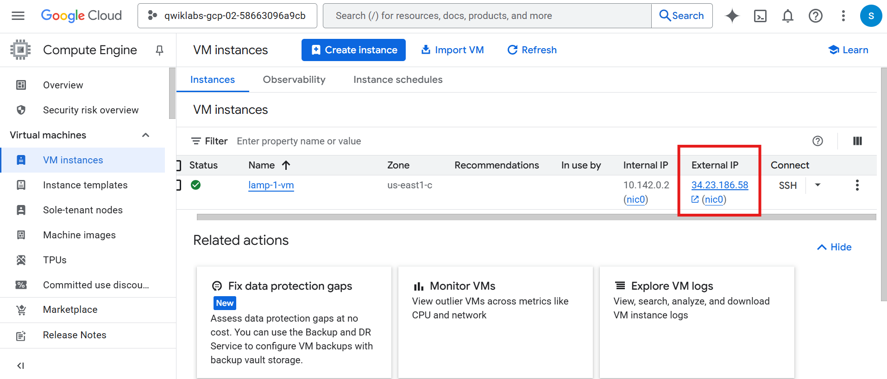
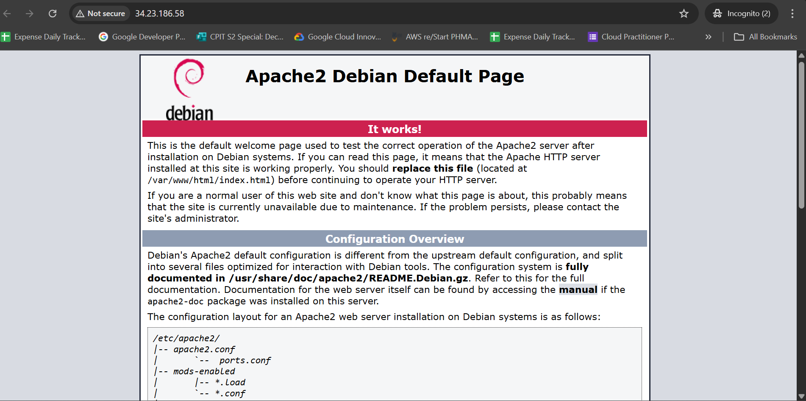

4. If External IP is hidden, enable it from Column Display Options.

---

📊 Create a Monitoring Metrics Scope

1. Navigation menu → View All Products → Observability → Monitoring


2. Monitoring Overview loads → Metrics scope ready.

---

📡 Install the Monitoring and Logging Agents
Install Monitoring agent
```bash
curl -sSO https://dl.google.com/cloudagents/add-google-cloud-ops-agent-repo.sh
sudo bash add-google-cloud-ops-agent-repo.sh --also-install
```

If prompted: press Y

Check agent status
```bash
sudo systemctl status google-cloud-ops-agent"*"
```

Press q

Update packages
```bash
sudo apt-get update
```


---

## 🟢 Task 3: Create an Uptime Check

1. Navigation menu → Uptime checks → Create Uptime Check


2. Configure:

| Field         | Value     |
| ------------- | --------- |
| Protocol      | HTTP      |
| Resource Type | Instance  |
| Instance      | lamp-1-vm |
| Frequency     | 1 minute  |

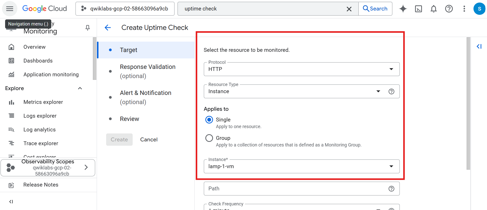
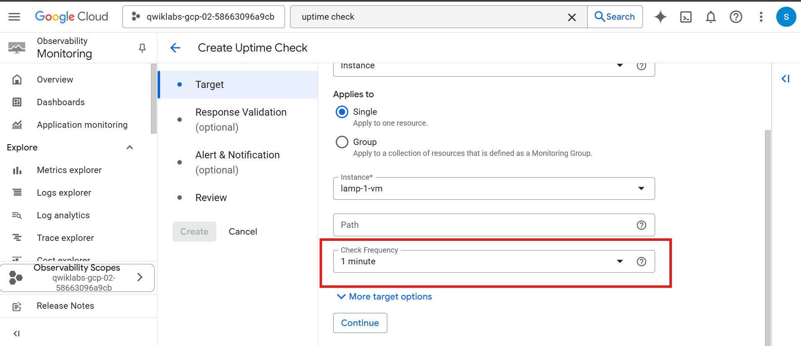

3. Continue → accept defaults
4. Title: Lamp Uptime Check

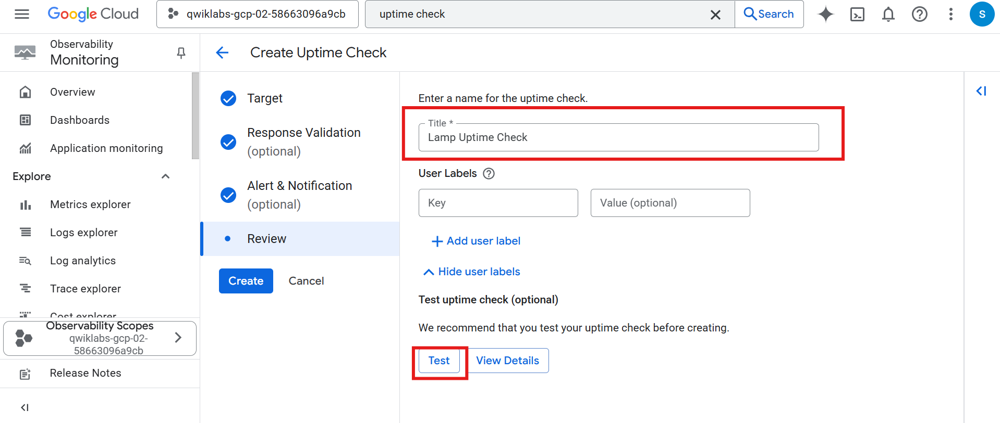

5. Click Test → Look for green check


6. Click Create

---

## 🚨 Task 4: Create an Alerting Policy

1. Navigation menu → Alerting → +Create Policy


2. Select metric → Uncheck Active
3. Search Network traffic
4. Choose:
   - VM instance → Interface → Network traffic (agent.googleapis.com/interface/traffic)

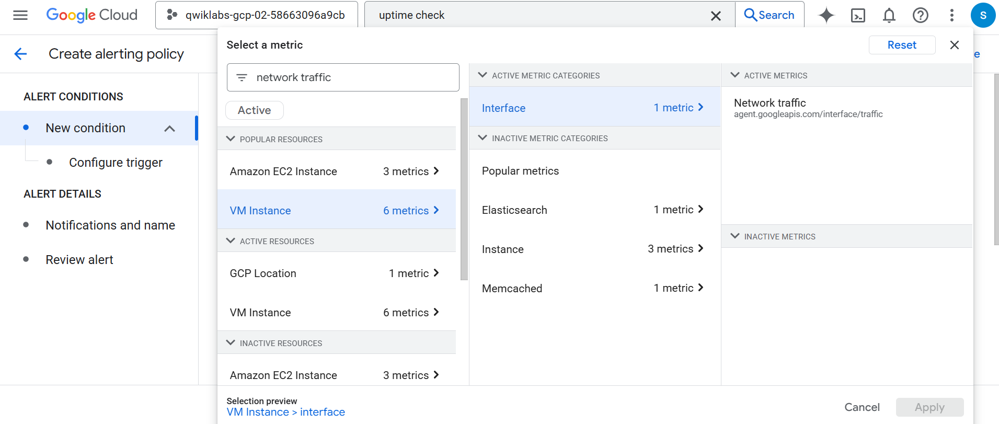

5. Threshold:
  - Above threshold
  - 500
  - Retest window: 1 min

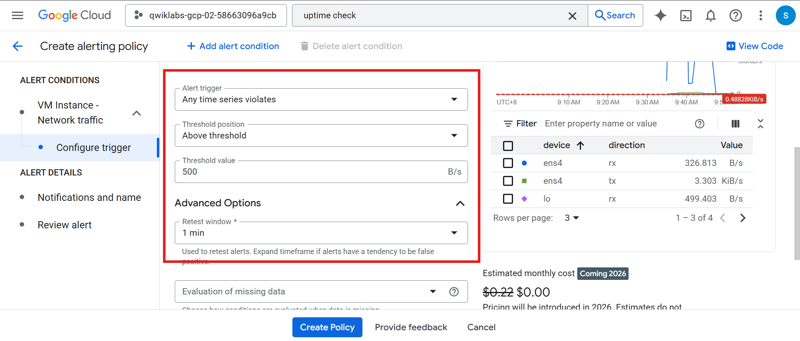

Configure Notification Channel

  1. Notification Channels → Manage Notification Channels

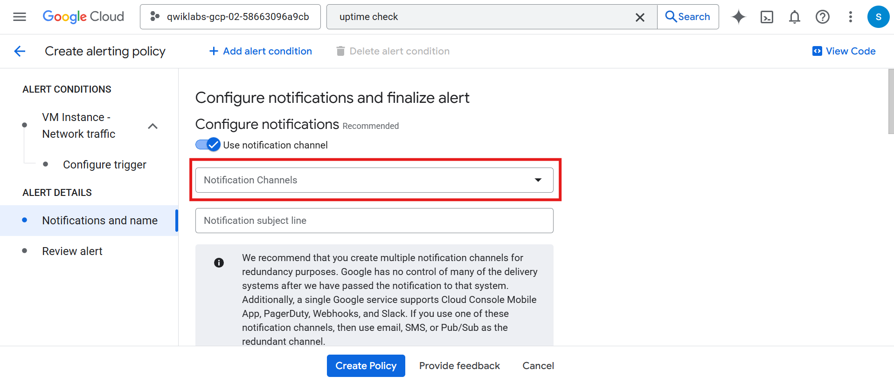

  2. Scroll → ADD NEW (Email)
  3. Enter email + display name → Save


  4. Go back → Refresh → select your channel

Finalize

- Documentation message: Include any note
- Alert name: Inbound Traffic Alert
- Click Create Policy

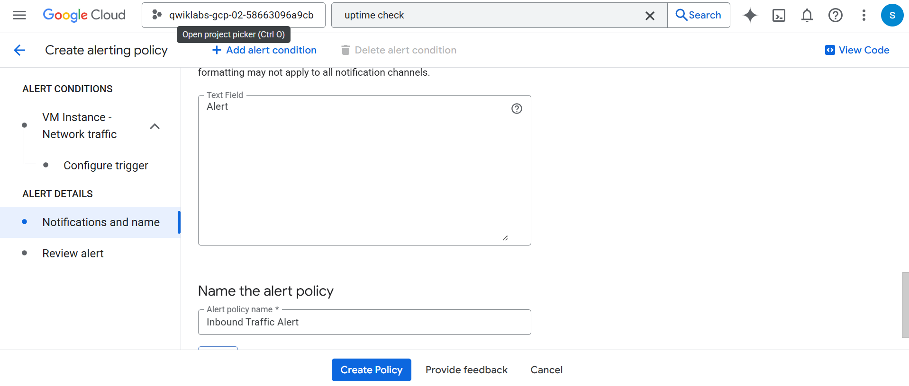

---

## 📈 Task 5: Create a Dashboard and Charts

1. Navigation menu → Dashboards → Create Custom Dashboard


2. Name: Cloud Monitoring LAMP Qwik Start Dashboard

Chart 1: CPU Load
- Add Widget → Line
- Title: CPU Load
- Metric: CPU load (1m)
- Uncheck Active

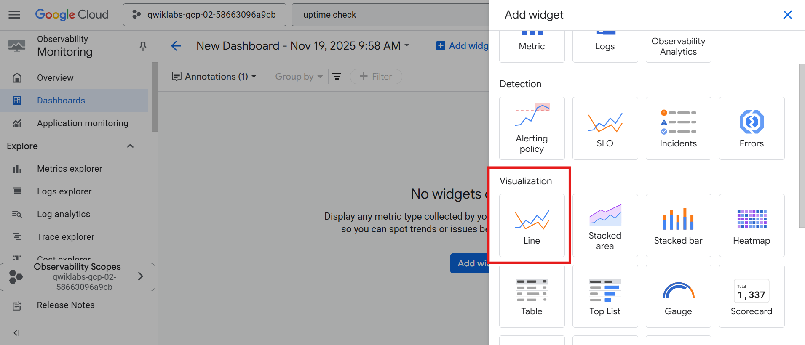
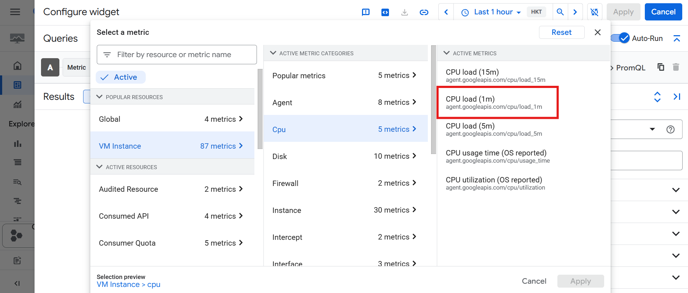

Chart 2: Received Packets
- Add Widget → Line
- Title: Received Packets
- Metric: Received packets
- Uncheck Active


Refresh tab to view graphs.


---

## 📜 Task 6: View Your Logs
1. Navigation menu → Logging → Logs Explorer
2. Resource:
   - VM Instance → lamp-1-vm
Observe VM lifecycle logs
  1. Open Compute Engine in a new window
  2. Stop the VM → watch logs

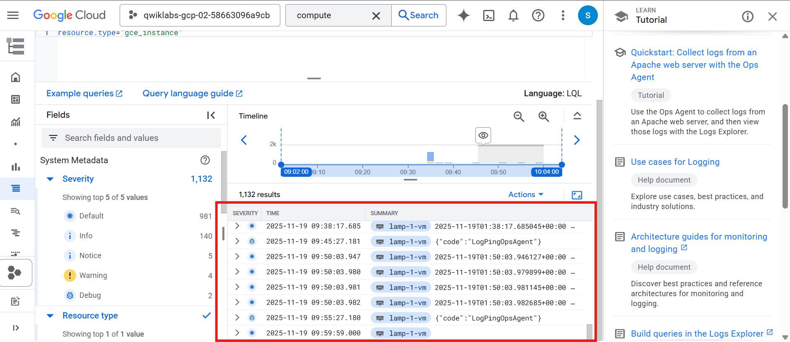

  3. Start the VM → watch logs update

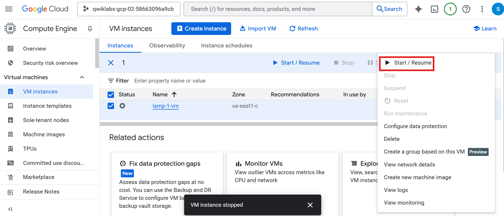


---

## 🧪 Task 7: Check Uptime Check & Alerts
1. Navigation menu → Monitoring → Uptime checks
2. Select Lamp Uptime Check
3. Fresh restarts may show failures → wait 5 minutes
4. Navigation menu → Alerting
   - Check incidents
   - Check your email for alerts
⚠️ Remove email notification after lab to stop further emails.


---

## Task Completed
✔ Set up and monitored a VM
✔ Installed monitoring & logging agents
✔ Created uptime checks
✔ Created alerting policies
✔ Created dashboards & charts
✔ Viewed logs and VM lifecycle events
