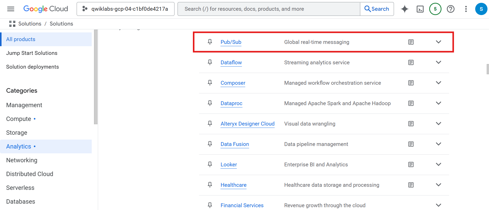
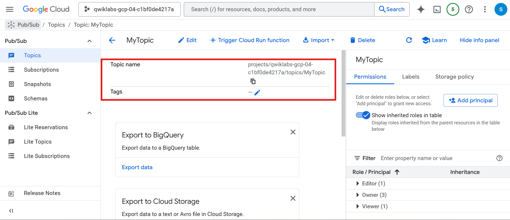
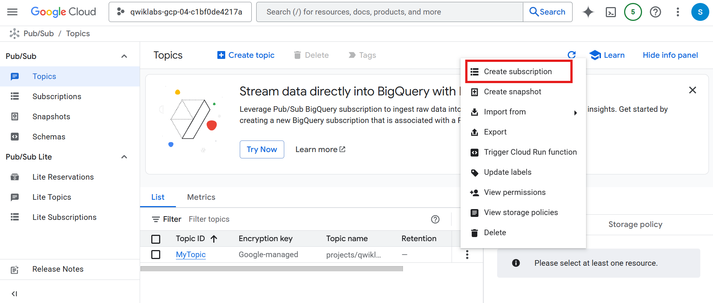
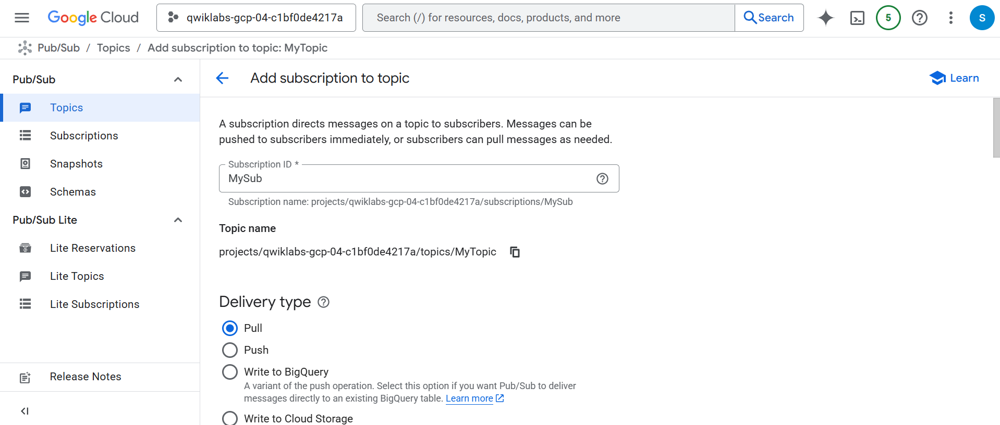
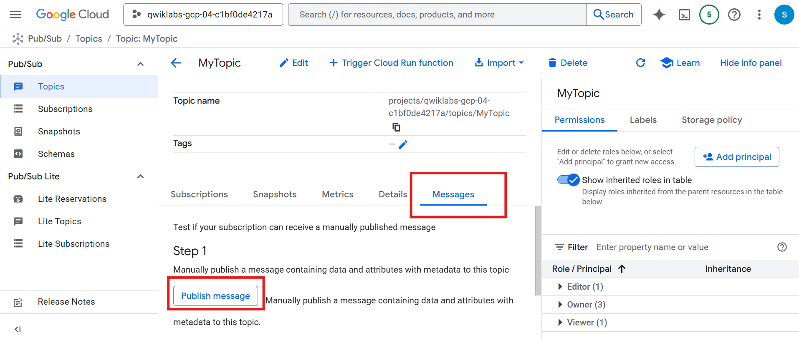
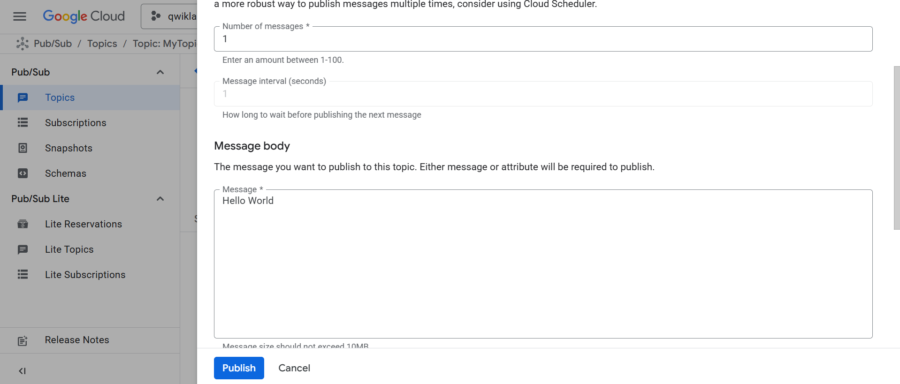
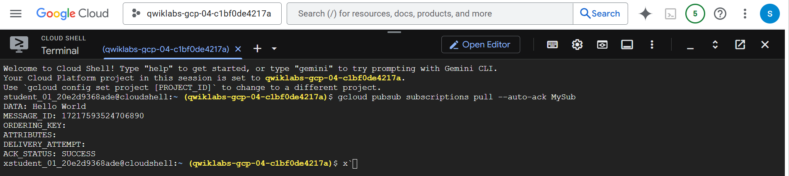

# 🚀 Pub/Sub: Qwik Start – Console  

## 📚 Overview  
Pub/Sub is a **messaging service** for exchanging event data among applications and services.  
- A **producer** publishes messages to a **topic**.  
- A **consumer** creates a **subscription** to that topic.  
- Subscribers either **pull** messages or receive them through **push** (webhooks).  
- Every subscriber must **acknowledge messages** within a configurable time window.

---

## 🎯 What You'll Learn  
- 🧱 Set up a Pub/Sub topic  
- 🔗 Subscribe to a topic  
- 💬 Publish messages  
- 📥 Consume messages using a pull subscription  

---

## 🛠️ Setup and Requirements  

### Before Starting the Lab  
⚠️ Labs are **timed** and cannot be paused. Resources are temporary.

You need:  
- 🌐 A browser (Chrome recommended)  
- 🕵️ Use **Incognito/Private window**  
- ⏳ Time to finish the lab in one sitting  
- 🔐 Only use the **provided student account**  

---

## 🚀 Start Your Lab & Sign In to Google Cloud Console  

1. Click **Start Lab**.  
2. Review the **Lab Details pane** (credentials + info).  
3. Click **Open Google Cloud Console** (open in Incognito if possible).  
4. On the sign-in page:  
   - Click **Use Another Account** if needed  
   - Enter the **Username** (from lab)  
   - Enter the **Password** (from lab)  
5. Accept:  
   - Terms & Conditions  
   - No recovery options  
   - No 2FA  
   - Do **not** sign up for a free trial  
6. Google Cloud Console loads.  

Use the **Navigation Menu** or **Search Bar** to access products.

---

## 💻 Activate Cloud Shell  

1. Click **Activate Cloud Shell** (top-right).  
2. Continue through prompts and **Authorize**.  
3. Cloud Shell automatically sets your **Project ID**.

Check active account (optional):  
```bash
gcloud auth list
```

Check project ID (optional):
```bash
gcloud config list project
```

---

## 📝 Task 1: Setting Up Pub/Sub
🧩 Create a Topic
1. Open Navigation Menu → View All Products → Analytics → Pub/Sub > Topics.



2. Click Create topic.


3. Set:
  - Topic ID: MyTopic


4. Leave defaults → Create.
✔️ Topic created successfully.



---

## 📝 Task 2: Add a Subscription

1. On the Topics page, click the 3-dot menu beside MyTopic → Create subscription.



2. Set:
  - Subscription name: MySub
  - Delivery Type: Pull



3. Leave other settings as default → Create.
✔️ Subscription created successfully.

---

## 📝 Task 3: Publish a Message
1. Go to Pub/Sub → Topics → MyTopic.
2. Open Messages tab → click Publish Message.



3. Enter:
```nginx
Hello World
```



4. Click Publish.

---

## 📝 Task 5: View the Message

Use Cloud Shell to pull the message using your subscription:
```bash
gcloud pubsub subscriptions pull --auto-ack MySub
```
📌 The message appears in the DATA field.



---

## Task Completed
- ✔️ Created a Pub/Sub topic
- ✔️ Published a message
- ✔️ Created a subscription
- ✔️ Pulled and viewed the message
