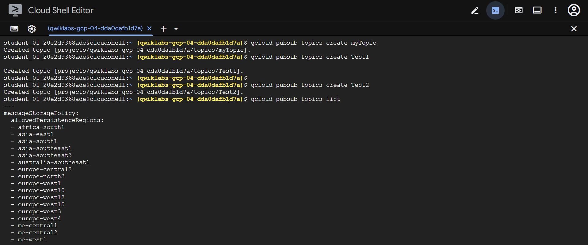
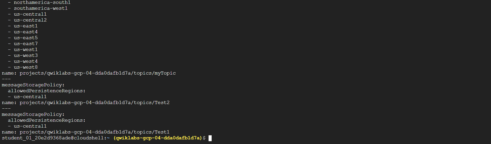
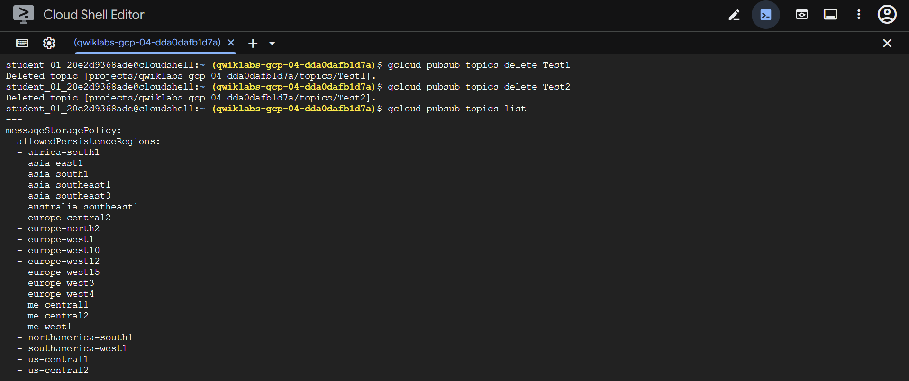
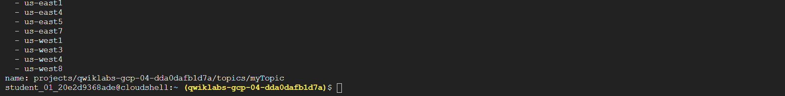
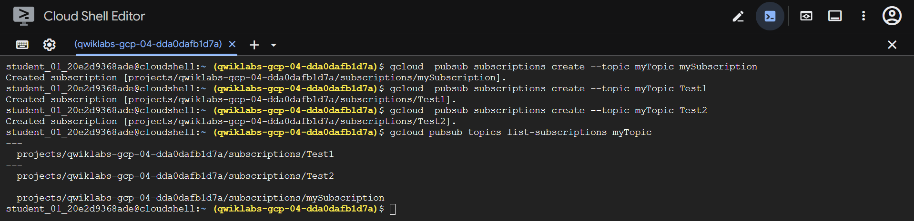
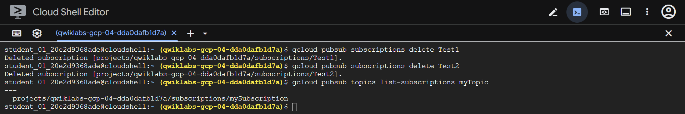
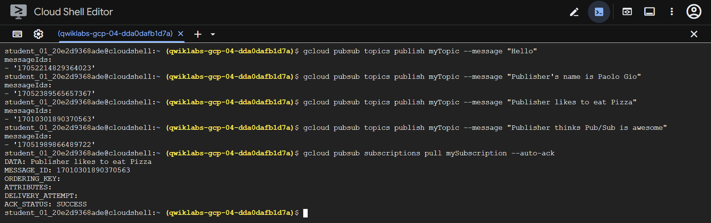
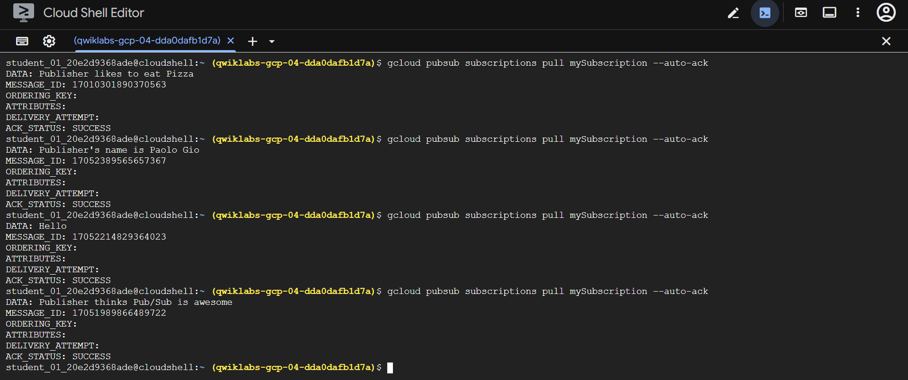
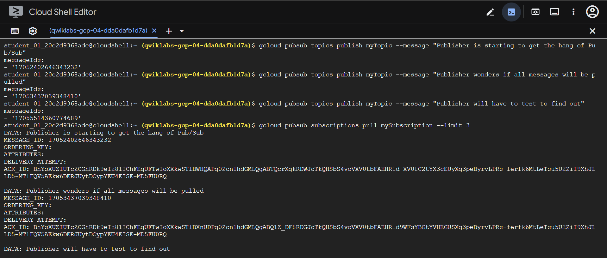
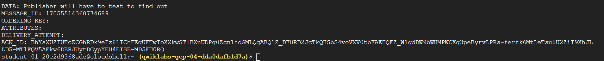

# 🚀 Pub/Sub: Qwik Start – Command Line  

## 📚 Overview  
Pub/Sub is a **messaging service** for exchanging event data among applications and services.  
By decoupling senders and receivers, it enables **secure**, **low-latency**, and **highly available** communication between independently built apps.  

Common use cases:  
- 🔄 Asynchronous workflows  
- 📣 Event notifications  
- 📡 Streaming data  

---

## 🎯 What You'll Learn  
- 🧱 Create, delete, and list Pub/Sub **topics** and **subscriptions**  
- 💬 Publish messages to a topic  
- 📥 Use a **pull subscriber**  

---

## 🧰 Prerequisites  
This is an introductory lab—no prior Pub/Sub experience required.

---

## 🛠️ Setup and Requirements

### Before You Click **Start Lab**
⚠️ Labs are timed. You **cannot pause** once started.  
You will receive **temporary credentials** for accessing Google Cloud.

You need:  
- 🌐 Chrome or any standard browser  
- 🕵️ Use **Incognito/Private window**  
- 🔐 Use only the **student account** provided  

---

## 🚀 Start Your Lab & Sign In

1. Click **Start Lab**.  
2. Review the **Lab Details** panel:  
   - Open Console button  
   - Credentials  
   - Remaining time  
3. Click **Open Google Cloud Console** (open in Incognito).  
4. Sign in using the provided **Username** and **Password**.  
5. Accept:  
   - Terms & Conditions  
   - No recovery options  
   - No 2FA  
   - No free trial  
6. Console opens.

You may use the **Navigation menu** or **Search bar** to access services.

---

## 💻 Activate Cloud Shell  

1. Click **Activate Cloud Shell**.  
2. Continue and **Authorize**.  
3. Cloud Shell sets your **Project_ID** automatically.

Check active account (optional):  
```bash
gcloud auth list
```

Check project ID (optional):
```bash
gcloud config list project
```

---

## 📦 Pub/Sub Basics
- Topic = shared communication channel
- Publishers send messages
- Subscribers receive messages
- Every subscriber must acknowledge each message
- A producer publishes to a topic, a consumer receives via a subscription

---

## 📝 Task 1: Pub/Sub Topics
Pub/Sub is preinstalled in Cloud Shell. No setup required.

▶️ Create a Topic
```bash
gcloud pubsub topics create myTopic
```

▶️ Create Two More Topics
```bash
gcloud pubsub topics create Test1
gcloud pubsub topics create Test2
```

▶️ List All Topics
```bash
gcloud pubsub topics list
```

Expected output:
---
messageStoragePolicy:
  allowedPersistenceRegions:
  - us-central1
name: projects/.../topics/myTopic
---
name: projects/.../topics/Test1
---
name: projects/.../topics/Test2




---

🧹 Delete Test Topics
```bash
gcloud pubsub topics delete Test1
gcloud pubsub topics delete Test2
```

▶️ Verify Remaining Topics
```bash
gcloud pubsub topics list
```

Expected:
---
name: projects/.../topics/myTopic




---

## 📝 Task 2: Pub/Sub Subscriptions

▶️ Create a Subscription
```bash
gcloud pubsub subscriptions create --topic myTopic mySubscription
```

▶️ Create Two More Subscriptions
```bash
gcloud pubsub subscriptions create --topic myTopic Test1
gcloud pubsub subscriptions create --topic myTopic Test2
```

▶️ List Subscriptions for myTopic
```bash
gcloud pubsub topics list-subscriptions myTopic
```

Expected:
```bash
projects/.../subscriptions/Test2  
projects/.../subscriptions/Test1  
projects/.../subscriptions/mySubscription
```



🧹 Delete Subscriptions Test1 & Test2
```bash
gcloud pubsub subscriptions delete Test1
gcloud pubsub subscriptions delete Test2
```

▶️ Verify
```bash
gcloud pubsub topics list-subscriptions myTopic
```

Expected:
```bash
projects/.../subscriptions/mySubscription
```



---

## 📝 Task 3: Publish & Pull a Single Message
▶️ Publish a Message
```bash
gcloud pubsub topics publish myTopic --message "Hello"
```

▶️ Publish More Messages
Replace placeholders with your info:
```bash
gcloud pubsub topics publish myTopic --message "Publisher's name is <YOUR NAME>"
gcloud pubsub topics publish myTopic --message "Publisher likes to eat <FOOD>"
gcloud pubsub topics publish myTopic --message "Publisher thinks Pub/Sub is awesome"
```

▶️ Pull Messages
```bash
gcloud pubsub subscriptions pull mySubscription --auto-ack
```
📌 Note:
- Pull without flags returns only one message
- Once pulled, a message cannot be pulled again



Run the pull command multiple times to retrieve remaining messages.
A final empty pull shows:
```nginx
Listed 0 items.
```



---

## 📝 Task 4: Pulling All Messages (Using Flags)

Republish new messages:
```bash
gcloud pubsub topics publish myTopic --message "Publisher is starting to get the hang of Pub/Sub"
gcloud pubsub topics publish myTopic --message "Publisher wonders if all messages will be pulled"
gcloud pubsub topics publish myTopic --message "Publisher will have to test to find out"
```

▶️ Pull All Messages with a Limit
```bash
gcloud pubsub subscriptions pull mySubscription --limit=3
```

Expected: A table showing three messages.

You now understand how to use flags such as `--limit` and 1--auto-ack.




---

## 🎉 Task Completed
- ✔️ Create and delete topics
- ✔️ Create and delete subscriptions
- ✔️ Publish messages
- ✔️ Pull single and multiple messages
- ✔️ Use flags with Pub/Sub commands
