# 🔐 Cloud IAM: Qwik Start  

## 📝 Overview
Google Cloud's **Identity and Access Management (IAM)** lets you create and manage permissions for Google Cloud resources. Cloud IAM unifies access control across services and provides a consistent permissions system.

In this lab, you'll sign in with **two different sets of credentials** to experience how **granting and revoking permissions** works between a **Project Owner** and **Project Viewer**.

---

## 🎯 What You'll Learn
- 👤 Assign a role to a second user  
- 🔒 Remove roles assigned through Cloud IAM  

---

## 📚 Prerequisites
- Beginner-friendly — no prior IAM experience required  
- Helpful (but optional): familiarity with **Cloud Storage**  
- Have any **.txt** or **.html** file ready  
- For advanced IAM practice, see **IAM Custom Roles** on Google Cloud Skills Boost  

---

# ⚙️ Setup and Requirements

This lab provides **two sets of credentials** to illustrate IAM behavior.

In the **Lab Connection** panel, you will see two identities:

- **Username 1** → Project Owner  
- **Username 2** → Viewer  

These identities have different IAM roles and therefore different permissions.

---

# 🔑 Sign in to Cloud Console as Username 1

1. Click **Open Google Console**.  
2. If asked, choose **Use another account**.  
3. Enter **Username 1** (googlexxxxxx_student@qwiklabs.net) → Next  
4. Enter password → Next  
5. Accept Terms → Agree and Continue  

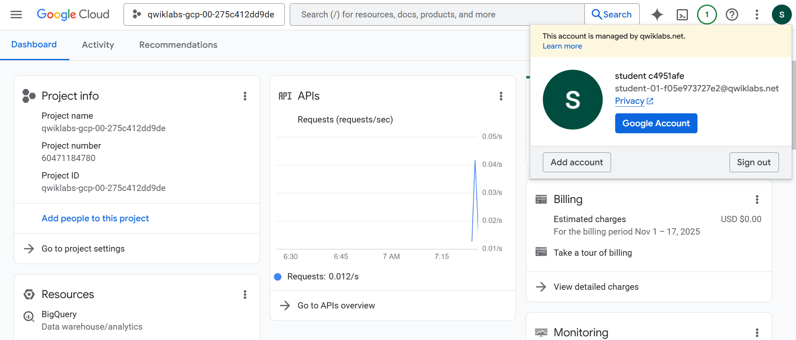

---

# 🔑 Sign in to Cloud Console as Username 2

1. Click **Open Google Console** again.  
2. Choose **Use another account**.  
3. Enter **Username 2** → Next  
4. Enter password → Next  
5. Accept Terms → Agree and Continue  

You should now have **two Cloud Console tabs** open — one for each user.

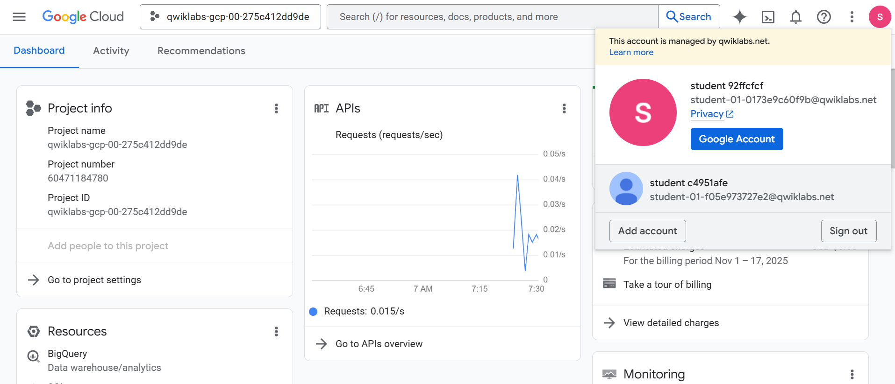

---

## 👀 View or Reset the Active User

To check which user is signed in:

- Hover over your **Avatar** in the top right

To reset:

1. Click Avatar → **Sign out**  
2. Return to Lab panel → **Open Google Console**  
3. Sign in with correct username/password  

---

# 🧪 Task 1 — Explore IAM Console and Project-Level Roles

### On Username 1 tab:

1. Go to **Navigation menu → IAM & Admin → IAM**  
2. Click **+ GRANT ACCESS**  

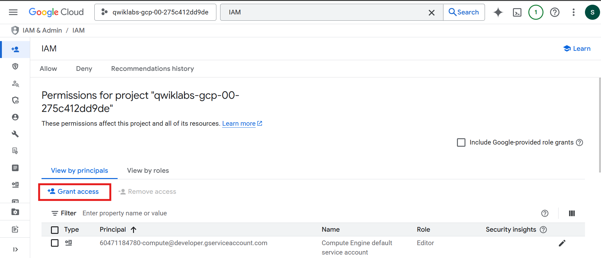

3. Under **Select a role → Basic**, observe the three primitive roles:
   - 👁️ Viewer  
   - 🛠️ Editor  
   - 👑 Owner  

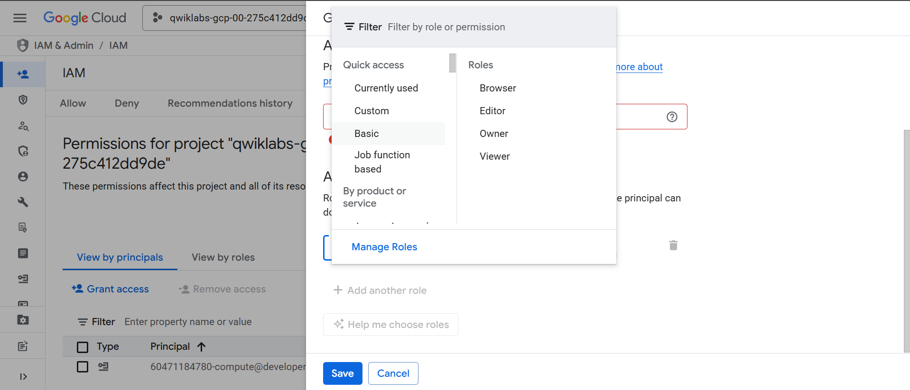

Primitive roles apply **project-wide** and affect all resources unless otherwise limited.

Role summaries:

| Role | Permissions |
|------|-------------|
| **Viewer** | Read-only access; cannot modify resources |
| **Editor** | Viewer permissions + modify existing resources |
| **Owner** | Editor permissions + manage roles and billing |

Since Username 1 can manage roles, they are a **Project Owner**.

Click **CANCEL**.

---

## 🔍 Explore Username 2 Permissions

Switch to **Username 2** tab:

1. Go to **Navigation menu → IAM & Admin → IAM**  
2. Look for:
   - Username 1 → Owner  
   - Username 2 → Viewer  

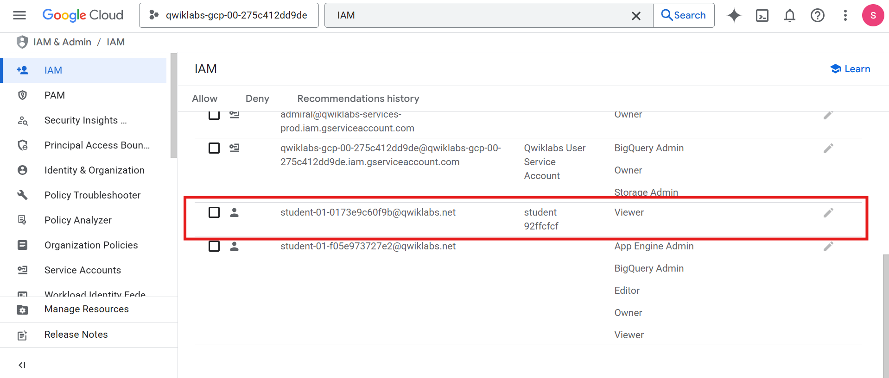

The **+ GRANT ACCESS** button is grayed out. Attempting to click it shows:

> “You need permissions for this action. Required: resourcemanager.projects.setIamPolicy”

This demonstrates IAM restrictions.

Return to **Username 1** tab.

---

# 🧪 Task 2 — Prepare a Cloud Storage Bucket for Testing

### ✔️ Using Username 1

## Create a Bucket
1. Go to **Navigation menu → Cloud Storage → Buckets**  
2. Click **+ CREATE**  

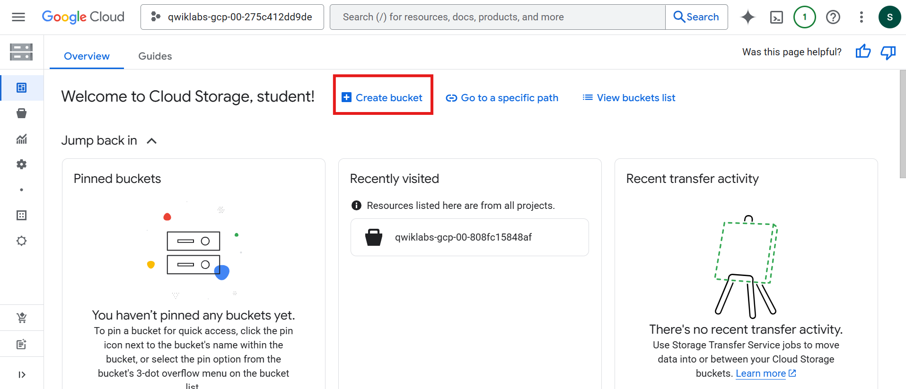

3. Configure:
   - **Name:** globally unique name  

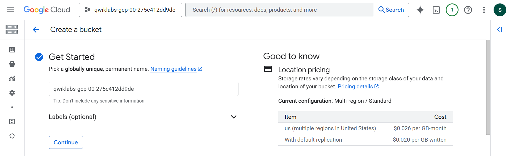

   - **Location Type:** Multi-Region  

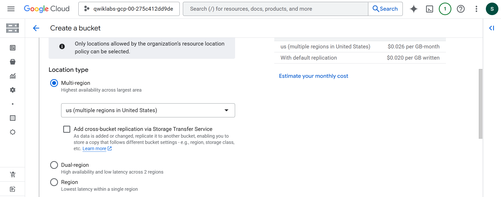

5. Click **CREATE**  
6. If prompted → **Confirm** public access blocking


---

## Upload a Sample File
1. On Bucket Details page → click **UPLOAD FILES**  
2. Select any `.txt` or `.html` file  
3. Click the three dots next to the uploaded file → **Rename**  
4. Rename → `sample.txt`  
5. Click **RENAME**  

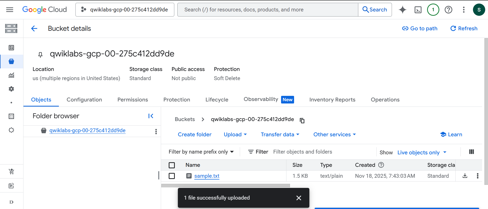

---

## Verify Viewer Access
Switch to **Username 2**:

- Go to **Cloud Storage → Buckets**  
- Confirm Username 2 **can see** the bucket (Viewer role = read-only access)

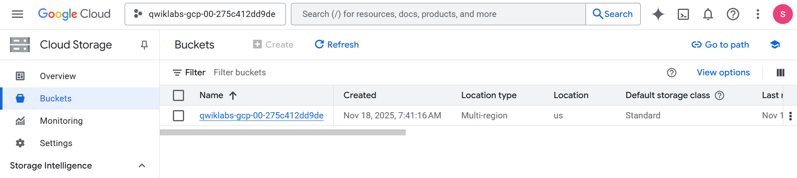

---

# 🧪 Task 3 — Remove Project Access

### Using Username 1:

1. Go to **IAM & Admin → IAM**  
2. Locate Username 2 → Click the **pencil icon**  

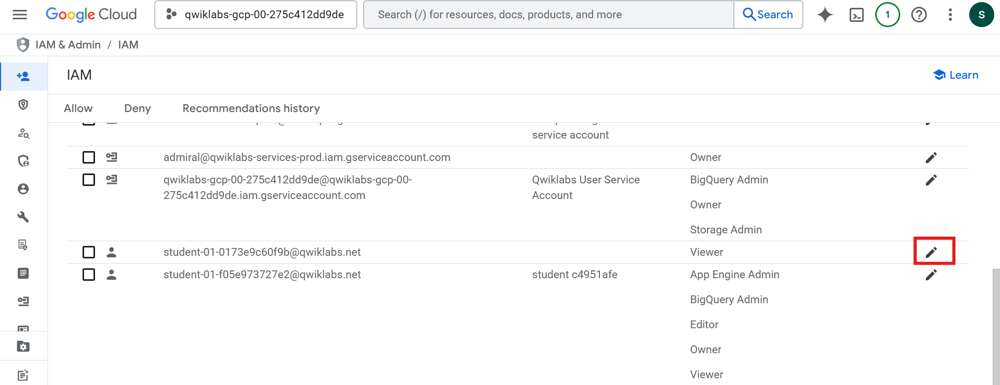

3. Click the **trash can** next to the Viewer role  

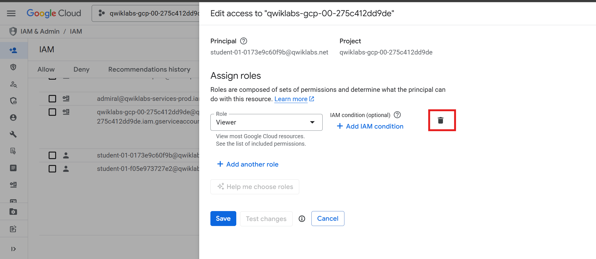

4. Click **SAVE**  

Username 2 disappears from the list.  
(Accepts may take up to **80 seconds** to propagate.)

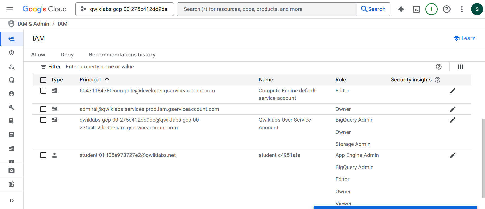

### Verify Revocation
Switch to **Username 2**:

1. Go to **Cloud Storage → Buckets**  
2. You should now see a **permission error**  

Wait 1–2 minutes if needed, then refresh.

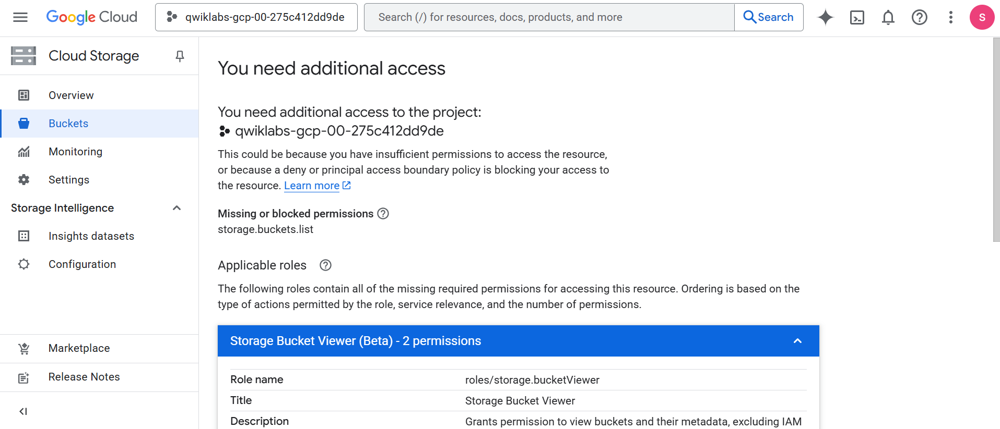

---

# 🧪 Task 4 — Add Cloud Storage Permissions

### Using Username 1:

1. Copy **Username 2** from Lab panel  
2. Go to **IAM & Admin → IAM**  
3. Click **+ GRANT ACCESS**  
4. Paste Username 2 into **New principals**  
5. Select role:  
   - **Cloud Storage → Storage Object Viewer**  
6. Click **SAVE**

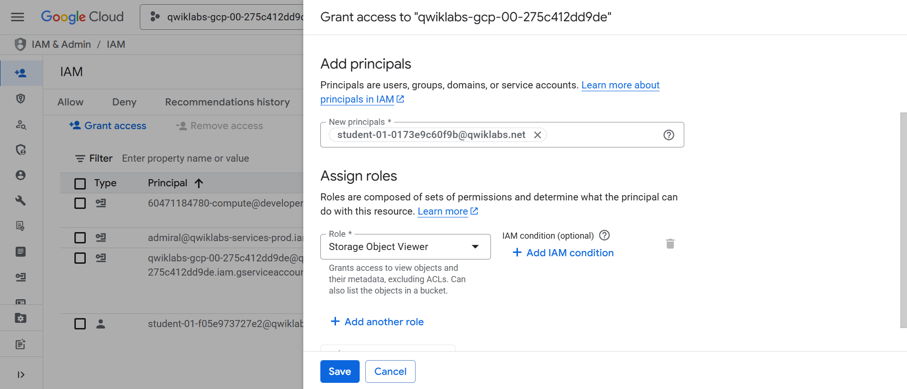

---

## ✔️ Verify Username 2 Access (via Cloud Shell)

Switch to the **Username 2** tab.

Since Username 2 is *not* a Project Viewer anymore:

- They **cannot see** resources in the Console UI  
- But they **can** access the bucket via CLI because of the specific Storage IAM role

### Open Cloud Shell
Click the **Activate Cloud Shell** icon → Continue

Run:
```bash
gsutil ls gs://[YOUR_BUCKET_NAME]
```

Expected output:
```bash
gs://[YOUR_BUCKET_NAME]/sample.txt
```

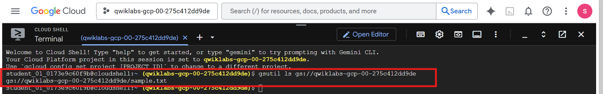

If you see `AccessDeniedException`, wait a moment and try again.

---

## Task Completed

- Assigned and removed IAM roles 🔐  
- Tested Project-level and Resource-level IAM behavior 🧪  
- Observed access propagation delays ⏳  
- Verified permissions using UI and Cloud Shell 🖥️  
