# 🚀 Cloud Run Functions: Qwik Start – Console  

## 📘 Overview  
A **Cloud Run function** is a piece of code that runs in response to an event, such as an HTTP request, a message from a messaging service, or a file upload. Cloud events are things that happen in your cloud environment—like changes to a database, new files in storage, or creation of a VM instance.

Since Cloud Run functions are **event-driven**, they run only when triggered. This makes them ideal for quick tasks or tasks that don’t need to run continuously.

### 🌟 Example use cases  
- 🖼️ Automatically generate thumbnails for images uploaded to Cloud Storage  
- 📩 Send notifications via Pub/Sub  
- 📊 Process Cloud Firestore data to generate reports  

Cloud Run Functions supports any language that supports Node.js and can be deployed easily from the console.

This hands-on lab shows you how to **create**, **deploy**, and **test** a Cloud Run function using the Google Cloud console.

---

## 🎯 What You'll Do  
- Create a Cloud Run function  
- Deploy and test the function  
- View logs  

---

## 🛠️ Setup and Requirements  

### Before you click **Start Lab**  
Labs are timed—you **cannot pause** them. When the timer starts, your temporary Google Cloud environment activates.

This lab uses a **temporary student account**, not your personal Google Cloud account.

You need:  
- 🌐 A standard internet browser (Chrome recommended)  
- 🕶️ Incognito mode to avoid account conflicts  
- ⏱️ Enough time to finish the lab in one go  
- ⚠️ Use *only* the student-provided account to avoid charges  

---

## 🔐 How to Start Your Lab and Sign In  

1. Click **Start Lab**.  
2. In the Lab Details pane, locate:  
   - **Open Google Cloud Console** button  
   - Time remaining  
   - Username & Password  
3. Click **Open Google Cloud Console** (incognito recommended).  
4. If prompted, click **Use Another Account**.  
5. Copy and paste the **Username**.  
6. Click **Next**.  
7. Copy and paste the **Password**.  
8. Click **Next**.  
9. Accept terms and conditions.  
10. Do **not** add recovery options or 2FA.  
11. Do **not** sign up for free trials.  
12. The Google Cloud Console will open.

Use the **Navigation Menu** or **Search bar** to open services.

---

# 🧩 Task 1: Create a Function  

1. In the console, open **Navigation Menu → Cloud Run**.  
2. Click **WRITE A FUNCTION**.  

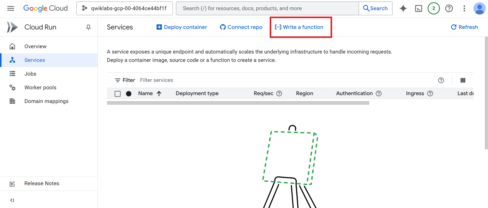

3. Enter the following values:

| Field | Value |
|-------|--------|
| Service name | `gcfunction` |
| Region | `REGION` |
| Authentication | Allow public access |
| Memory allocated | Keep default |
| Execution environment | Second generation |
| Revision scaling | Set maximum number of instances to **5** |

📌 If a popup appears requesting API enablement, click **ENABLE**.

You will deploy the function in the next section.


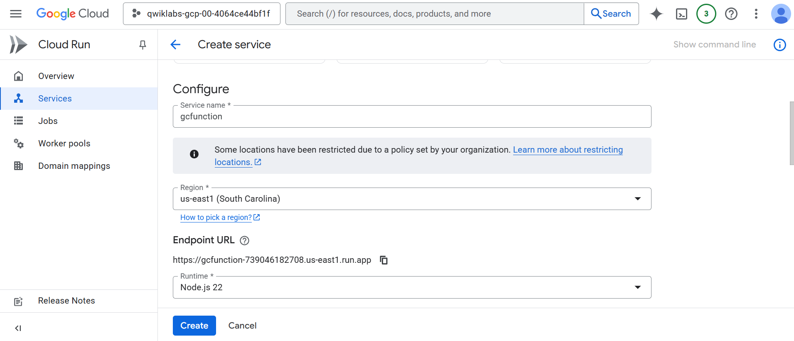
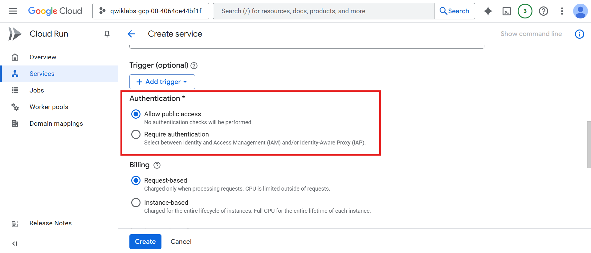
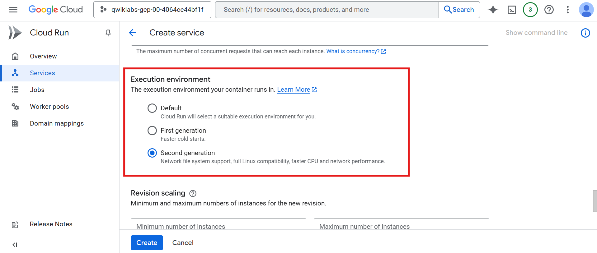
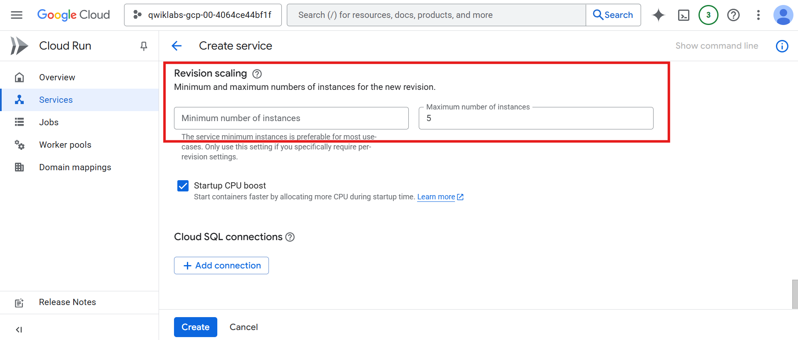

---

# 🚀 Task 2: Deploy the Function  

In the **Create function** dialog:  

- Under **Source code (Inline editor)**, keep the default `helloHttp` function in `index.js`.  
- Click **SAVE AND REDEPLOY**.
  
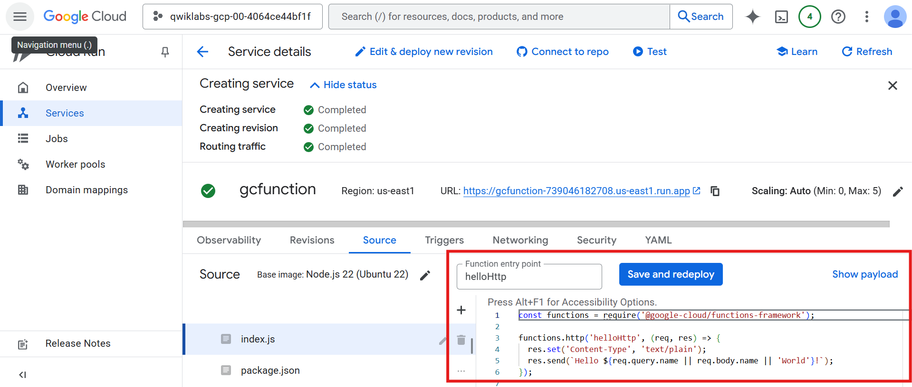

Deployment indicators:  
- ⏳ Spinner = deploying  
- ✅ Green check = deployed  

---

# 🧪 Task 3: Test the Function  

1. On the function details dashboard, click **TEST**.  

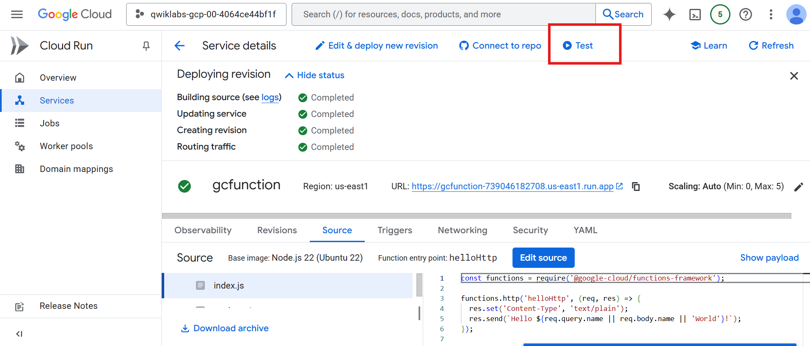

2. In the Triggering event field, enter:

```text
"message":"Hello World!"
```

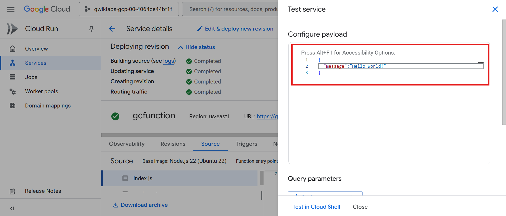

3. Copy the CLI test command provided and run it in **Cloud Shell**.  

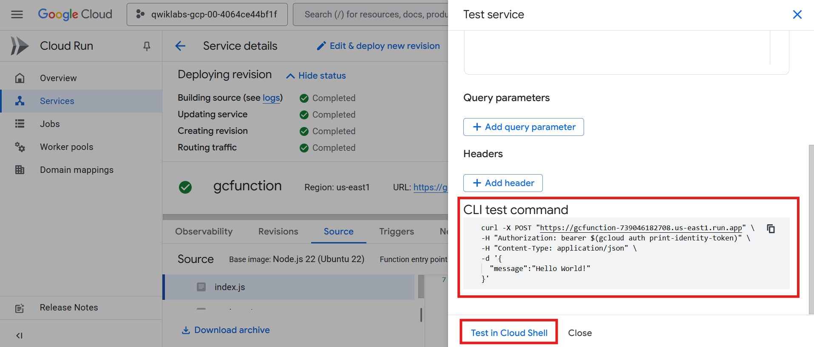

4. You will see: **"Hello World!"** as the output.

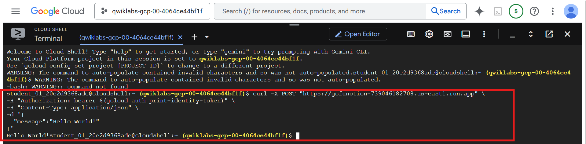

---

# 📄 Task 4: View Logs  

1. On the **Service Details** page, click **Observability → Logs**.  
2. The Results panel displays log history.

Your application is now deployed, tested, and monitored.

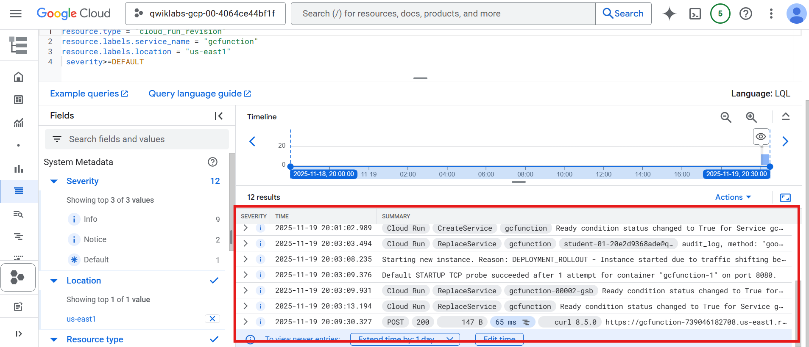

---

# 📝 Task 5: Test Your Understanding  

**1. Cloud Run functions is a serverless execution environment for event-driven services on Google Cloud.**  
- True  
- False  

**2. Which type of trigger is used while creating Cloud Run functions in the lab?**  
- Pub/Sub  
- Firebase  
- **HTTPS**  
- Cloud Storage  

---

# 🎉 Task Completed
You used the Google Cloud Console to **create**, **deploy**, and **test** a Cloud Run function.


