# ⚡ Cloud Run Functions: Qwik Start - Command Line  

## 📘 Overview  
A **Cloud Run function** is a piece of code that runs in response to an event, such as:

- 🌐 an HTTP request  
- 📩 a Pub/Sub message  
- 📂 a file upload  

Cloud events represent things that happen in your environment—database changes, new files in storage, or VM instance creation.

Because Cloud Run functions are **event-driven**, they run *only* when triggered. This makes them ideal for:

- 🖼️ automatically generating image thumbnails for Cloud Storage uploads  
- 🔔 sending notifications for Pub/Sub messages  
- 📊 processing Firestore data and generating reports  

You can write your code in any language that supports Node.js. Once deployed, Cloud Run functions automatically run in response to events.

This hands-on lab shows you how to **create, deploy, and test a Cloud Run function using the Google Cloud Shell command line.**

---

## 🎯 What you'll do  
- ✨ Create a Cloud Run function  
- 🚀 Deploy and test the function  
- 📜 View logs  

---

## 🧰 Setup  

### 🛑 Before you click **Start Lab**
- Labs are timed ⏳  
- You cannot pause them  
- Temporary credentials will be provided  

You need:

- 💻 A standard browser (Chrome recommended)  
- 🔐 Use **Incognito mode** to avoid account conflicts  
- ⏱️ Enough time to finish the lab  
- 👤 Use only the **lab-provided student account**  

---

## 🚀 How to start your lab and sign in  
1. Click **Start Lab**  
2. The Lab Details pane will display:
   - ▶️ *Open Google Cloud Console*  
   - ⏳ Remaining time  
   - 👤 Username & password  
3. Click **Open Google Cloud Console** (Incognito recommended)

If you see **Choose an account**, click **Use another account**

4. Copy/paste the provided **Username → Next**  
5. Copy/paste the **Password → Next**  

⚠️ You *must* use the student credentials — NOT your personal Google account.

Then:

- ✔️ Accept terms  
- ❌ Do NOT add recovery options  
- ❌ Do NOT enable 2FA  
- ❌ Do NOT start free trials  

After login, the Google Cloud Console opens.

---

## 💻 Activate Cloud Shell  
Cloud Shell provides:

- ☁️ A VM with dev tools  
- 💾 5GB persistent home directory  
- 🔐 Pre-authenticated access  
- 🧰 gcloud CLI preinstalled  

Click **Activate Cloud Shell** (terminal icon)

Then:

- Continue  
- Authorize Cloud Shell  
- Wait until VM initializes

You will see something like:
```text
Your Cloud Platform project in this session is set to "PROJECT_ID"
```

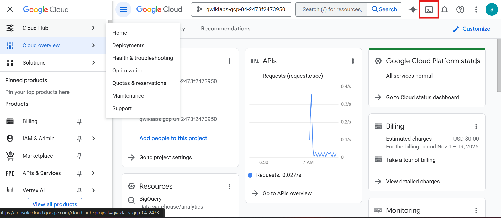

Optional commands:

### List active account  
```bash
gcloud auth list
```


### List current project  
```bash
gcloud config list project
```

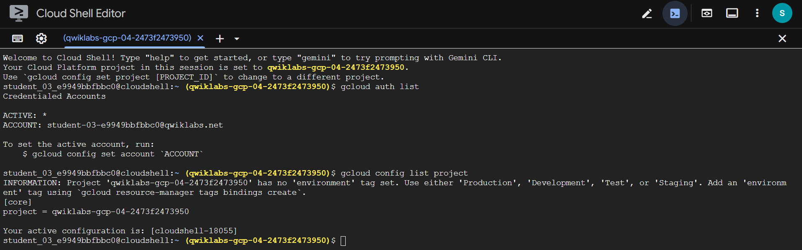

---

# 🧪 Task 1 — Create a Function  

You will create a simple function named **helloWorld** that logs a message when triggered by a **Pub/Sub event**.

### 📍 Step 1: Set the default region  
```bash
gcloud config set run/region REGION
```

### 📂 Step 2: Create a directory  
```bash
mkdir gcf_hello_world && cd $_
```

### 📝 Step 3: Create `index.js`  
```bash
nano index.js
```

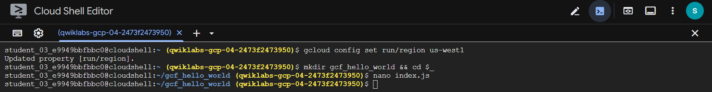

Paste:

```js
const functions = require('@google-cloud/functions-framework');

// Register a CloudEvent callback with the Functions Framework that will
// be executed when the Pub/Sub trigger topic receives a message.
functions.cloudEvent('helloPubSub', cloudEvent => {
  // The Pub/Sub message is passed as the CloudEvent's data payload.
  const base64name = cloudEvent.data.message.data;

  const name = base64name
    ? Buffer.from(base64name, 'base64').toString()
    : 'World';

  console.log(`Hello, ${name}!`);
});
```

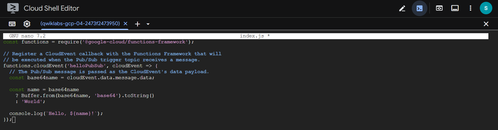

Save + exit nano:
- CTRL + X
- Y
- ENTER

### 📝 Step 4: Create package.json

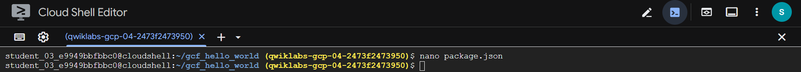

Paste:
```json
{
  "name": "gcf_hello_world",
  "version": "1.0.0",
  "main": "index.js",
  "scripts": {
    "start": "node index.js",
    "test": "echo \"Error: no test specified\" && exit 1"
  },
  "dependencies": {
    "@google-cloud/functions-framework": "^3.0.0"
  }
}
```

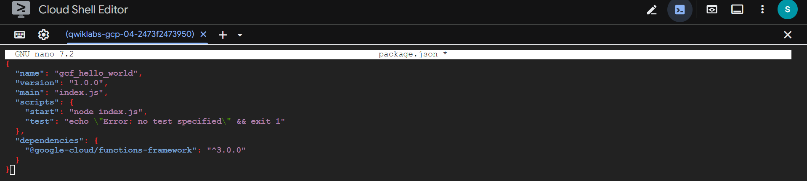

---

### 📦 Step 5: Install dependencies

```nginx
npm install
```

Expected output contains:
```nginx
added 140 packages...
found 0 vulnerabilities
```

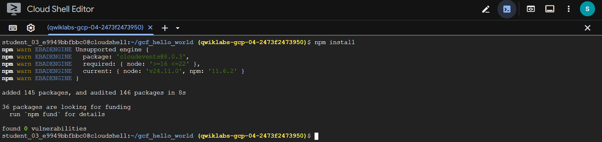

---

# 🚀 Task 2 — Deploy your function

Deploy using Pub/Sub trigger topic cf-demo
```sh
gcloud functions deploy nodejs-pubsub-function \
  --gen2 \
  --runtime=nodejs20 \
  --region=REGION \
  --source=. \
  --entry-point=helloPubSub \
  --trigger-topic cf-demo \
  --stage-bucket PROJECT_ID-bucket \
  --service-account cloudfunctionsa@PROJECT_ID.iam.gserviceaccount.com \
  --allow-unauthenticated
```
⚠️ If asked about serviceAccountTokenCreator → choose n

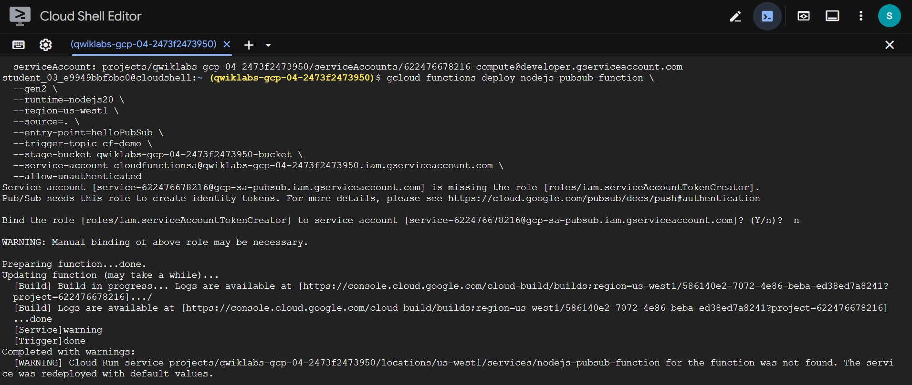
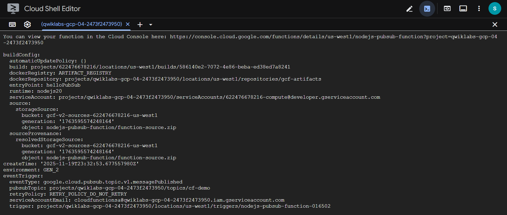


### 🔍 Verify deployment:
```sh
gcloud functions describe nodejs-pubsub-function \
  --region=REGION
```

Look for:
```makefile
State: ACTIVE
```

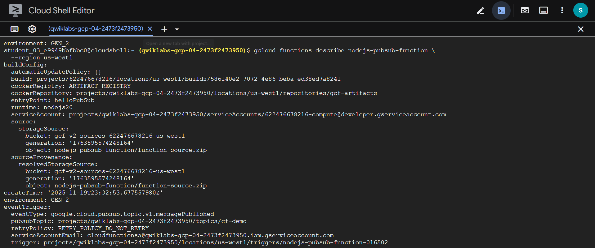
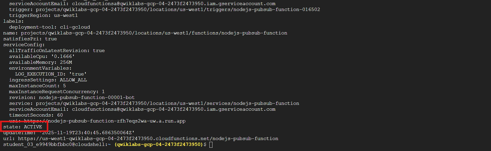

---

# 🧪 Task 3 — Test the function

Publish a message to the Pub/Sub topic:
```sh
gcloud pubsub topics publish cf-demo --message="Cloud Function Gen2"
```

Example output:
```vbnet
messageIds:
- '11927162971409664'
```

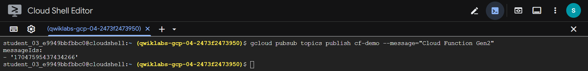

---

# 📜 Task 4 — View logs
Run:
```sh
gcloud functions logs read nodejs-pubsub-function \
  --region=REGION
```
⚠️ Logs may take ~10 minutes to appear.

Example log output:
```vbnet
NAME: nodejs-pubsub-function
EXECUTION_ID: h4v6akxf4sxt
LOG: Hello, Cloud Function Gen2!
```

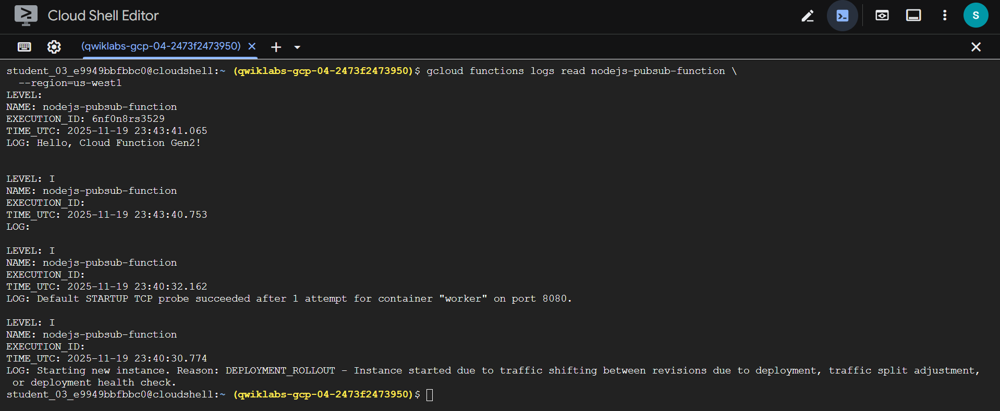

---

# 🎉 Task Completed

Created, deployed, tested, and viewed logs for a Cloud Run function using the command line! 🎉
