# 🚀 Build Infrastructure with Terraform on Google Cloud: Challenge Lab

## 📝 Overview
In a **challenge lab**, you’re given a **scenario** and a set of **tasks**. Instead of following step-by-step instructions, you must use the skills learned from earlier labs to complete the tasks on your own.

An **automated scoring system** will provide feedback on whether you completed your tasks correctly ✔️.

Challenge labs **do not teach new Google Cloud concepts**. You are expected to:
- Modify default values 🛠️  
- Troubleshoot issues 🐛  
- Research error messages 🔍  
- Fix mistakes and solve problems independently 💡  

To score **100%**, you must successfully complete **all tasks** within the time limit ⏳.

This lab is recommended for students enrolled in **Build Infrastructure with Terraform on Google Cloud**. Ready for the challenge? 💪

---

## 🎯 Topics Tested
- Import existing infrastructure into your Terraform configuration.
- Build and reference your own Terraform modules.
- Add a remote backend to your configuration.
- Use and implement a module from the Terraform Registry.
- Re-provision, destroy, and update infrastructure.
- Test connectivity between the resources you've created.

---

## 🛠️ Setup and Requirements

### Before you click the **Start Lab** button:
Read these instructions carefully. **Labs are timed**, and you cannot pause them. The timer begins as soon as you click **Start Lab**, and it shows how long the Google Cloud resources are available to you.

This hands-on lab uses **real Google Cloud resources**, not a simulation. You will be provided with **temporary credentials** valid only for the duration of the lab.

### ✅ You will need:
- A standard internet browser (Chrome recommended 🌐).
- Use **Incognito Mode** or a private window to prevent conflicts with personal Google accounts 🙈.
- Sufficient time to finish the lab — once started, it **cannot be paused** ⛔.

> **Note:** Use only the provided *student account*. Using your personal Google Cloud account may incur charges 💳.

---

## 🧩 Challenge Scenario
You are a **cloud engineer intern** at a new startup. Your first task is to quickly and efficiently build infrastructure — and create a system to track and manage changes.

You are required to use **Terraform** to complete this project.

For this project, you will:
- Import and create **multiple VM instances** 🖥️  
- Create a **VPC network** with **two subnetworks** 🌐  
- Configure a **firewall rule** to allow connectivity between the instances 🔥  
- Create a **Cloud Storage bucket** to serve as your **remote backend** 🪣  
- Import mismanaged resources and manage them properly using Terraform.

At the end of every section, remember to:
1. Run `terraform plan` 📋  
2. Run `terraform apply` 🚀  

Since you will update many Terraform files, ensure:
- Correct indentation  
- Correct file paths  
- Proper resource referencing  

---

## 🧩 Task 1: Create the Configuration Files

### 📁 Step 1: Create the Terraform Directory Structure
In **Cloud Shell**, create the following folder and file structure:

main.tf
variables.tf
modules/
└── instances
├── instances.tf
├── outputs.tf
└── variables.tf
└── storage
├── storage.tf
├── outputs.tf
└── variables.tf

```bash
mkdir -p modules/instances
mkdir -p modules/storage

touch main.tf variables.tf
touch modules/instances/instances.tf modules/instances/outputs.tf modules/instances/variables.tf
touch modules/storage/storage.tf modules/storage/outputs.tf modules/storage/variables.tf
```

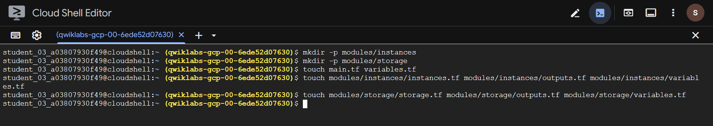

Verify:

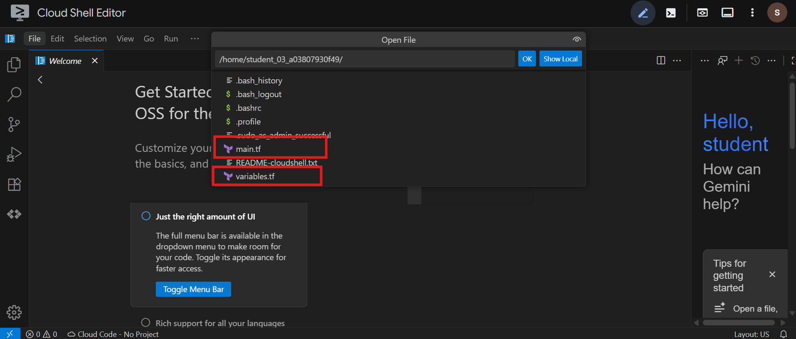

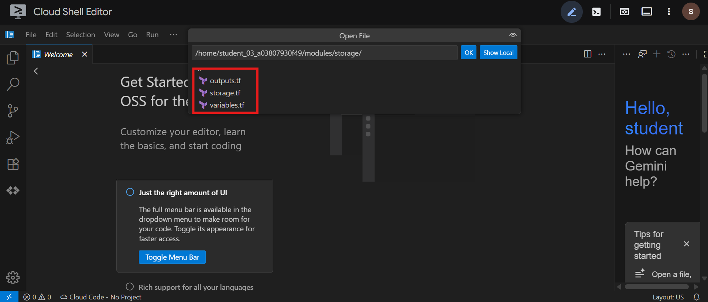

### 📝 Step 2: Define Variables in All `variables.tf` Files
In the **root** `variables.tf` and in each module’s `variables.tf` (`instances` and `storage`), add the following variables:

```hcl
variable "region" {
  description = "Deployment region"
  default     = "us-east1"
}

variable "zone" {
  description = "Deployment zone"
  default     = "us-east1-c"
}

variable "project_id" {
  description = "Google Cloud Project ID"
  default     = "qwiklabs-gcp-00-6ede52d07630"
}
```
> ⚠️ Note: Replace values with the ones provided at lab start (region, zone, and Project ID).
Use these variables everywhere appropriate in module and root resource configurations.


In the root variable.tf

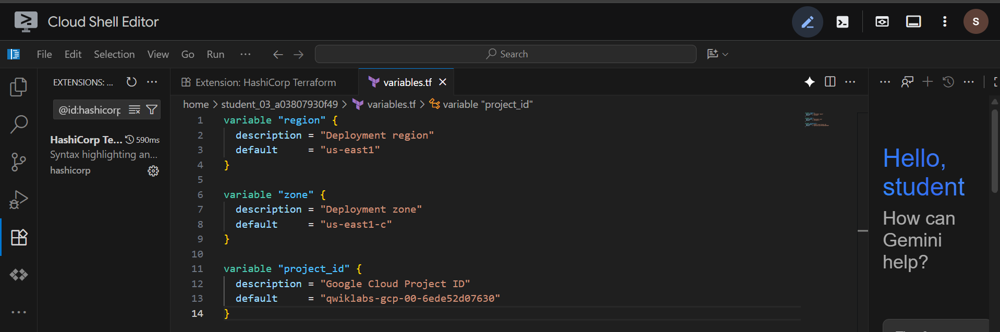

In the instance variable.tf

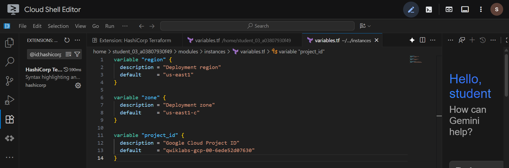

In the storage variable.tf

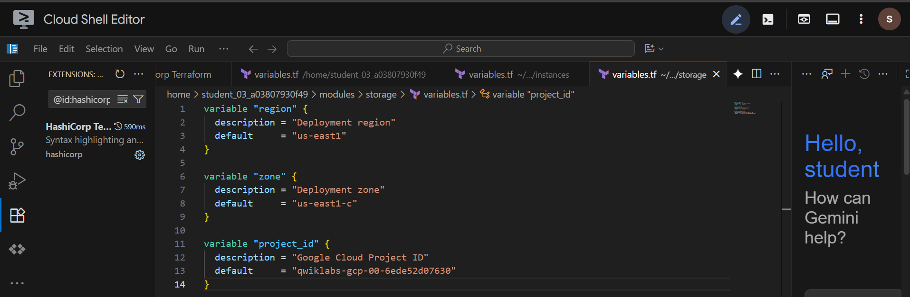


### 🏗️ Step 3: Add Terraform Block and Google Provider in `main.tf`

Inside `main.tf`, add the required Terraform configuration:
```h
terraform {
  required_version = ">= 1.0.0"

  required_providers {
    google = {
      source  = "hashicorp/google"
      version = "~> 5.0"
    }
  }
}
```

Then add the Google Provider block using your variables:

```hcl
provider "google" {
  project = var.project_id
  region  = var.region
  zone    = var.zone
}
```

->

```bash
provider "google" {
  project = "qwiklabs-gcp-00-6ede52d07630"
  region  = "us-east1"
  zone    = "us-east1-c"
}
```

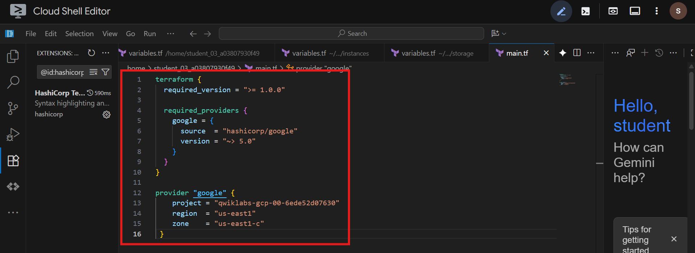

Verify that project, region, and zone are correctly referenced using variables.

### 🚀 Step 4: Initialize Terraform

From the root of your configuration, run:
```bash
terraform init
```
This will:
- Download the Google provider
- Prepare Terraform’s working directory
- Validate that your folder structure is set up correctly

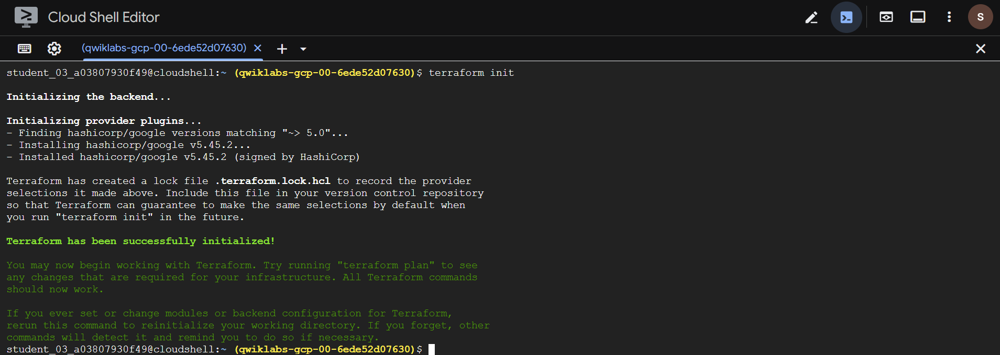

---

## 🧩 Task 2: Import Infrastructure

### 🖥️ Step 1: Review Existing VM Instances
In the **Google Cloud Console**, navigate to:

**Navigation Menu → Compute Engine → VM Instances**

You will see two pre-created VM instances:

## 🖥️ **tf-instance-1**
- **Name:** tf-instance-1  
- **Instance ID:** 7991131294052733579
- **Boot Disk Source Image:** debian-11-bullseye-v20251111
- **Machine Type:** e2-micro (2 vCPUs, 1 GB Memory)  

---

## 🖥️ **tf-instance-2**
- **Name:** tf-instance-2  
- **Instance ID:** 3414731769151574666
- **Boot Disk Source Image:** debian-11-bullseye-v20251111  
- **Machine Type:** e2-micro (2 vCPUs, 1 GB Memory)
  
> 💡 **Tip:** Click each instance to view details such as:
> - Instance ID  
> - Boot disk image  
> - Machine type  
>  
> These values are required when writing the Terraform resource configuration for import.

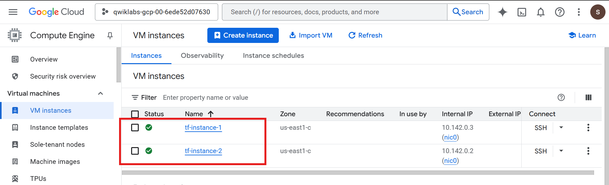

---

### 📦 Step 2: Add the Instances Module to `main.tf`
In your **main.tf**, add a module block referencing the `instances` module, then re-initialize Terraform:

```hcl
module "instances" {
  source     = "./modules/instances"
  project_id = "qwiklabs-gcp-00-6ede52d07630"
  region     = "us-east1"
  zone       = "us-east1-c"
}
```

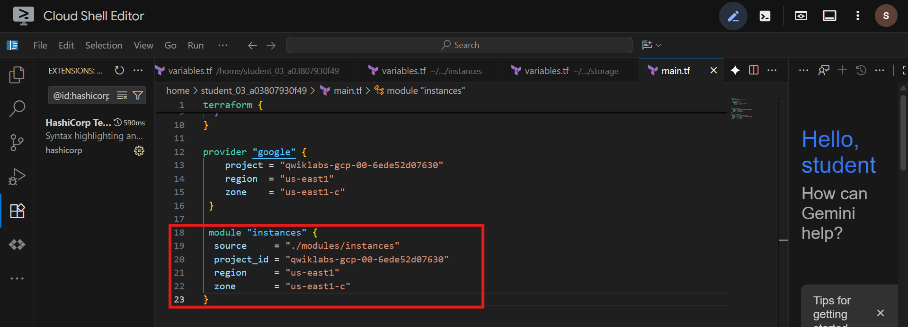

initialize
```bash
terraform init
```

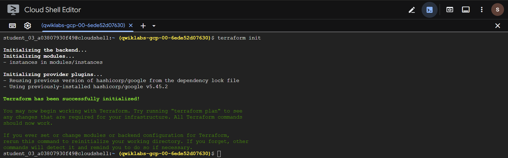

---

### 🏗️ Step 3: Write Resource Configurations in `instances.tf`

Inside `modules/instances/instances.tf`, define **minimal** resource configurations for the two existing instances.

These configurations match the real VM details you provided:

- **tf-instance-1**
  - Instance ID: `7991131294052733579`
  - Boot Image: `debian-11-bullseye-v20251111`
  - Machine type: `e2-micro`

- **tf-instance-2**
  - Instance ID: `3414731769151574666`
  - Boot Image: `debian-11-bullseye-v20251111`
  - Machine type: `e2-micro`

⚠️ **Important:**  
We keep the configuration **minimal** so Terraform can import the VMs **without recreating them**.

---

#### ✅ `modules/instances/instances.tf`

```hcl
resource "google_compute_instance" "tf-instance-1" {
  name         = "tf-instance-1"
  project      = var.project_id
  zone         = var.zone
  machine_type = "e2-micro"

  boot_disk {
    initialize_params {
      image = "debian-11-bullseye-v20251111"
    }
  }

  network_interface {
    # Using default network for now; will be updated in later tasks
    network = "default"
  }

  metadata_startup_script = <<-EOT
        #!/bin/bash
    EOT

  allow_stopping_for_update = true
}

resource "google_compute_instance" "tf-instance-2" {
  name         = "tf-instance-2"
  project      = var.project_id
  zone         = var.zone
  machine_type = "e2-micro"

  boot_disk {
    initialize_params {
      image = "debian-11-bullseye-v20251111"
    }
  }

  network_interface {
    # Using default network for now; will be updated in later tasks
    network = "default"
  }

  metadata_startup_script = <<-EOT
        #!/bin/bash
    EOT

  allow_stopping_for_update = true
}
```

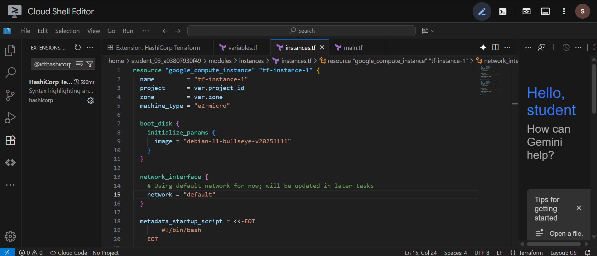
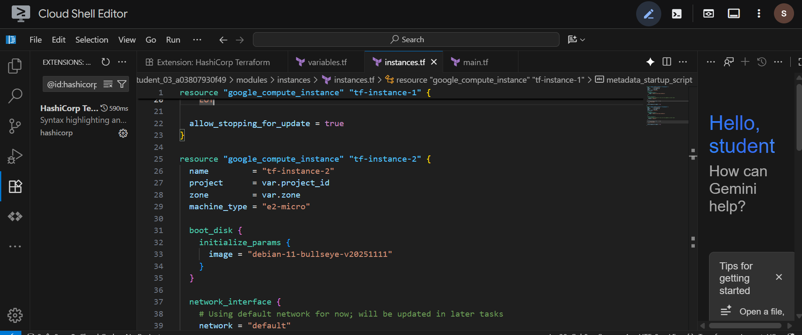

---


### 🔄 Step 4: Import the Existing Instances

Use the terraform import command to import each resource into your module.

Example format:
```bash
terraform import 'module.instances.google_compute_instance.tf-instance-1' 7991131294052733579
terraform import 'module.instances.google_compute_instance.tf-instance-2' 3414731769151574666
```
Replace <instance-id-X> with each VM’s Instance ID from the console.

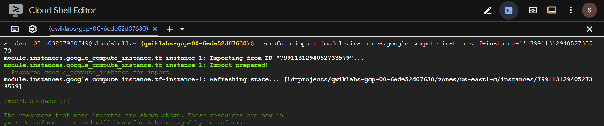
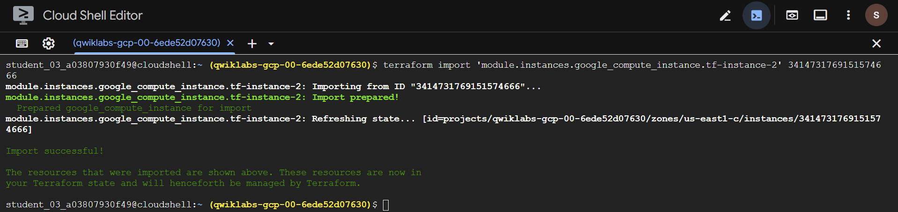

### 🚀 Step 5: Apply the Changes

Run:
```bash
terraform apply
```

Since the instance configurations were not fully defined, Terraform will update the instances in place.
This behavior is acceptable for the lab, but in production you should fully define all instance arguments before importing.

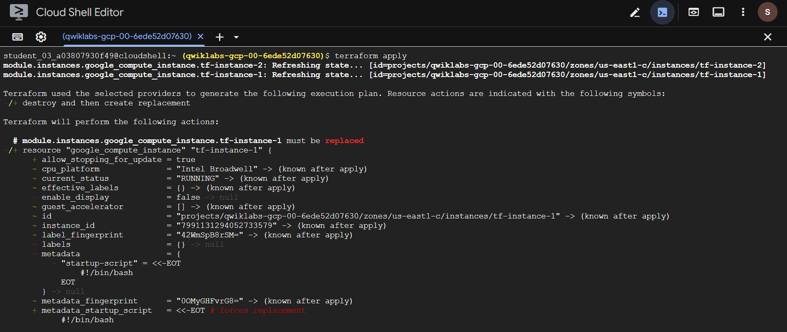
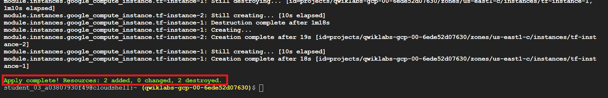

---

## 🧩 Task 3: Configure a Remote Backend

### 🪣 Step 1: Create the Cloud Storage Bucket in the `storage` Module
Inside the **storage module** (`modules/storage/storage.tf`), create a Cloud Storage bucket resource with the following required arguments:

```hcl
resource "google_storage_bucket" "backend_bucket" {
  name                        = "tf-bucket-566908"
  location                    = "US"
  force_destroy               = true
  uniform_bucket_level_access = true
}
```
💡 Note:
You may optionally add output values to outputs.tf if desired.

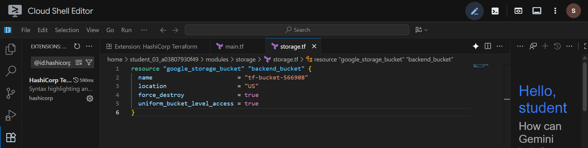


### 📝 Step 2: Add `bucket_name` Variable to Storage Module

Create or update **modules/storage/variables.tf** with:

```hcl
variable "bucket_name" {
  description = "Name of the GCS bucket used for remote backend"
  type        = string
}
```

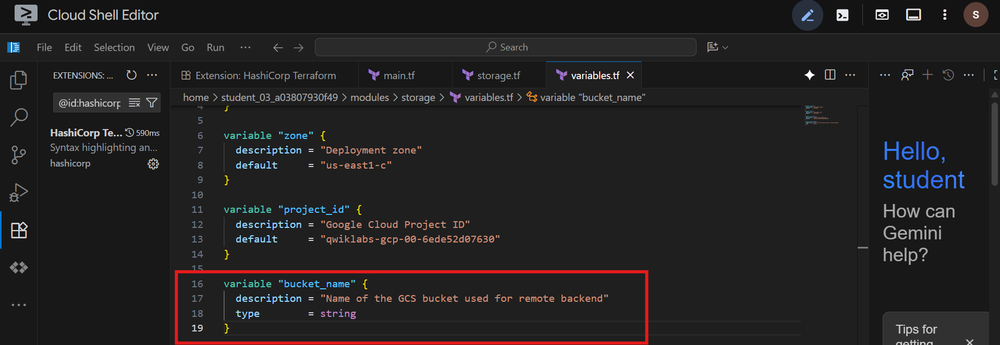

### 🔗 Step 3: Add the Storage Module to main.tf

Add a module block referencing the storage module:
```h
module "storage" {
  source     = "./modules/storage"
  project_id = var.project_id
  region     = var.region

  # Bucket name required by the lab
  bucket_name = "tf-bucket-566908"
}
```

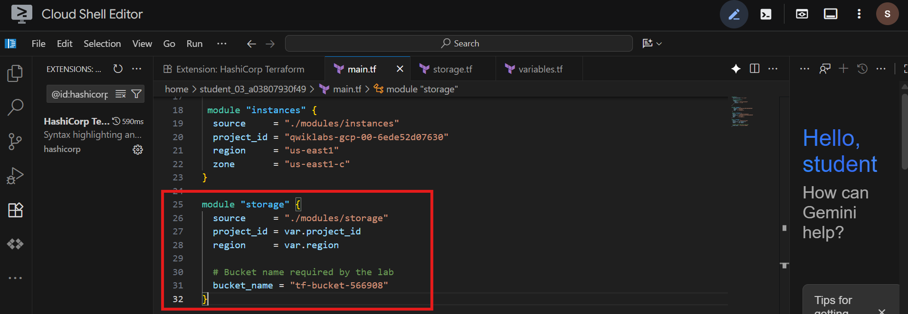

Initialize and apply changes to create the bucket:

```bash
terraform init
terraform apply
```

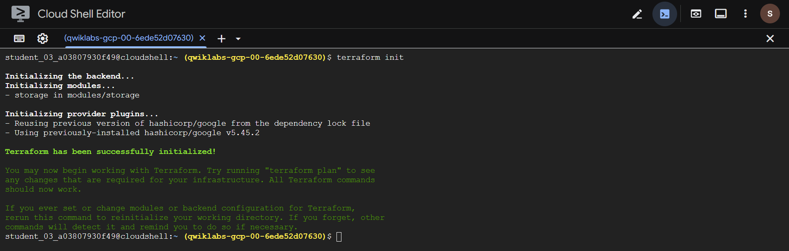
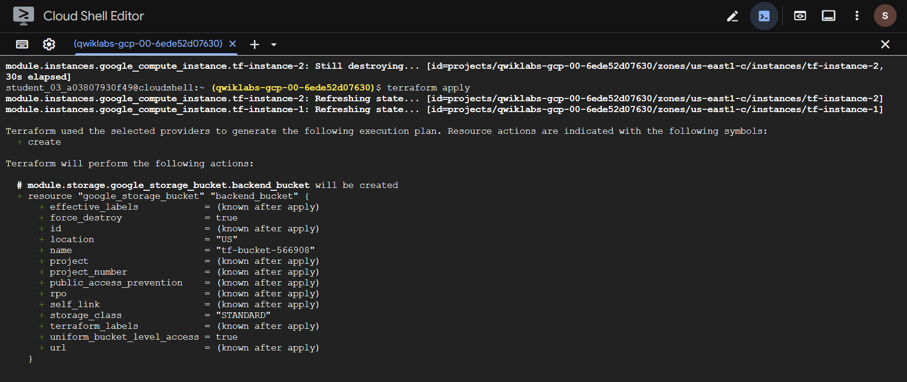
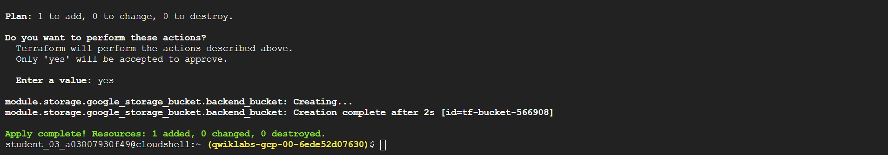

### 🏗️ Step 4: Configure the Remote Backend

In your main.tf, add the Terraform backend block and configure it to use the storage bucket you just created.
Be sure to use the required prefix terraform/state:
```hcl
terraform {
  backend "gcs" {
    bucket = "tf-bucket-566908"
    prefix = "terraform/state"
  }

  required_version = ">= 1.0.0"

  required_providers {
    google = {
      source  = "hashicorp/google"
      version = "~> 5.0"
    }
  }
}
```
> Replace <your-bucket-name> with the bucket name created by your module.

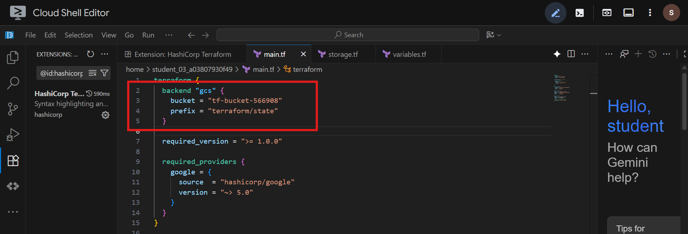

### 🔄 Step 5: Re-Initialize Terraform to Migrate State

Run:
```bash
terraform init
```

If your configuration is correct, Terraform will display a prompt:
```pgsqql
Do you want to copy existing state to the new backend? (yes/no)
```
Type:
```bash
yes
```

Terraform will then migrate your local state to the remote Cloud Storage backend.

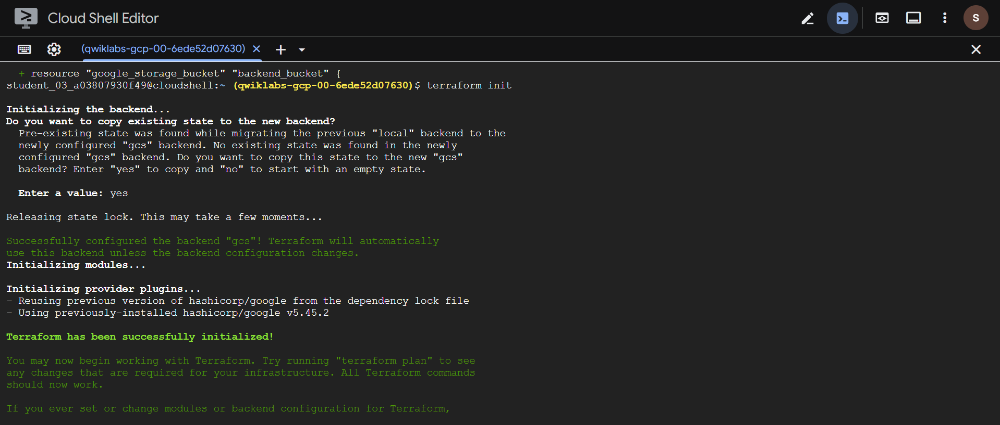

---

## 🧩 Task 4: Modify and Update Infrastructure

### 🖥️ Step 1: Update Existing Instances
Navigate to the **instances module** (`modules/instances/instances.tf`) and modify the machine type for the existing instances:

```hcl
resource "google_compute_instance" "tf-instance-1" {
  machine_type               = "e2-standard-2"
  # ... other existing arguments
}

resource "google_compute_instance" "tf-instance-2" {
  machine_type               = "e2-standard-2"
  # ... other existing arguments
}
```

or you may use Google Code Assist: Input this prompt - Update the instance machine types for both instances from e2-micro to e2-standard-2

⚠️ Note: Ensure the machine_type for both tf-instance-1 and tf-instance-2 is updated to e2-standard-2.

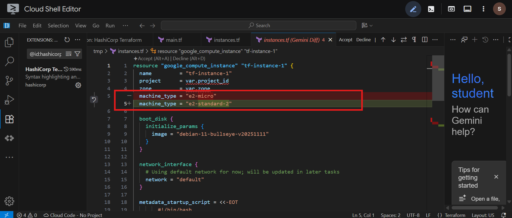
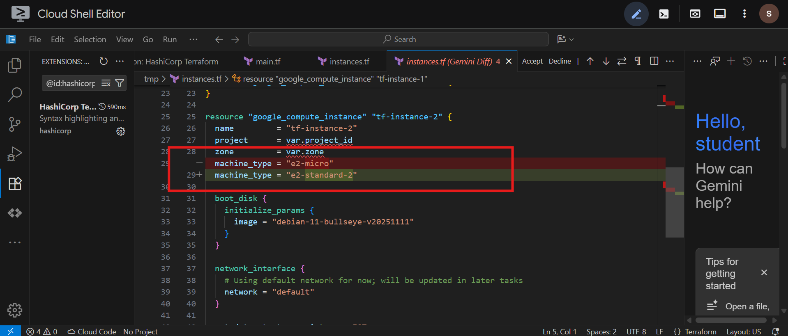

### ➕ Step 2: Add a Third Instance

Add a new instance resource in the same module:
```hcl
resource "google_compute_instance" "tf-instance-511043" {
  name         = "tf-instance-511043"
  project      = var.project_id
  zone         = var.zone
  machine_type = "e2-standard-2"

  boot_disk {
    initialize_params {
      image = "debian-11-bullseye-v20251111"
    }
  }

  network_interface {
    network = "default" # Will be updated in later tasks
  }

  metadata_startup_script = <<-EOT
        #!/bin/bash
    EOT

  allow_stopping_for_update = true
}
```

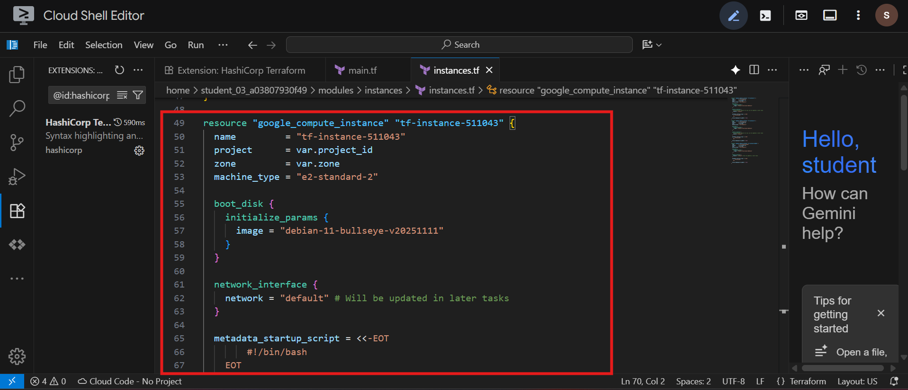

### 🔄 Step 3: Apply the Changes

Initialize Terraform and apply the updated configuration:
```bash
terraform init
terraform apply
```
⚠️ Note: Optionally, you can add output values for these resources in outputs.tf within the module.

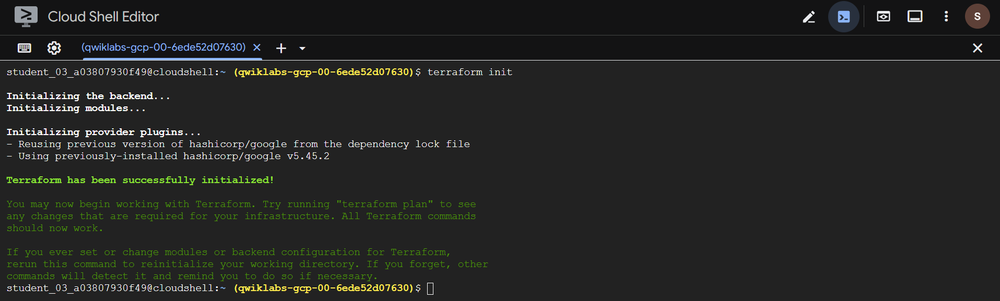
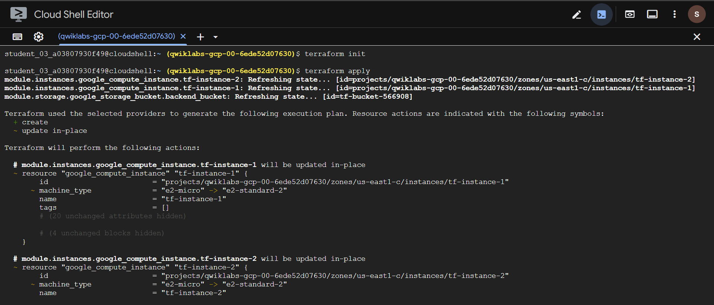
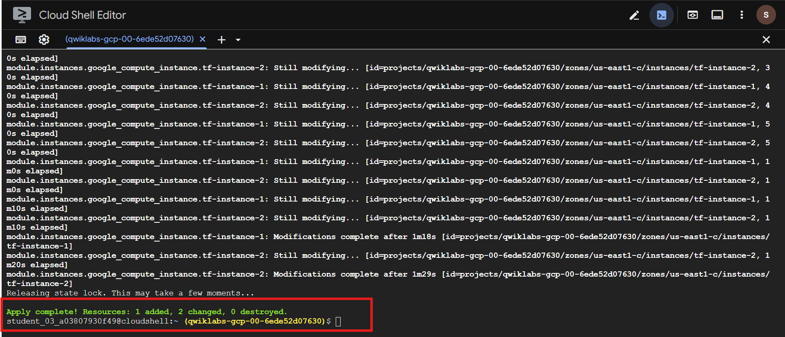

---

## 🧩 Task 5: Destroy Resources

### 🗑️ Step 1: Remove the Third Instance
Navigate to the **instances module** (`modules/instances/instances.tf`) and **delete the resource block** for the third instance (`tf-instance-3`):

```hcl
# Remove this entire block
resource "google_compute_instance" "tf-instance-511043" {
  name         = "tf-instance-511043"
  project      = var.project_id
  zone         = var.zone
  machine_type = "e2-standard-2"

  boot_disk {
    initialize_params {
      image = "debian-11-bullseye-v20251111"
    }
  }

  network_interface {
    network = "default" # Will be updated in later tasks
  }

  metadata_startup_script = <<-EOT
        #!/bin/bash
    EOT

  allow_stopping_for_update = true
}
```

### 🔄 Step 2: Re-Initialize and Apply Terraform

After removing the resource, run the following commands from the root directory:
```bash
terraform init
terraform apply
```

Terraform will detect that tf-instance-3 has been removed and destroy the third instance from your Google Cloud project.

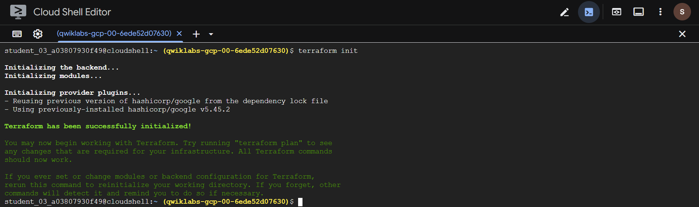
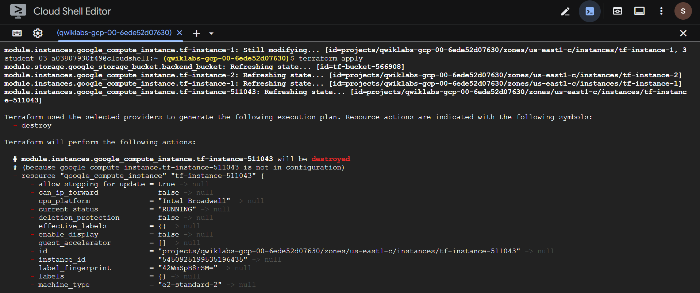


---

## 🌐 Task 6: Use a Module from the Terraform Registry

### 🏗️ Step 1: Add the Network Module from the Terraform Registry

In the **Terraform Registry**, locate the **Network Module** and add it to your `main.tf` with the following configuration:

```hcl
module "vpc" {
  source  = "terraform-google-modules/network/google"
  version = "10.0.0"

  project_id   = var.project_id
  network_name = "tf-vpc-963827"
  routing_mode = "GLOBAL"

  subnets = [
    {
      subnet_name   = "subnet-01"
      subnet_ip     = "10.10.10.0/24"
      subnet_region = "us-east1"
    },
    {
      subnet_name   = "subnet-02"
      subnet_ip     = "10.10.20.0/24"
      subnet_region = "us-east1"
    }
  ]
}
```

⚠️ Note:
Do not include secondary ranges or additional routes, as they are not required for this lab.

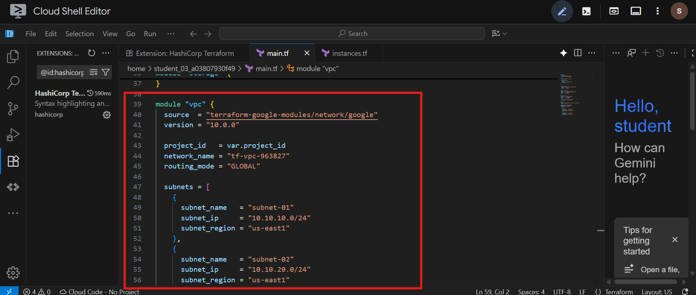

### 🔄 Step 2: Initialize and Apply Terraform

Run the following commands to initialize the new module and create the networks:
```bash
terraform init
terraform apply
```
Terraform will create the VPC and the two subnets.

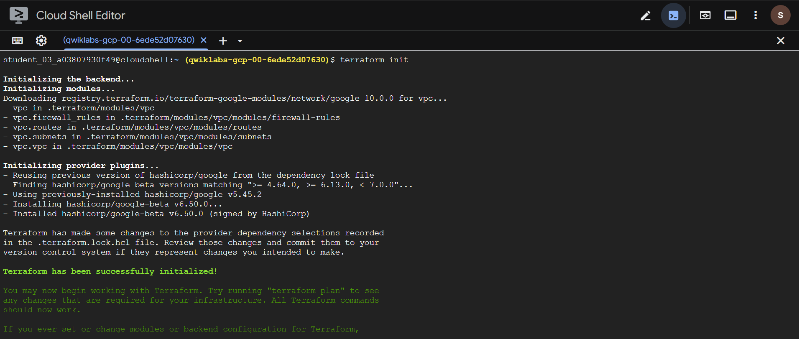
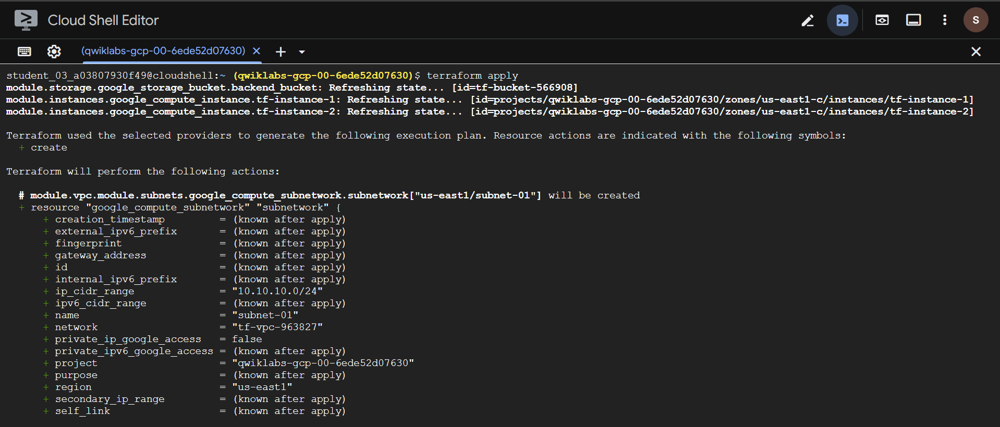
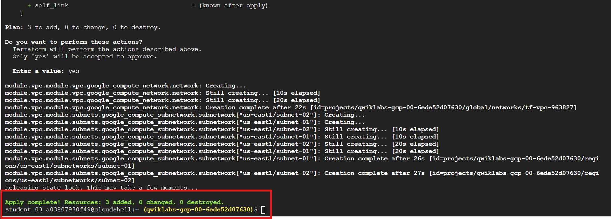

### 🔄 Step 3: Update modules/instances/variables.tf

```bash
variable "network_name" {
  description = "The VPC network name"
  type        = string
}

variable "subnet_1_name" {
  description = "Subnet-01 name"
  type        = string
}

variable "subnet_2_name" {
  description = "Subnet-02 name"
  type        = string
}
```

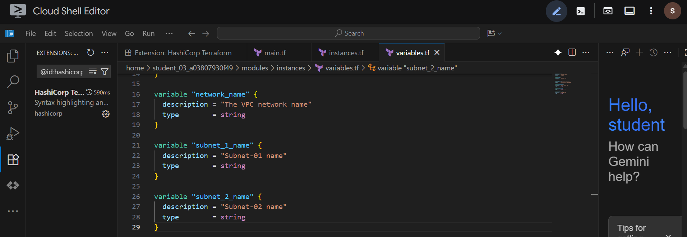

### 🔄 Step 4: Update main.tf to pass the VPC info to the instances module

```bash
module "instances" {
  source     = "./modules/instances"
  project_id = var.project_id
  region     = var.region
  zone       = var.zone

  network_name = module.vpc.network_name
  subnet_1_name = values(module.vpc.subnets)[0].name
  subnet_2_name = values(module.vpc.subnets)[1].name
}
```
> Note: Depending on the network module version, the output for subnets may be .name or .subnet_name. Use terraform output module.vpc.subnets to confirm.

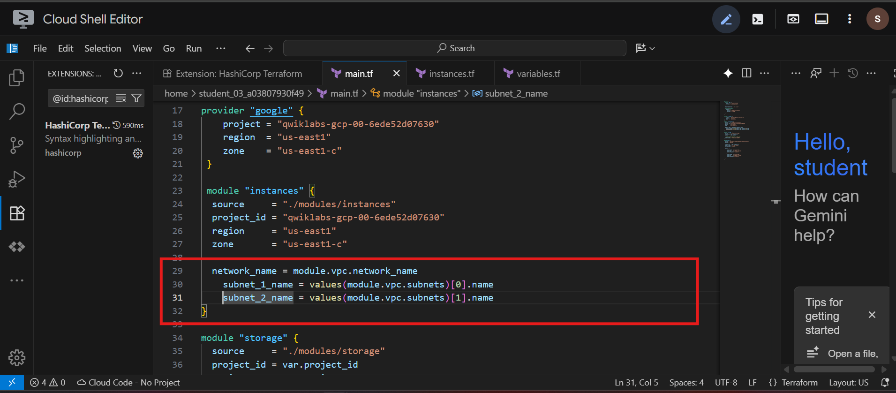

### 🏗️ Step 5: Update Instances to Use the New Subnets

In modules/instances/instances.tf, update the network configuration for each VM:

```
resource "google_compute_instance" "tf-instance-1" {
  name         = "tf-instance-1"
  project      = var.project_id
  zone         = var.zone
  machine_type = "e2-standard-2"

  boot_disk {
    initialize_params {
      image = "debian-11-bullseye-v20251111"
    }
  }

  network_interface {
    network    = var.network_name
    subnetwork = var.subnet_1_name
  }

  metadata_startup_script = <<-EOT
        #!/bin/bash
    EOT

  allow_stopping_for_update = true
}

resource "google_compute_instance" "tf-instance-2" {
  name         = "tf-instance-2"
  project      = var.project_id
  zone         = var.zone
  machine_type = "e2-standard-2"

  boot_disk {
    initialize_params {
      image = "debian-11-bullseye-v20251111"
    }
  }

  network_interface {
    network    = var.network_name
    subnetwork = var.subnet_2_name
  }

  metadata_startup_script = <<-EOT
        #!/bin/bash
    EOT

  allow_stopping_for_update = true
}
```

💡 Tip:
Ensure that network points to the VPC created by the module and subnetwork matches the corresponding subnet for each instance.

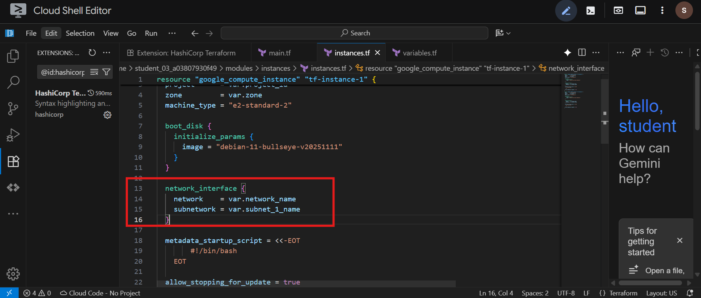
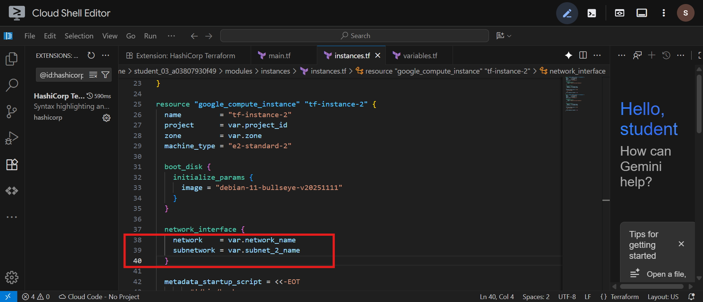

### ✅ Step 4: Apply the Changes

After updating the instances, run:

```bash
terraform init
terraform apply
```
This will attach each instance to the correct subnet in the new VPC.


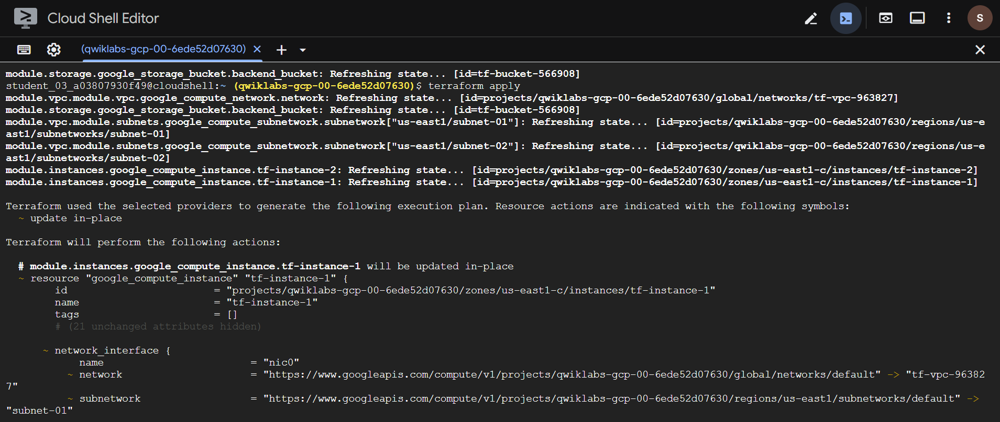
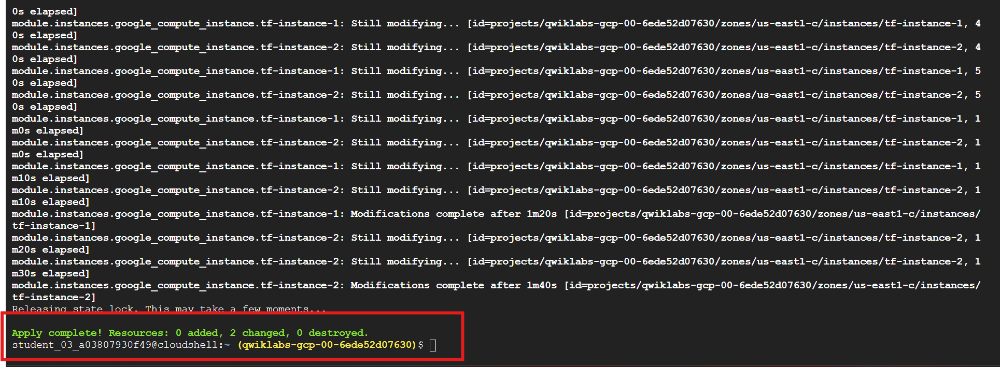

---

## 🧩 Task 7: Configure a Firewall

### 🔥 Step 1: Add Firewall Rule in main.tf
Add a google_compute_firewall resource block to your main.tf to allow ingress traffic on TCP port 80:

```hcl
resource "google_compute_firewall" "tf-firewall" {
  name    = "tf-firewall"
  network = module.vpc.network_name

  allow {
    protocol = "tcp"
    ports    = ["80"]
  }

  source_ranges = ["0.0.0.0/0"]
}
```
> ⚠️ Note:
> The network argument can be the name of the VPC (module.vpc.network_name) or the full self_link (module.vpc.network_self_link) depending on your module output.
> This firewall allows HTTP traffic from any IP to your VMs in the VPC.

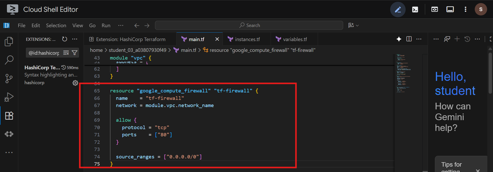

### 🔄 Step 2: Initialize and Apply Terraform

Run the following commands to create the firewall rule:
```bash
terraform init
terraform apply
```
Terraform will provision the firewall rule to allow HTTP (TCP port 80) traffic to your VPC.

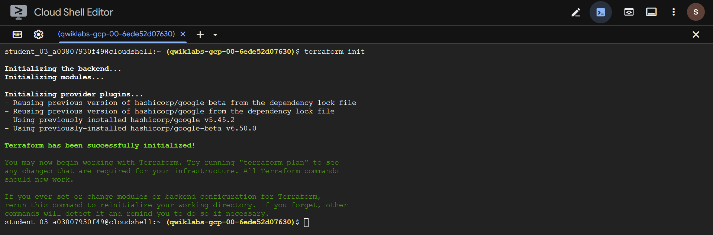


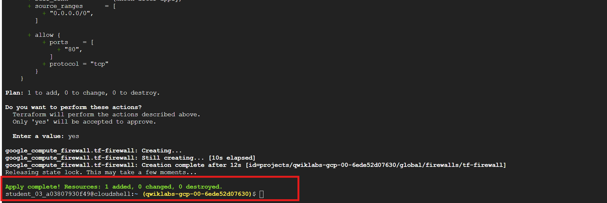

---

## 🎉 Task Completed

- Importing two pre-existing VMs into Terraform.
- Creating a Cloud Storage bucket to configure a remote backend.
- Adding a new VM instance and practicing updates within your modules.
- Leveraging a Terraform Registry module to create a VPC with two subnets.
- Connecting your instances to the new VPC subnets.
- Creating a firewall rule to allow communication between the instances.
