# Managing a GKE Multi-tenant Cluster with Namespaces 🚀

## 📘 Overview

When considering cost optimization solutions for any Google Cloud infrastructure built around Google Kubernetes Engine (GKE) clusters, it's important to ensure that you're making effective use of the resources that are being billed. A common misstep is assigning a one to one ratio of users or teams to clusters, resulting in cluster proliferation.

A multi-tenancy cluster allows for multiple users or teams to share one cluster for their workloads while maintaining isolation and fair resource sharing. This is achieved by creating namespaces. Namespaces allow multiple virtual clusters to exist on the same physical cluster.

In this lab you will learn how to set up a multi-tenant cluster using multiple namespaces to optimize resource utilization and, in effect, optimize costs.

---

## 🎯 Objectives

In this lab, you will learn how to:

- Create multiple namespaces in a GKE cluster. 🏷️  
- Configure role-based access control for namespace access. 🔐  
- Configure Kubernetes resource quotas for fair sharing resources across multiple namespaces. ⚖️  
- View and configure monitoring dashboards to view resource usage by namespace. 📊  
- Generate a GKE metering report in Looker Studio for fine grained metrics on resource utilization by namespace. 📑  

---

## 🧰 Setup and requirements

### ⏳ Before you click the **Start Lab** button

Read these instructions. Labs are timed and you cannot pause them. The timer, which starts when you click Start Lab, shows how long Google Cloud resources are made available to you.

This hands-on lab lets you do the lab activities in a real cloud environment, not in a simulation or demo environment. It does so by giving you new, temporary credentials you use to sign in and access Google Cloud for the duration of the lab.

To complete this lab, you need:

- Access to a standard internet browser (Chrome browser recommended). 🌐  
  **Note:** Use an Incognito (recommended) or private browser window to run this lab. This prevents conflicts between your personal account and the student account, which may cause extra charges incurred to your personal account.
- Time to complete the lab—remember, once you start, you cannot pause a lab. ⏲️  
- **Important:** Use only the student account for this lab. If you use a different Google Cloud account, you may incur charges to that account. ⚠️  

---

## ▶️ How to start your lab and sign in to the Google Cloud console

Click the **Start Lab** button. If you need to pay for the lab, a dialog opens for you to select your payment method. On the left is the *Lab Details* pane with the following:

- The **Open Google Cloud console** button  
- Time remaining  
- The temporary credentials that you must use for this lab  
- Other information, if needed, to step through this lab  

Click **Open Google Cloud console** (or right-click and select **Open Link in Incognito Window** if you are running the Chrome browser).

The lab spins up resources, and then opens another tab that shows the Sign-in page.

👉 **Tip:** Arrange the tabs in separate windows, side-by-side.

**Note:** If you see the *Choose an account* dialog, click **Use Another Account**.

If necessary, copy the **Username** below and paste it into the Sign in dialog.
```text
"Username"
```


You can also find the Username in the Lab Details pane.

Click **Next**.

Copy the **Password** below and paste it into the Welcome dialog.
```text
"Password"
```


You can also find the Password in the Lab Details pane.

Click **Next**.

⚠️ **Important:** You must use the credentials the lab provides you. Do not use your own Google Cloud account credentials.  
**Note:** Using your own Google Cloud account for this lab may incur extra charges.

Click through the subsequent pages:

- Accept the terms and conditions.  
- Do not add recovery options or two-factor authentication (because this is a temporary account).  
- Do not sign up for free trials.  

After a few moments, the Google Cloud console opens in this tab.

**Note:** To access Google Cloud products and services, click the **Navigation menu** or type the service or product name in the **Search** field.

---

## 🏁 Start Up

After pressing the **Start Lab** button, you will see a blue *Provisioning Lab Resources* message with an estimated time remaining. It is creating and configuring the environment you will use to test managing a multi-tenant cluster. In about 5 minutes a cluster is created, BigQuery datasets are copied, and service accounts which will represent teams are generated.

Once finished, the message will no longer be displayed.

⏳ **Please wait** for this start-up process to complete and the message to be removed before proceeding with the lab.

---

## 💻 Activate Cloud Shell

Cloud Shell is a virtual machine that is loaded with development tools. It offers a persistent 5GB home directory and runs on Google Cloud. Cloud Shell provides command-line access to your Google Cloud resources.

Click **Activate Cloud Shell** at the top of the Google Cloud console.

Click through the following windows:

- Continue through the Cloud Shell information window.  
- Authorize Cloud Shell to use your credentials to make Google Cloud API calls.  

When connected, you are already authenticated, and the project is set to your `PROJECT_ID`. The output contains a line:
```text
Your Cloud Platform project in this session is set to "PROJECT_ID"
```

`gcloud` is the command-line tool for Google Cloud. It comes pre-installed on Cloud Shell and supports tab-completion.

### (Optional) Check the active account:
```bash
gcloud auth list
```


Click **Authorize**.

**Output:**
```bash
ACTIVE: *
ACCOUNT: "ACCOUNT"
```

To set the active account:
```bash
gcloud config set account ACCOUNT
```


### (Optional) List the project ID:
```bash
gcloud config list project
```

**Output:**
```bash
[core]
project = "PROJECT_ID"
```

**Note:** For full documentation of `gcloud`, refer to the *gcloud CLI overview guide*. 📚

---

# 🧪 Task 1. Download required files

In this lab, some steps will use yaml files to configure your Kubernetes cluster. In your Cloud Shell, download these files from a Cloud Storage bucket:
```bash
gsutil -m cp -r gs://spls/gsp766/gke-qwiklab ~
```

Change your current working directory to gke-qwiklab:
```bash
cd ~/gke-qwiklab
```


---

# 🏷️ Task 2. View and create namespaces

Run the following to set a default compute zone and authenticate the provided cluster multi-tenant-cluster:
```bash
export ZONE=placeholder
gcloud config set compute/zone ${ZONE} && gcloud container clusters get-credentials multi-tenant-cluster
```

---

## 📌 Default namespaces

By default, Kubernetes clusters have 4 system namespaces.

You can get a full list of the current cluster's namespaces with:
```bash
kubectl get namespace
```

The output should be similar to:
```nginx
NAME STATUS AGE
default Active 5m
kube-node-lease Active 5m
kube-public Active 5m
kube-system Active 5m
```

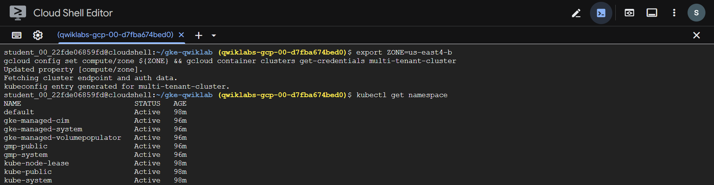

- **default** — the default namespace used when no other namespace is specified  
- **kube-node-lease** — manages the lease objects associated with the heartbeats of each of the cluster's nodes  
- **kube-public** — for resources visible or readable by all users throughout the whole cluster  
- **kube-system** — used for components created by the Kubernetes system  

Not everything belongs to a namespace. For example, nodes, persistent volumes, and namespaces themselves do not belong to a namespace.

For a complete list of namespaced resources:
```bash
kubectl api-resources --namespaced=true
```
When they are created, namespaced resources must be associated with a namespace. This is done by including the `--namespace` flag or indicating a namespace in the yaml's metadata field.

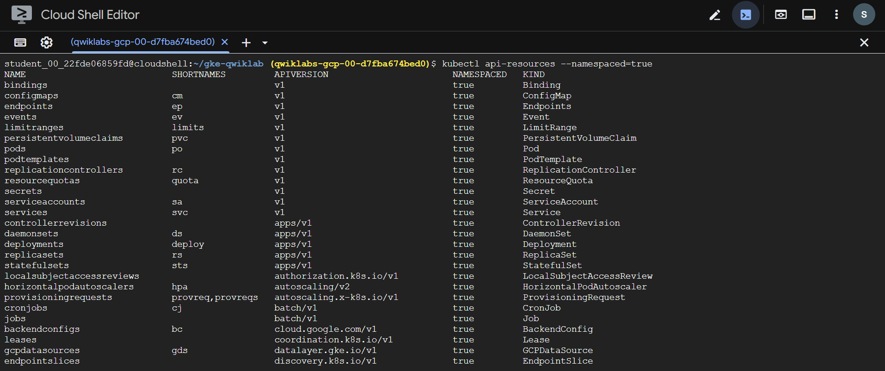
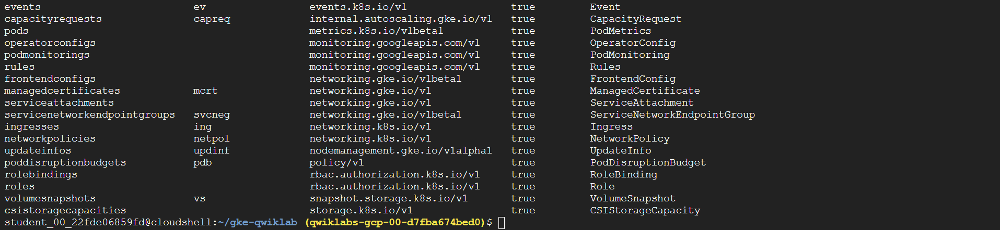

The namespace can also be specified with any `kubectl get` subcommand to display a namespace's resources. For example:
```bash
kubectl get services --namespace=kube-system
```
This will output all services in the kube-system namespace.

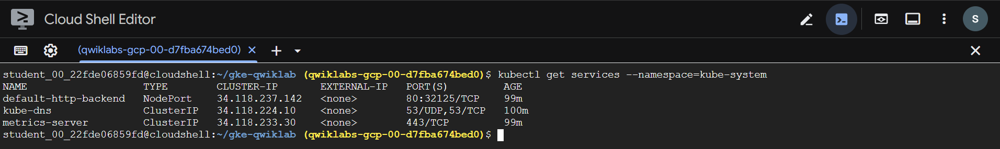

---

## 🛠️ Creating new namespaces

**Note:** When creating additional namespaces, avoid prefixing the names with `kube` as this is reserved for system namespaces.

Create 2 namespaces for team-a and team-b:
```bash
kubectl create namespace team-a &&
kubectl create namespace team-b
```

The output for `kubectl get namespace` should now include your 2 new namespaces:
```nginx
namespace/team-a created
namespace/team-b created
```

By specifying the `--namespace` tag, you can create cluster resources in the provided namespace. Names for resources, such as deployments or pods, only need to be unique *within* their respective namespaces.

As an example, run the following to deploy a pod in the team-a namespace and in the team-b namespace using the same name:
```bash
kubectl run app-server --image=quay.io/centos/centos:9 --namespace=team-a -- sleep infinity &&
kubectl run app-server --image=quay.io/centos/centos:9 --namespace=team-b -- sleep infinity
```
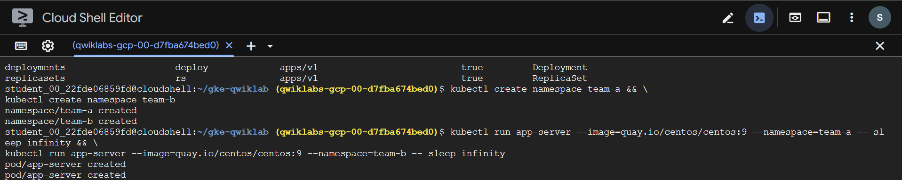

Use:
```bash
kubectl get pods -A
```
to see there are 2 pods named **app-server**, one for each team namespace.

**Output:**
```nginx
NAMESPACE NAME READY STATUS RESTARTS AGE
kube-system event-exporter-gke-8489df9489-k2blq 2/2 Running 0 3m41s
kube-system fluentd-gke-fmt4v 2/2 Running 0 113s
kube-system fluentd-gke-n9dvn 2/2 Running 0 79s
kube-system fluentd-gke-scaler-cd4d654d7-xj78p 1/1 Running 0 3m37s
kube-system gke-metrics-agent-4jvn8 1/1 Running 0 3m33s
kube-system gke-metrics-agent-b4vvw 1/1 Running 0 3m27s
kube-system kube-dns-7c976ddbdb-gtrct 4/4 Running 0 3m41s
kube-system kube-dns-7c976ddbdb-k9bgk 4/4 Running 0 3m
kube-system kube-dns-autoscaler-645f7d66cf-jwqh5 1/1 Running 0 3m36s
kube-system kube-proxy-gke-new-cluster-default-pool-eb9986d5-tpql 1/1 Running 0 3m26s
kube-system kube-proxy-gke-new-cluster-default-pool-eb9986d5-znm6 1/1 Running 0 3m33s
kube-system l7-default-backend-678889f899-xvt5t 1/1 Running 0 3m41s
kube-system metrics-server-v0.3.6-64655c969-jtl57 2/2 Running 0 3m
kube-system prometheus-to-sd-d6dpf 1/1 Running 0 3m27s
kube-system prometheus-to-sd-rfdlv 1/1 Running 0 3m33s
kube-system stackdriver-metadata-agent-cluster-level-79f9ddf6d6-7ck2w 2/2 Running 0 2m56s
team-a app-server 1/1 Running 0 33s
team-b app-server 1/1 Running 0 33s
```

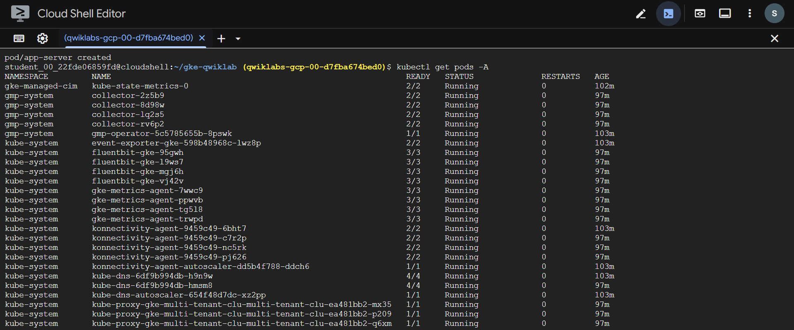
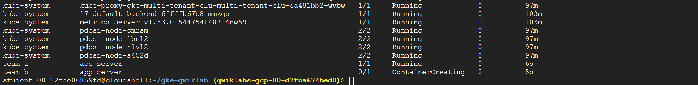

---

## 🔍 View pod details

Use `kubectl describe` to see additional details for each of the newly created pods by specifying the namespace with the `--namespace` tag:
```bash
kubectl describe pod app-server --namespace=team-a
```

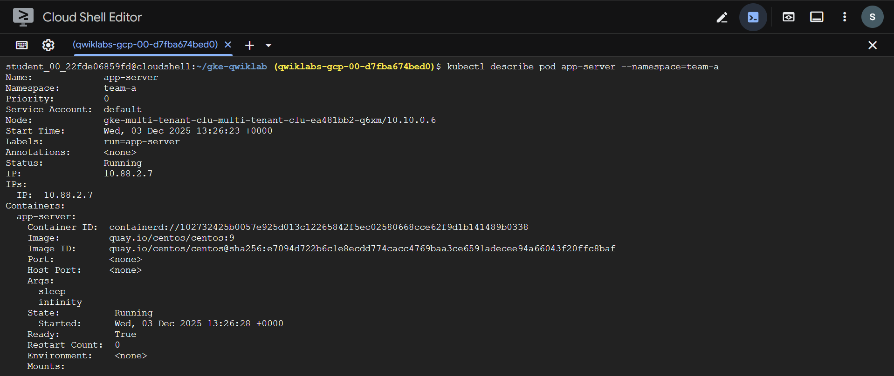
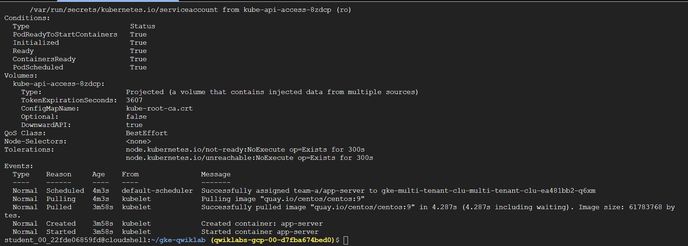

To work exclusively with resources in one namespace, you can set it once in the kubectl context instead of using the `--namespace` flag for every command:
```bash
kubectl config set-context --current --namespace=team-a
```

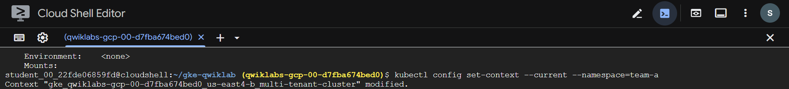

After this, any subsequent commands will be run against the indicated namespace without specifying the namespace flag:
```bash
kubectl describe pod app-server
```

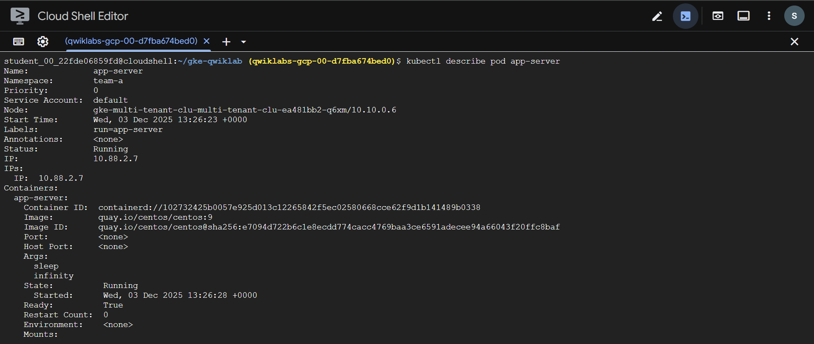
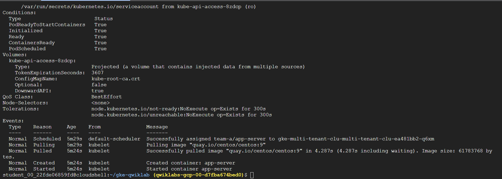

---

# 🔐 Task 3. Access Control in namespaces

Provisioning access to namespaced resources in a cluster is accomplished by granting a combination of IAM roles and Kubernetes' built-in role-based access control (RBAC). An IAM role will give an account initial access to the project while the RBAC permissions will grant granular access to a cluster's namespaced resources (pods, deployments, services, etc).

## 🧭 IAM Roles

**Note:** To grant IAM roles in a project, you'll need the Project IAM Admin role assigned. This is already set up in your Qwiklabs temporary account.

When managing access control for Kubernetes, Identity and Access Management (IAM) is used to manage access and permissions on a higher organization and project levels.

There are several roles that can be assigned to users and service accounts in IAM that govern their level of access with GKE. RBAC's granular permissions build on the access already provided by IAM and cannot restrict access granted by it. As a result, for multi-tenant namespaced clusters, the assigned IAM role should grant minimal access.

Here’s a table of common GKE IAM roles you can assign:

| Role | Description |
|------|-------------|
| **Kubernetes Engine Admin** | Provides access to full management of clusters and their Kubernetes API objects. A user with this role will be able to create, edit and delete any resource in any cluster and subsequent namespaces. |
| **Kubernetes Engine Developer** | Provides access to Kubernetes API objects inside clusters. A user with this role will be able to create, edit, and delete resources in any cluster and subsequent namespaces. |
| **Kubernetes Engine Cluster Admin** | Provides access to management of clusters. A user with this role will not have access to create or edit resources within any cluster or subsequent namespaces directly, but will be able to create, modify, and delete any cluster. |
| **Kubernetes Engine Viewer** | Provides read-only access to GKE resources. A user with this role will have read-only access to namespaces and their resources. |
| **Kubernetes Engine Cluster Viewer** | Get and list access to GKE Clusters. This is the minimal role required for anyone who needs to access resources within a cluster's namespaces. |

While most of these roles grant too much access to restrict with RBAC, the IAM role **Kubernetes Engine Cluster Viewer** gives users just enough permissions to access the cluster and namespaced resources.

Your lab project has a service account that will represent a developer that will use the team-a namespace.

Grant the account the Kubernetes Engine Cluster Viewer role by running the following:
```bash
gcloud projects add-iam-policy-binding ${GOOGLE_CLOUD_PROJECT}
--member=serviceAccount:team-a-dev@${GOOGLE_CLOUD_PROJECT}.iam.gserviceaccount.com
--role=roles/container.clusterViewer
```

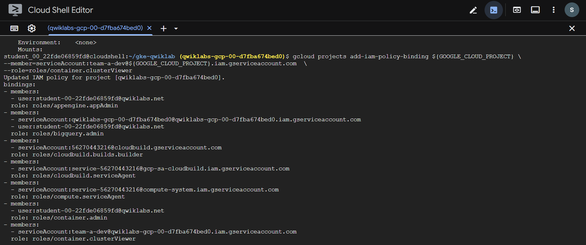
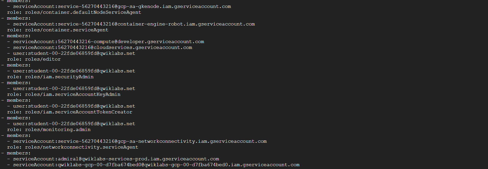
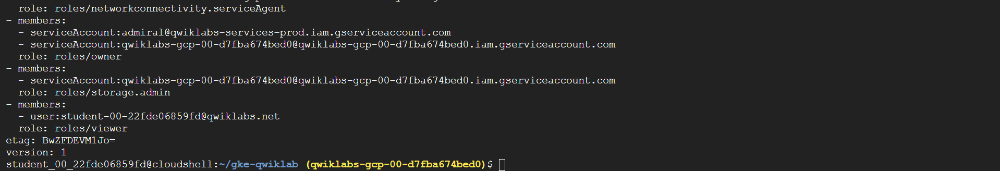

---

## 🛡️ Kubernetes RBAC

Within a cluster, access to any resource type (pods, services, deployments, etc) is defined by either a **role** or a **cluster role**. Only roles are allowed to be scoped to a namespace. While a role will indicate the resources and the action allowed for each resource, a **role binding** will indicate to what user accounts or groups to assign that access to.

To create a role in the current namespace, specify the resource type as well as the verbs that will indicate what type of action that will be allowed.

Roles with single rules can be created with `kubectl create`:
```bash
kubectl create role pod-reader
--resource=pods --verb=watch --verb=get --verb=list
```

Roles with multiple rules can be created using a yaml file. An example file is provided within the files you downloaded earlier in the lab.

Inspect the yaml file:
```bash
cat developer-role.yaml
```

Sample output:
```nginx
apiVersion: rbac.authorization.k8s.io/v1
kind: Role
metadata:
namespace: team-a
name: developer
rules:

apiGroups: [""]
resources: ["pods", "services", "serviceaccounts"]
verbs: ["update", "create", "delete", "get", "watch", "list"]

apiGroups:["apps"]
resources: ["deployments"]
verbs: ["update", "create", "delete", "get", "watch", "list"]
```

Apply the role above:
```bash
kubectl create -f developer-role.yaml
```

Create a role binding between the team-a-developers serviceaccount and the developer-role:
```bash
kubectl create rolebinding team-a-developers
--role=developer --user=team-a-dev@${GOOGLE_CLOUD_PROJECT}.iam.gserviceaccount.com
```

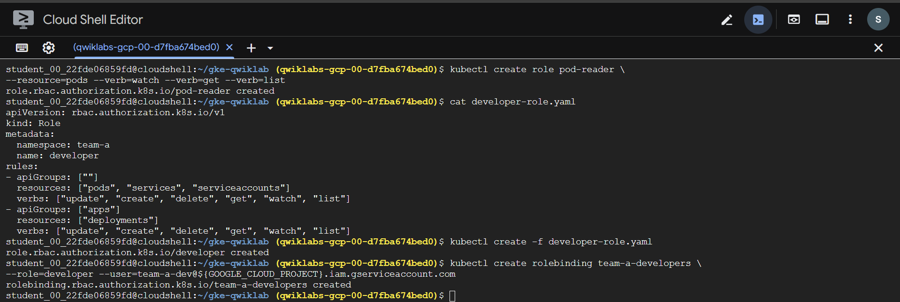

---

## 🧪 Test the rolebinding

Download the service account keys used to impersonate the service account:
```bash
gcloud iam service-accounts keys create /tmp/key.json --iam-account team-a-dev@${GOOGLE_CLOUD_PROJECT}.iam.gserviceaccount.com
```

Click **Check my progress** to verify that you've performed the above task.  
**Access Control in namespaces**

In Cloud Shell click the **+** to open a new tab in your terminal.

Here, run the following to activate the service account. This will allow you to run the commands as the account:
```bash
gcloud auth activate-service-account --key-file=/tmp/key.json
```

Get the credentials for your cluster, as the service account:
```bash
export ZONE=placeholder
gcloud container clusters get-credentials multi-tenant-cluster --zone ${ZONE} --project ${GOOGLE_CLOUD_PROJECT}
```

You’ll see now that as team-a-dev you're able to list pods in the team-a namespace:
```bash
kubectl get pods --namespace=team-a
```

Output:
```bash
NAME READY STATUS RESTARTS AGE
app-server 1/1 Running 0 6d
```

But listing pods in the team-b namespace is restricted:
```bash
kubectl get pods --namespace=team-b
```

Output:
```bash
Error from server (Forbidden): pods is forbidden: User "team-a-dev@a-gke-project.iam.gserviceaccount.com
" cannot list resource "pods" in API group "" in the namespace "team-b": requires one of ["container.pods.list"] permission(s).
```

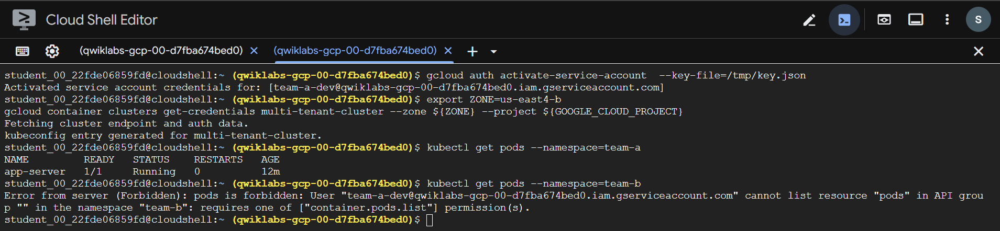

Return to your first Cloud Shell tab or open a new one.

Renew the cluster credentials and reset your context to the team-a namespace:
```bash
export ZONE=placeholder
gcloud container clusters get-credentials multi-tenant-cluster --zone ${ZONE} --project ${GOOGLE_CLOUD_PROJECT}
```

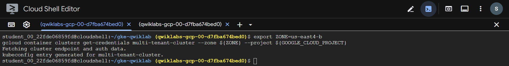

---

# 🌐 Task 4: Resource Quotas

When working in a multi-tenant Kubernetes cluster, it's important to prevent users from consuming more resources than allowed. A ResourceQuota object sets limits on resource consumption within a namespace.

Quotas may restrict:
- 🔢 Number of objects (pods, services, statefulsets, etc.)
- 💾 Total storage (PVCs, ephemeral storage, storage classes)
- 🧮 Compute resources (CPU and memory)

## 🧪 Example: Limiting Pod and LoadBalancer Count

Apply a quota that limits team-a to:
- 2 pods
- 1 LoadBalancer service
```bash
kubectl create quota test-quota \
--hard=count/pods=2,count/services.loadbalancers=1 --namespace=team-a
```

## 🧩 Test Pod Limit
✔️ Create second pod in team-a:
```bash
kubectl run app-server-2 --image=quay.io/centos/centos:9 --namespace=team-a -- sleep infinity
```

❌ Try to create a third pod:
```bash
kubectl run app-server-3 --image=quay.io/centos/centos:9 --namespace=team-a -- sleep infinity
```

Expected error:
```bash
Error from server (Forbidden): pods "app-server-3" is forbidden: exceeded quota: test-quota, requested: count/pods=1, used: count/pods=2, limited: count/pods=2
```

🔍 Check Quota Status
```bash
kubectl describe quota test-quota --namespace=team-a
```

Example output:
```nginxx
Resource                      Used  Hard
--------                      ----  ----
count/pods                    2     2
count/services.loadbalancers  0     1
```

## ✏️ Update the Pod Limit (Increase to 6 Pods)

Open the quota in an editor:
```bash
export KUBE_EDITOR="nano"
kubectl edit quota test-quota --namespace=team-a
```

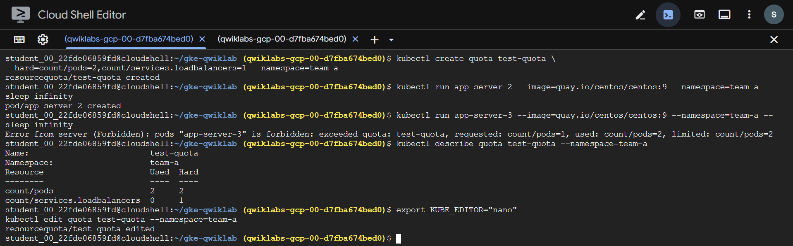

Update:
```bash
spec:
  hard:
    count/pods: "6"
    count/services.loadbalancers: "1"
```
Save (CTRL+X, Y, ENTER).

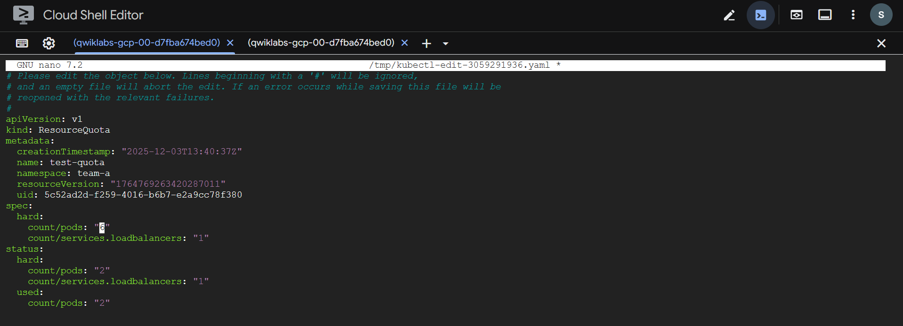

Recheck the quota:
```bash
kubectl describe quota test-quota --namespace=team-a
```

Expected:
```bash
count/pods   2 / 6
```

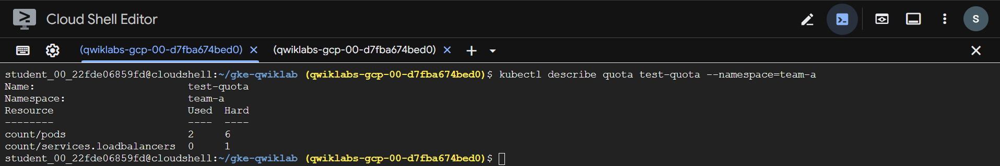

## 🔢 CPU and Memory Quotas

You can also restrict total CPU and memory usage in a namespace.

Sample quota file (cpu-mem-quota.yaml):
```bash
apiVersion: v1
kind: ResourceQuota
metadata:
  name: cpu-mem-quota
  namespace: team-a
spec:
  hard:
    limits.cpu: "4"
    limits.memory: "12Gi"
    requests.cpu: "2"
    requests.memory: "8Gi"
```

Apply the quota:
```bash
kubectl create -f cpu-mem-quota.yaml
```
This enforces:
- Requests total: 2 CPU, 8Gi memory
- Limits total: 4 CPU, 12Gi memory
⚠️ Note: If CPU/memory quotas exist, all new pods must define CPU & memory requests/limits.

## 🐳 Create Pod with Requests and Limits

cpu-mem-demo-pod.yaml:
```yaml
apiVersion: v1
kind: Pod
metadata:
  name: cpu-mem-demo
  namespace: team-a
spec:
  containers:
  - name: cpu-mem-demo-ctr
    image: nginx
    resources:
      requests:
        cpu: "100m"
        memory: "128Mi"
      limits:
        cpu: "400m"
        memory: "512Mi"
```

Create the pod:
```bash
kubectl create -f cpu-mem-demo-pod.yaml --namespace=team-a
```

## 📊 Verify CPU and Memory Quota Usage
```bash
kubectl describe quota cpu-mem-quota --namespace=team-a
```

Expected output:
```powershell
Resource         Used   Hard
--------         ----   ----
limits.cpu       400m   4
limits.memory    512Mi  12Gi
requests.cpu     100m   2
requests.memory  128Mi  8Gi
```

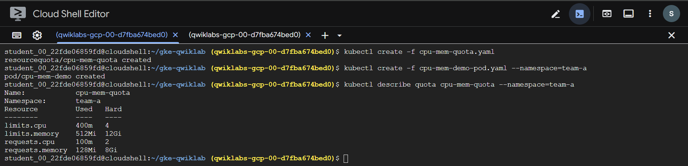

---

# 📊 Task 5: Monitoring GKE and GKE Usage Metering

In multi-tenant GKE clusters, workloads and resource usage vary per tenant. Monitoring and usage metering help you observe consumption and make informed decisions about quotas and cost allocation.

## 📈 Monitoring Dashboard

1️⃣ Open Monitoring
- Go to Navigation menu → View All Products → Monitoring
- Wait for the Monitoring workspace to load.

2️⃣ Open Dashboards
- On the left menu, click Dashboards
- Select GKE


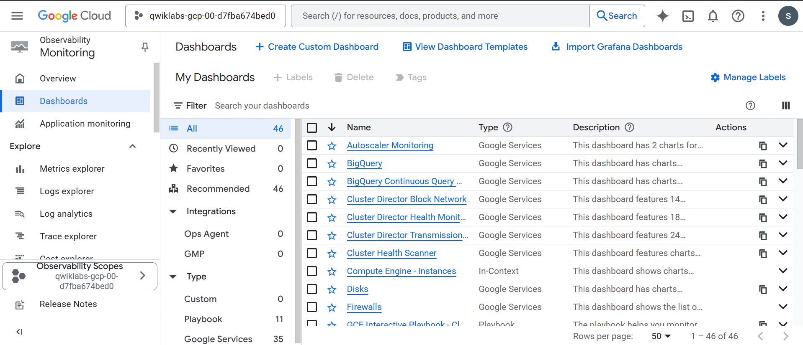

You will see tables summarizing:
- CPU usage
- Memory usage
- Disk utilization
- Namespaces
- Workloads

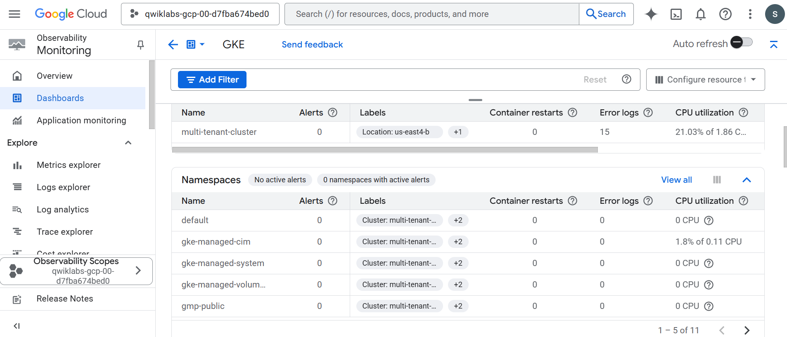

3️⃣ Filter Workloads by Namespace
- Click View All under Workloads
- In ADD FILTER, choose:
  - Namespaces → team-a

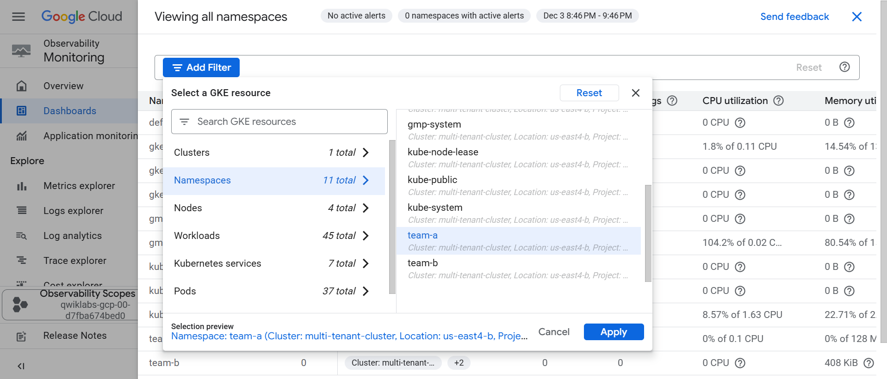

- Click Apply
Only workloads inside team-a will be shown.

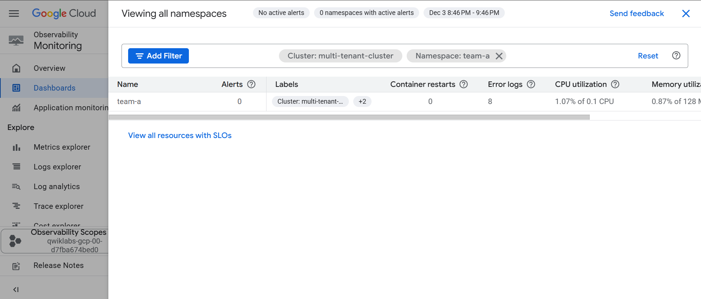

## 📉 Metrics Explorer

1️⃣ Open Metrics Explorer
From the left panel, choose Metrics Explorer.

2️⃣ Select Metric
- Click the Metric dropdown.
- Filter by: Kubernetes Container
- Choose: Container → CPU usage time
- Click Apply

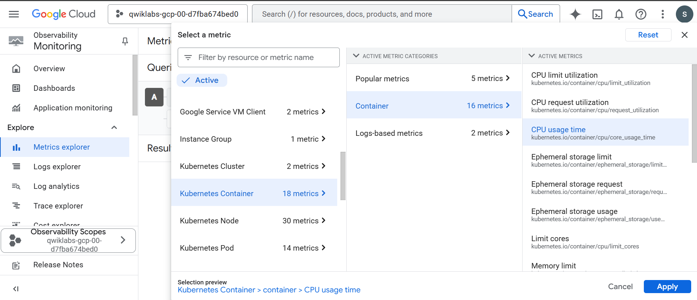
 
3️⃣ Exclude kube-system Namespace
- Click Add filter
  - Label: namespace_name
  - Condition: !=
  - Value: kube-system

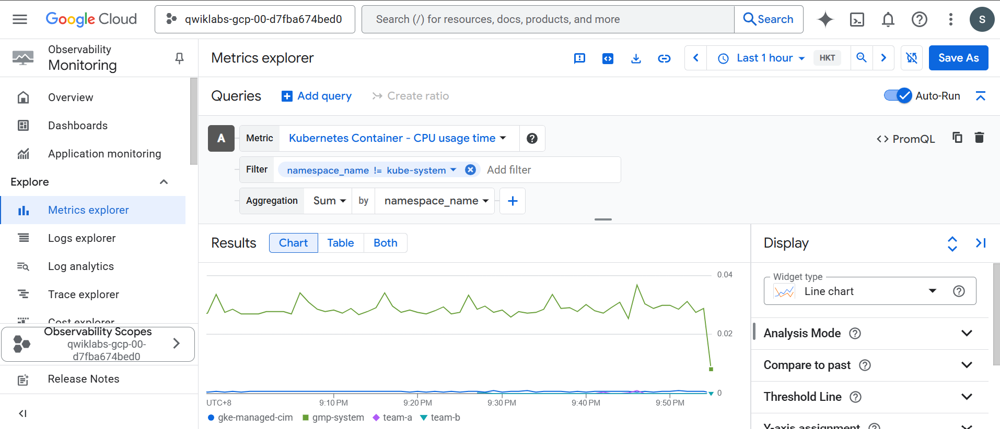
 
4️⃣ Adjust Aggregation
- Aggregation: Sum
- Group by: namespace_name
You'll see a graph of CPU usage time per namespace.

## 🧮 GKE Usage Metering

Usage metering exports cluster usage metrics to BigQuery for detailed cost and resource analysis.
This lab already provides two datasets:
| Dataset           | Description                                                 |
| ----------------- | ----------------------------------------------------------- |
| `cluster_dataset` | Contains GKE-generated usage & resource consumption tables. |
| `billing_dataset` | Contains daily GCP billing export for the project.          |

## ⚙️ Enable GKE Usage Metering
```bash
export ZONE=placeholder
gcloud container clusters \
  update multi-tenant-cluster --zone ${ZONE} \
  --resource-usage-bigquery-dataset cluster_dataset
```

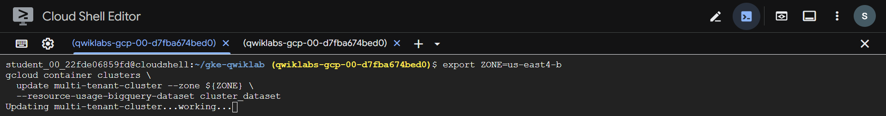
 
## 🧷 Create the GKE Cost Breakdown Table

1️⃣ Set environment variables
```bash
export GCP_BILLING_EXPORT_TABLE_FULL_PATH=${GOOGLE_CLOUD_PROJECT}.billing_dataset.gcp_billing_export_v1_xxxx
export USAGE_METERING_DATASET_ID=cluster_dataset
export COST_BREAKDOWN_TABLE_ID=usage_metering_cost_breakdown
```

2️⃣ Configure query generation variables
```bash
export USAGE_METERING_QUERY_TEMPLATE=~/gke-qwiklab/usage_metering_query_template.sql
export USAGE_METERING_QUERY=cost_breakdown_query.sql
export USAGE_METERING_START_DATE=2020-10-26
```

3️⃣ Generate the query
```bash
sed \
-e "s/\${fullGCPBillingExportTableID}/$GCP_BILLING_EXPORT_TABLE_FULL_PATH/" \
-e "s/\${projectID}/$GOOGLE_CLOUD_PROJECT/" \
-e "s/\${datasetID}/$USAGE_METERING_DATASET_ID/" \
-e "s/\${startDate}/$USAGE_METERING_START_DATE/" \
"$USAGE_METERING_QUERY_TEMPLATE" \
> "$USAGE_METERING_QUERY"
```

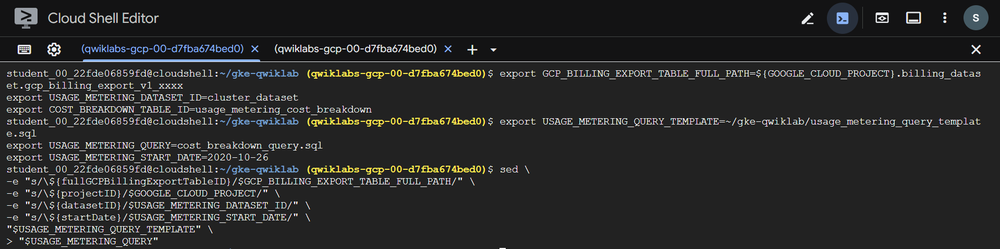
 
4️⃣ Create the scheduled query in BigQuery
```bash
bq query \
--project_id=$GOOGLE_CLOUD_PROJECT \
--use_legacy_sql=false \
--destination_table=$USAGE_METERING_DATASET_ID.$COST_BREAKDOWN_TABLE_ID \
--schedule='every 24 hours' \
--display_name="GKE Usage Metering Cost Breakdown Scheduled Query" \
--replace=true \
"$(cat $USAGE_METERING_QUERY)"
```
Authorize when prompted.

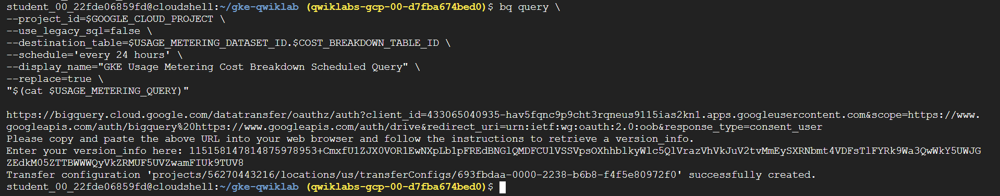
 
## 📊 Create Data Source in Looker Studio

1️⃣ Open Looker Studio
Go to: Data Sources → Create → Data Source

2️⃣ Account Setup
- Select country
- Enter company name (any)

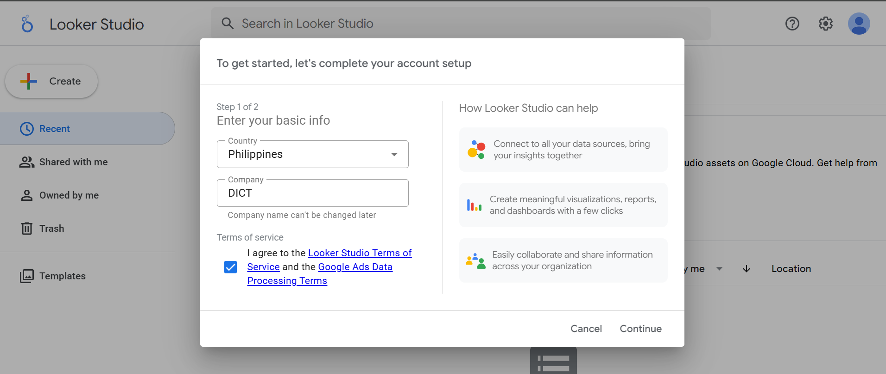
 
- Disable email preferences
- Continue

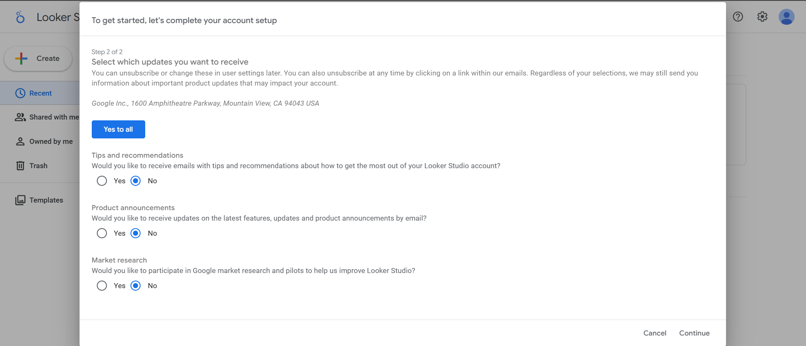
 
3️⃣ Add BigQuery Connector
- Click BigQuery
- Click Authorize

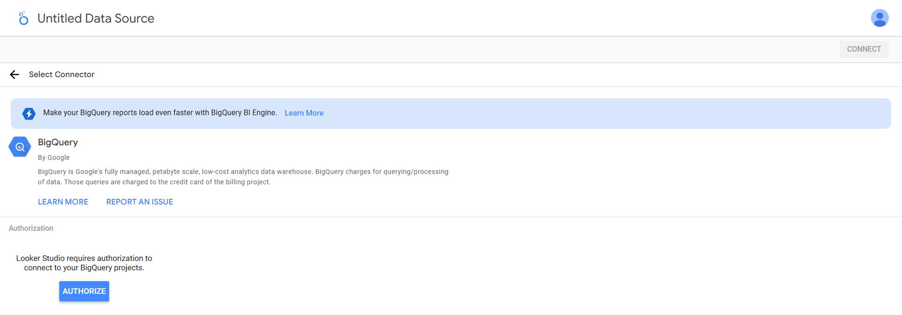
 
4️⃣ Configure Data Source
- Rename: GKE Usage
- Select CUSTOM QUERY
- Select project
- Enter:
```sql
SELECT * FROM `[PROJECT-ID].cluster_dataset.usage_metering_cost_breakdown`
```
- Click CONNECT

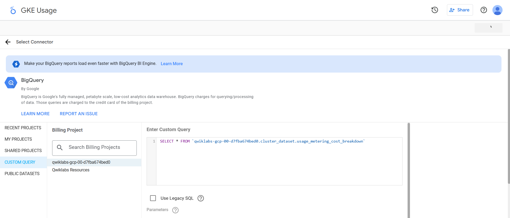
 
## 📝 Create Looker Studio Report
1️⃣ Create a new report
- Click CREATE REPORT
- Click ADD TO REPORT

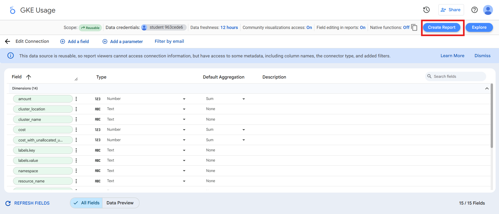
 
2️⃣ Configure Table
| Setting                  | Value              |
| ------------------------ | ------------------ |
| **Date Range Dimension** | `usage_start_time` |
| **Dimension**            | `namespace`        |
| **Metric**               | `cost`             |

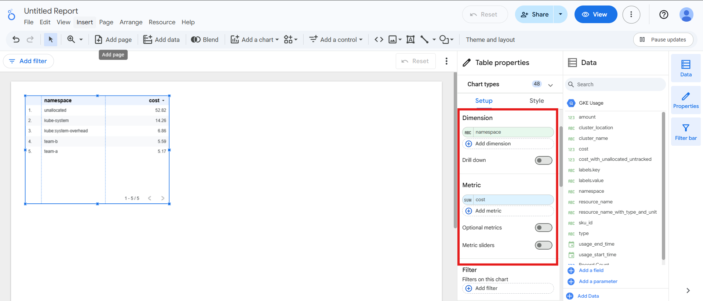
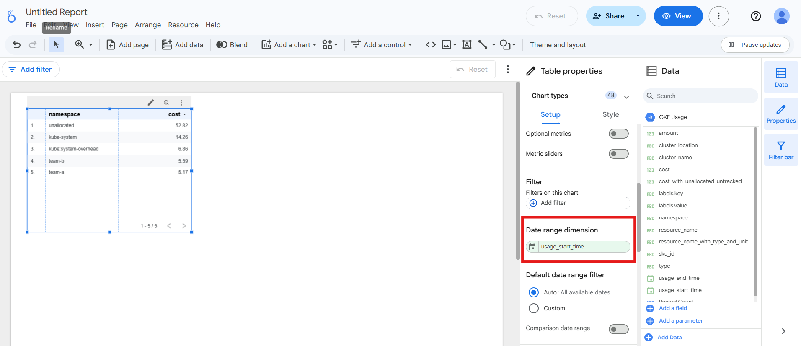
  
3️⃣ Add Filters

Filter 1 — Exclude unallocated namespaces
- Condition: Exclude
- Field: namespace
- Value: unallocated

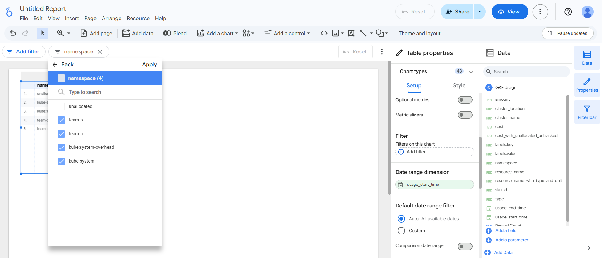
 
Filter 2 — Include requests
- Condition: Include
- Field: type
- Value: requests

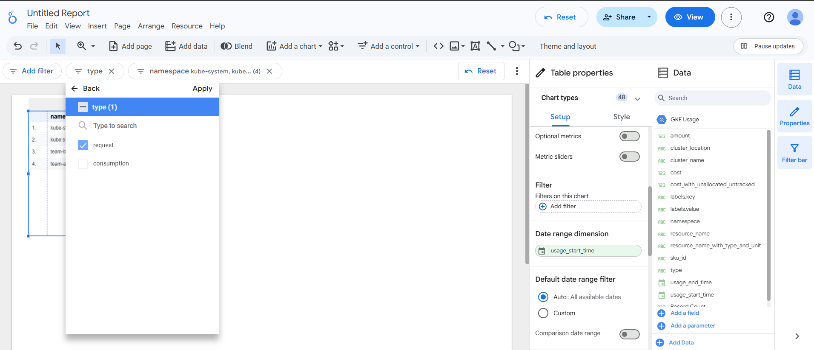
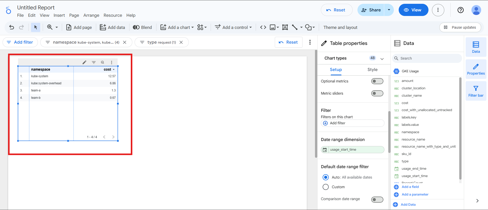
  
## 🥧 Add Visualizations

1️⃣ Pie Chart (Cost per Namespace)
- Right-click the table → Duplicate
- Change chart type → Pie Chart

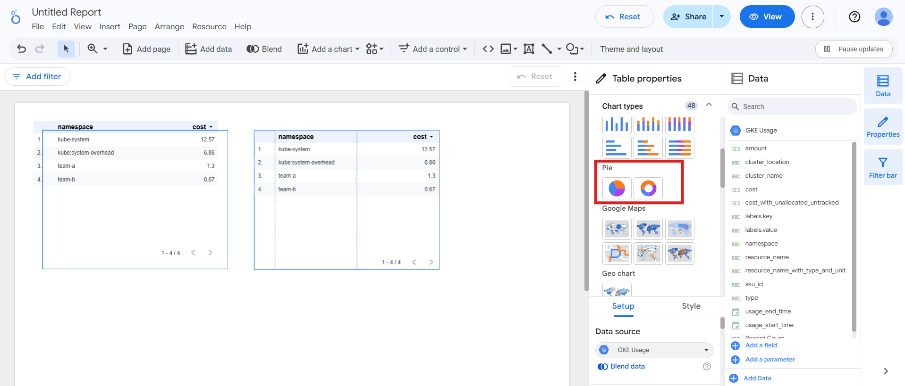
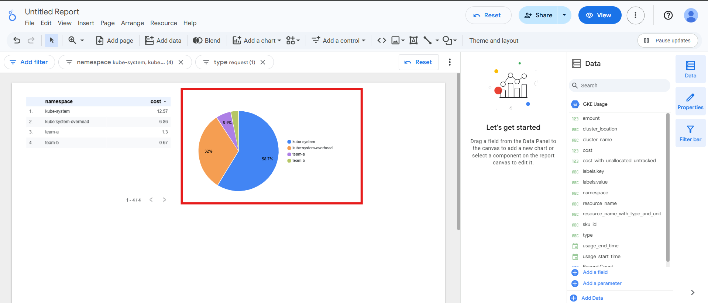
 
 
2️⃣ Donut Chart (Cost by Resource Type)
- Add chart → Donut
- Settings:
  - Date Range Dimension: usage_start_time
  - Dimension: resource_name
  - Metric: cost
  - Apply both filters

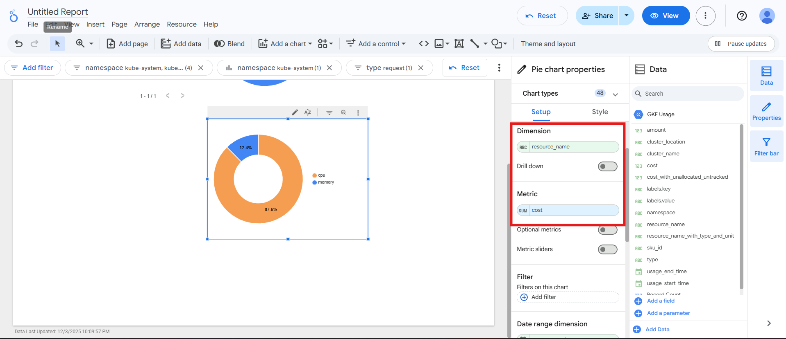
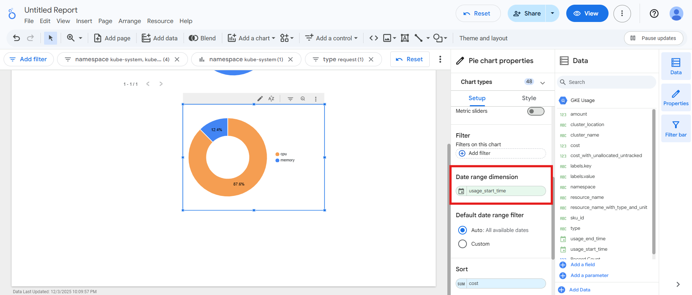

3️⃣ Namespace Filter Control
- Add control → Drop-down list

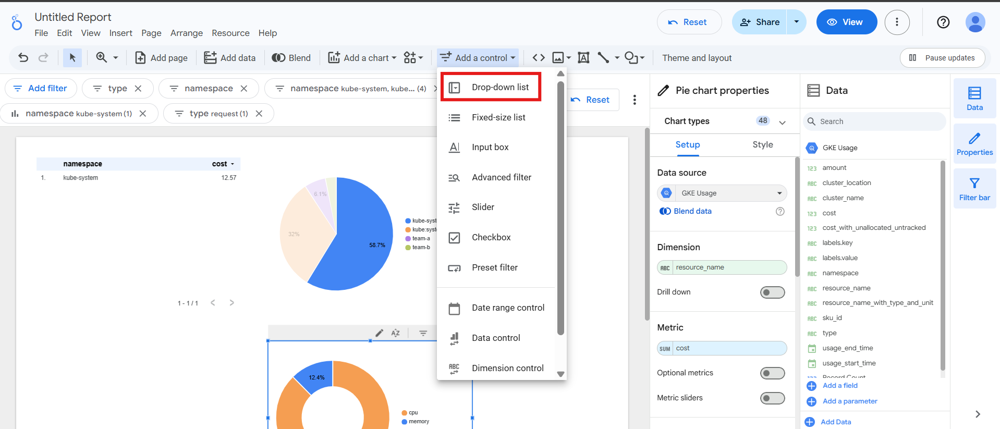
 
- Control field: namespace
- Filter: unallocated

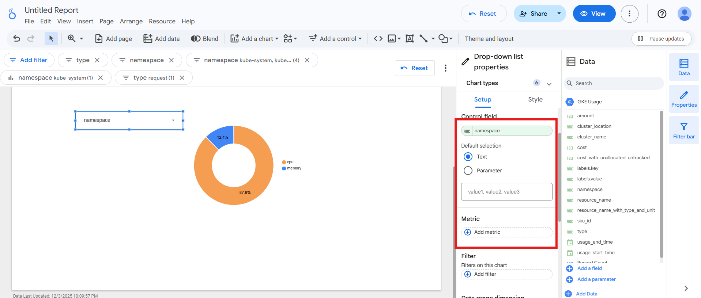
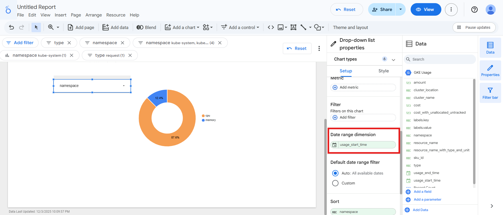

Group Control + Donut Chart
- Select both
- Right-click → Group

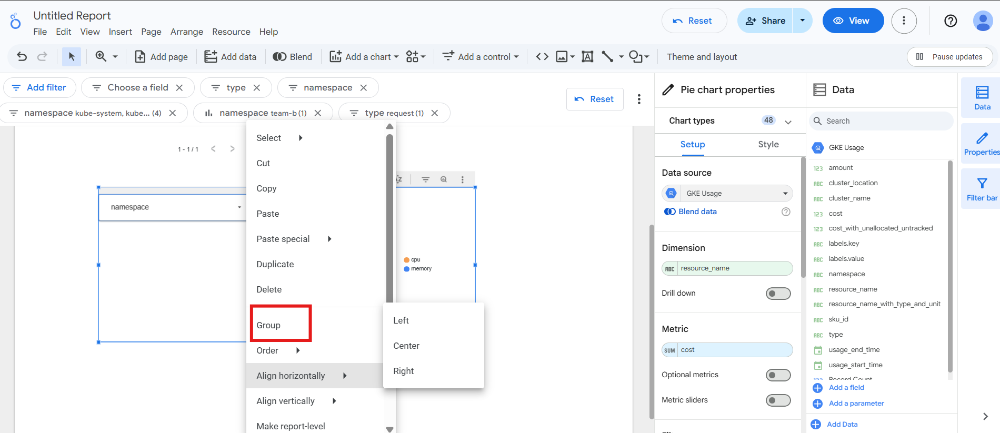

## 👀 Preview and Download Report
- Click View to preview
- From Share → Download report to export as PDF

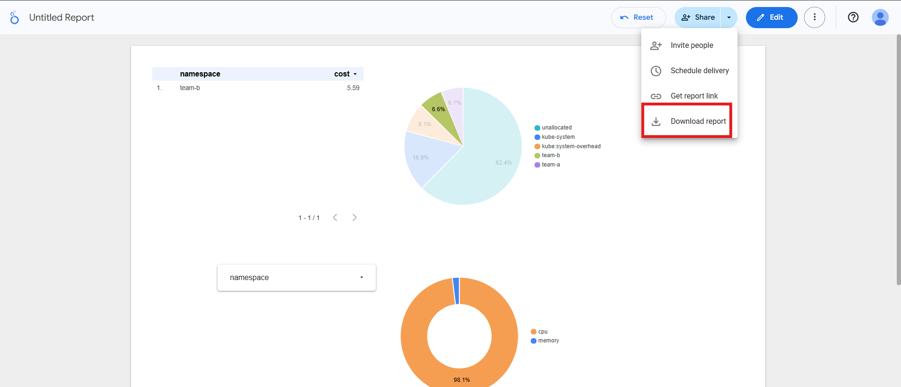

---

## 🎉 **Task Completed**

By leveraging **namespaces**, you’ve successfully configured your clusters for **multi-tenancy**, helping prevent resource underutilization, reduce unnecessary cluster proliferation, and avoid additional costs.

With the use of **monitoring tools** and **GKE metering**, you can now effectively visualize resource utilization per namespace, enabling smarter decisions on **resource quotas**, **cost management**, and overall **cluster optimization**.
