# 🏷️ Exploring Cost-Optimization for GKE Virtual Machines

## 📖 Overview

The underlying infrastructure of a **Google Kubernetes Engine (GKE) cluster** is made up of nodes, which are individual **Compute VM instances**. This lab demonstrates how optimization of your cluster's infrastructure can help **save costs** and lead to a more **efficient architecture** for your applications.

You will learn strategies to maximize utilization (and avoid underutilization) of your infrastructure resources through selecting **properly shaped machine types** for an example workload. In addition, the **geographical location** of your infrastructure also impacts cost. Through this exercise, you will explore how to create a **cost-effective strategy** for managing **higher availability regional clusters**.

---

## 🎯 Objectives

In this lab, you will learn how to:

- Examine Resource Usage of a Deployment  
- Scale Up a Deployment  
- Migrate Your Workload to a Node Pool with an Optimized Machine Type  
- Explore Location Options for your Cluster  
- Monitor Flow Logs between Pods in Different Zones  
- Move a Chatty Pod to Minimize Cross-Zonal Traffic Costs  

---

## 🛠️ Setup and Requirements

### Before you click the **Start Lab** button

1. Read these instructions. **Labs are timed and cannot be paused.** The timer starts when you click Start Lab and shows how long Google Cloud resources are available.  
2. This hands-on lab runs in a **real cloud environment**, not a simulation. Temporary credentials are provided to access Google Cloud for the lab duration.

### You need:

- Access to a **standard internet browser** (Chrome recommended).  
> **Note:** Use an Incognito/private browser window to prevent conflicts between your personal account and the student account.  
- Time to complete the lab (once started, you cannot pause).  
> **Important:** Use **only the student account** for this lab to avoid personal charges.  

---

## 🚀 How to Start Your Lab and Sign in to Google Cloud Console

1. Click the **Start Lab** button. If prompted, select your payment method.  
2. On the **Lab Details** pane, you will find:  
   - **Open Google Cloud Console** button  
   - **Time remaining**  
   - **Temporary credentials**  
   - Other information to step through the lab  

3. Click **Open Google Cloud Console** (or right-click → Open Link in Incognito Window).  

> The lab will spin up resources and open another tab showing the **Sign in page**.  
> 💡 **Tip:** Arrange tabs side-by-side in separate windows.

4. If the **Choose an account** dialog appears, click **Use Another Account**.  
5. Copy the **Username** from the Lab Details pane and paste it into the Sign in dialog.  
```text
"Username"
```
6. Click **Next**.  
7. Copy the **Password** from the Lab Details pane and paste it into the Welcome dialog.  
```text
"Password"
```
8. Click **Next**.  

> **Important:** Use only the credentials provided by the lab. Do **not** use your personal Google Cloud account.  

9. Click through the following pages:  
   - Accept the **terms and conditions**  
   - Do **not** add recovery options or 2FA (temporary account)  
   - Do **not** sign up for free trials  

> After a few moments, the Google Cloud console will open in this tab.  

- To access Google Cloud products/services, use the **Navigation menu** or type the product/service name in the **Search field**.

---

## ⏳ Lab Cluster Provisioning

- This lab generates a **small GKE cluster** for your use.  
- Provisioning takes **2-5 minutes**.  
- If you see a **blue "resources being provisioned" message** with a loading circle, your cluster is still being created.  

> You can read the next instructions while waiting, but shell commands won't work until resources finish provisioning.

---

# 📝 Task 1: Understanding Node Machine Types

## 🔍 General Overview

A **machine type** is a set of virtualized hardware resources available to a **virtual machine (VM) instance**, including:

- System memory size  
- Virtual CPU (vCPU) count  
- Persistent disk limits  

Machine types are grouped and curated by **families** for different workloads.

---

### 💡 Choosing a Machine Type

When choosing a machine type for your **node pool**, the **general-purpose machine type family** typically offers the **best price-performance ratio** for a variety of workloads.  

The **general-purpose machine types** consist of:

- **N-series**  
- **E2-series**  

A list of machine types includes **E2, N2, N2D, and N1**, along with their specifications such as memory and vCPUs.

> The differences between the machine types **might help your app and they might not**.  

- **E2s** have similar performance to N1s but are **optimized for cost**.  
- Utilizing the **E2 machine type alone** can often help **save on costs**.  

---

### ⚖️ Optimizing for Your Cluster

With a cluster, the most important factor is that **resources are optimized based on your application’s needs**:

- For bigger applications or deployments that need to **scale heavily**, it can be **cheaper to stack workloads on a few optimized machines** rather than spreading them across many general-purpose ones.  
- Understanding the **details of your app** is important for making informed decisions.  
- If your app has **specific requirements**, you can choose a **machine type shaped to fit your app**.

---

In the following section, you will explore a **demo app** and migrate it to a **node pool with a well-shaped machine type**.

---

# 📝 Task 2: Choosing the Right Machine Type for the Hello App

## 🔍 Inspect the Hello Demo Cluster's Requirements

On startup, your lab generated a **Hello Demo Cluster** with **two E2 medium nodes** (2 vCPU, 4GB memory). This cluster is deploying **one replica** of a simple web application called **Hello App**, a web server written in Go that responds to all requests with:
```text
Hello, World!
```


### Steps to Inspect Your Cluster

1. Wait until your lab finishes provisioning.  
2. In the **Cloud Console**, click the **Navigation Menu → Kubernetes Engine**.  
3. In the **Kubernetes Clusters** window, select your **hello-demo-cluster**.  

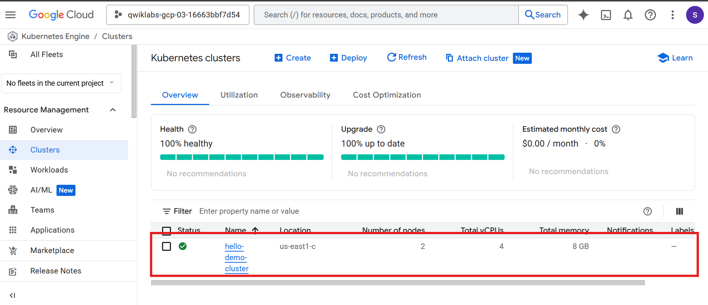

4. Click the **Nodes** tab.  

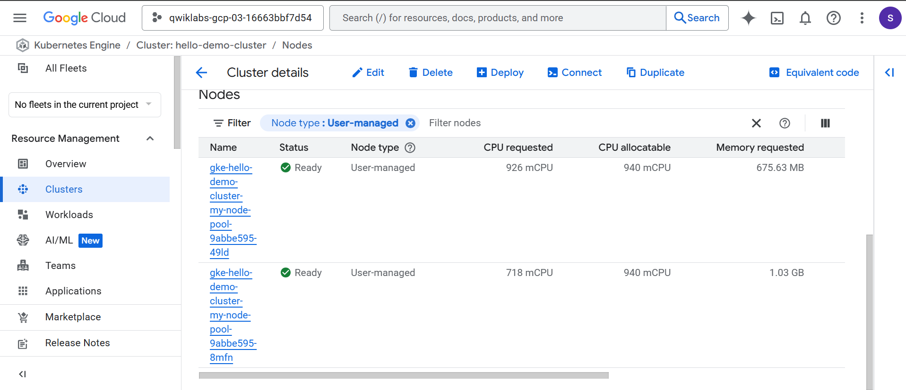

You should now see a list of your cluster's nodes along with:

- Status  
- CPU requests  
- Namespace  

> Observe how GKE has utilized the cluster’s resources. You can see how much **CPU and memory** is requested by each node and how much could potentially be allocated.

5. Click the first node of your cluster.  
6. Look at the **Pods** section. You should see your **hello-server pod** in the **default namespace**.  
   - If not, select the second node instead.  
> The hello-server pod requests **400m CPU**, along with other **kube-system pods** running essential services like monitoring.

   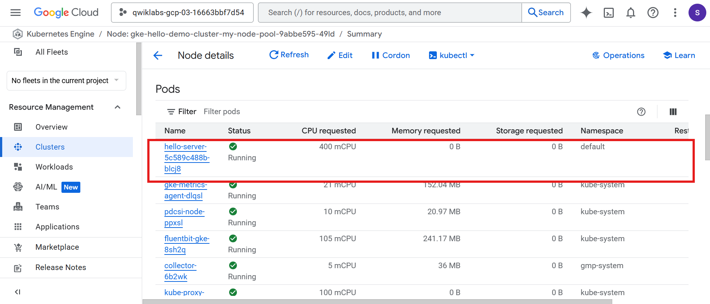

7. Press **Back** to return to the previous **Nodes** page.  

> It takes **two E2-medium nodes** to run one replica of Hello App along with essential kube-system services.  
> While most CPU is used, only about **1/3 of memory** is utilized.  

> For a **static workload**, a custom-shaped machine type could save costs. However, clusters often need to **scale workloads dynamically**.

---

## ⚡ Activate Cloud Shell

**Cloud Shell** provides a VM with development tools and a persistent 5GB home directory.

1. Click **Activate Cloud Shell** icon in the Cloud Console.  
2. Continue through the information windows and authorize Cloud Shell to use your credentials.  
3. Verify your project:

```bash
gcloud config list project
```

Output example:
```ini
[core]
project = "PROJECT_ID"
```

4. (Optional) List active account:
```bash
gcloud auth list
```

Output example:
```vbnet
ACTIVE: *
ACCOUNT: "ACCOUNT"
```

## ⬆️ Scale Up Hello App

Access Cluster Credentials
```bash
gcloud container clusters get-credentials hello-demo-cluster --zone "ZONE"
```

Scale the Deployment
```bash
kubectl scale deployment hello-server --replicas=2
```

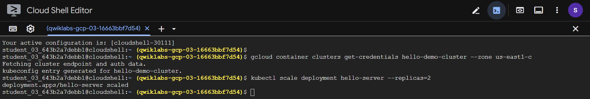

> Back in the Console → Kubernetes Engine → Workloads, you may see Does not have minimum availability error due to Insufficient CPU.

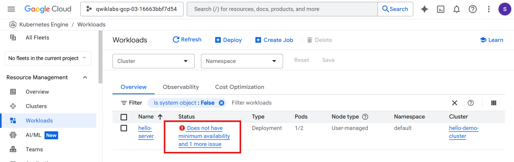
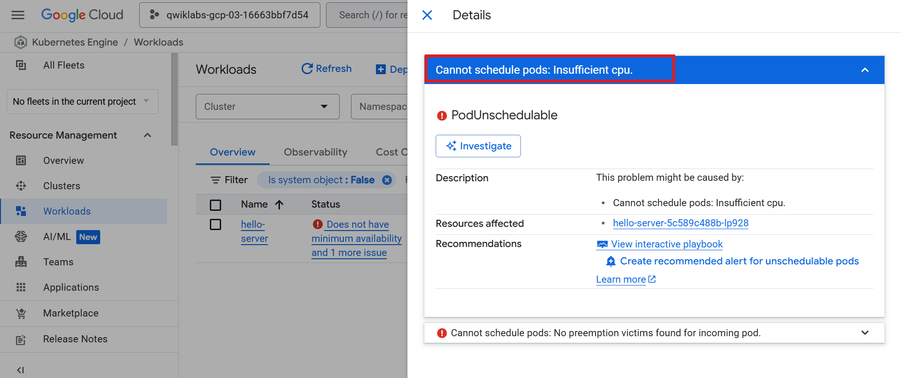

Increase Node Pool
```bash
gcloud container clusters resize hello-demo-cluster --node-pool my-node-pool \
    --num-nodes 3 --zone "ZONE"
```

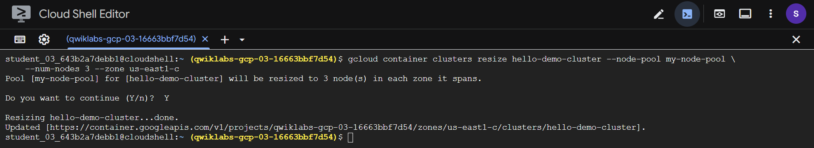

> Type `y` to continue. Refresh the Workloads page until hello-server status = OK.

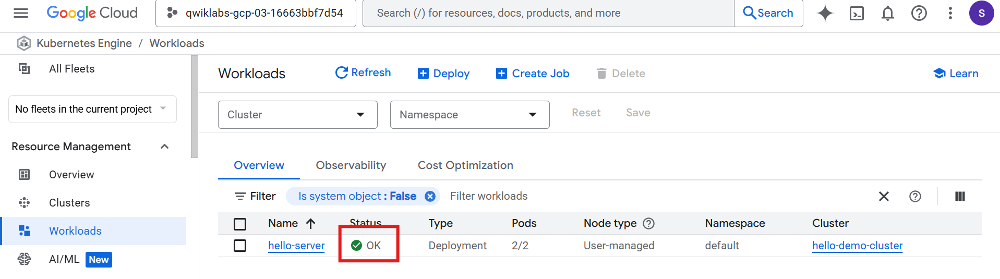

## 🔎 Examine Cluster Utilization
- Navigate to Nodes tab of your cluster.
- Observe resource utilization:
  - One node uses most memory
  - Two nodes have unused memory
> Scaling more replicas may trigger new nodes with ~600m CPU requests.

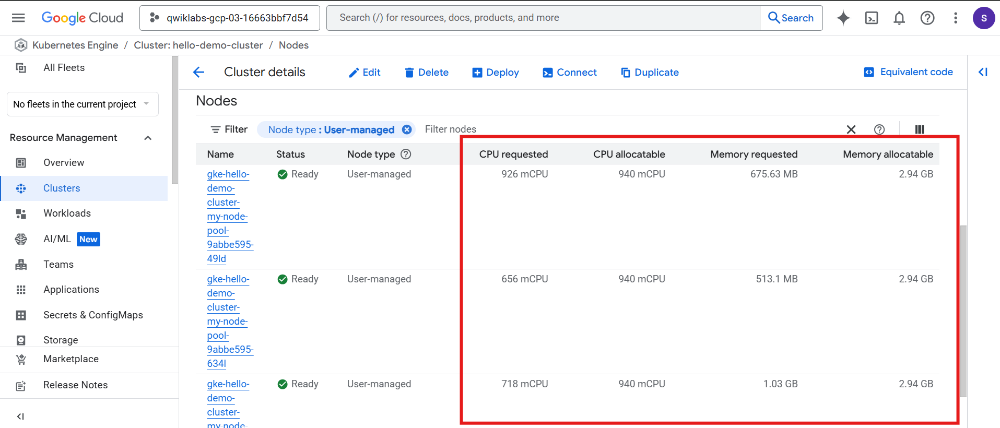

## ⚖️ Binpacking Problem
- Binpacking: fitting items of various volumes into limited bins efficiently.
- In Kubernetes: fit applications (CPU/memory) efficiently into cluster nodes.
- Current Hello Demo Cluster is not efficient in binpacking. Optimized machine types improve cost-efficiency.
> Note: Real clusters run multiple apps. Multiple GKE Node Pools allow managing different machine types.

## 🛠️ Migrate to Optimized Node Pool
Create Larger Node Pool
```bash
gcloud container node-pools create larger-pool \
  --cluster=hello-demo-cluster \
  --machine-type=e2-standard-2 \
  --num-nodes=1 \
  --zone="ZONE"
```

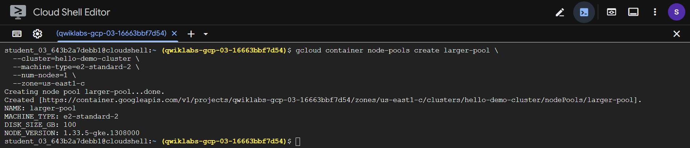

Migrate Pods
1. Cordon old node pool
```bash
for node in $(kubectl get nodes -l cloud.google.com/gke-nodepool=my-node-pool -o=name); do
  kubectl cordon "$node";
done
```

2. Drain old node pool
```bash
for node in $(kubectl get nodes -l cloud.google.com/gke-nodepool=my-node-pool -o=name); do
  kubectl drain --force --ignore-daemonsets --delete-emptydir-data --grace-period=10 "$node";
done
```

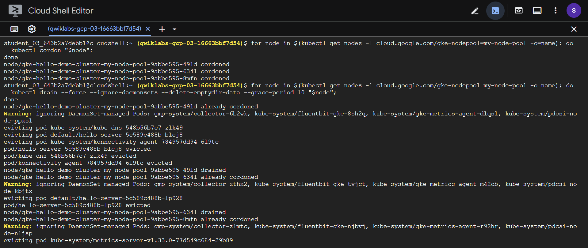
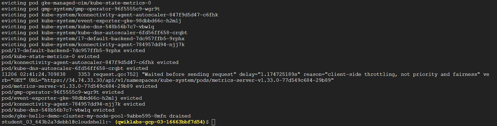

3. Verify pods on new node pool:
```bash
kubectl get pods -o=wide
```

4. Delete old node pool:
```bash
gcloud container node-pools delete my-node-pool --cluster hello-demo-cluster --zone "ZONE"
```
> Type `y` to confirm. Deletion may take ~2 minutes.

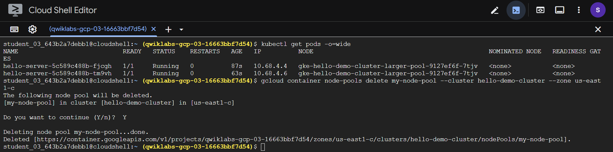

---

## 💲 Cost Analysis
- Previous setup: 3 E2-medium nodes (~$0.10/hour)
- Optimized setup: 1 E2-standard-2 node (~$0.067/hour)
> Savings: ~$0.04/hour, significant over time or at larger scale.
> E2-medium is shared-core, while E2-standard-2 packs workload more efficiently.

- Refresh Nodes tab → check CPU Requested and CPU Allocatable.
- New node could fit another replica or use a custom machine type for further optimization.

## 🌍 Selecting the Appropriate Location for a Cluster
Regions and Zones Overview
- Regions: specific geographical location, with ≥3 zones
- Zones: subdivisions of regions hosting VMs or zonal resources

Considerations:
- Handling failures: distribute resources across multiple zones/regions for high availability
- Network latency: choose region/zone close to users

### Best Practices for Clusters
- Costs vary by region (e.g., us-west2 > us-central1)
- Latency-sensitive production → prioritize performance and efficiency
- Dev environment → prioritize lower costs
> More info: VM instance pricing

### Handling Cluster Availability
- Zonal clusters: single/multi-zone, cheaper, less availability
- Regional clusters: multiple control plane replicas across zones, nodes in each zone → best availability
> Multi-zonal clusters: single control plane replica but multiple zones for workloads.
> Regional clusters: multiple control plane replicas → highest availability, more resource usage.

---

# 📝 Task 3: Managing a Regional Cluster

## ⚙️ Setup

Managing resources across **multiple zones** can lead to **extra costs** due to unnecessary inter-zonal communication.  

In this section, you will:

- Observe network traffic of your cluster  
- Move **chatty pods** (pods generating high traffic between them) to the **same zone**  

---

### Create a Regional Cluster

In **Cloud Shell**, run:

```bash
gcloud container clusters create regional-demo --region="REGION" --num-nodes=1
```
This command will take a few minutes.

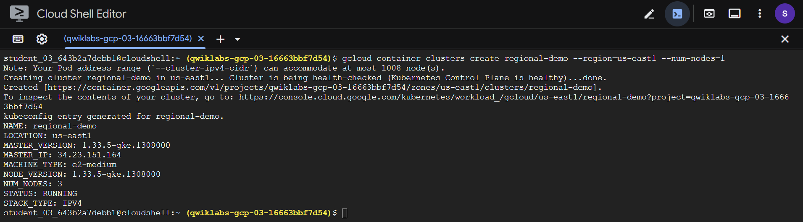

### Create Two Pods on Separate Nodes
Pod 1
Create a manifest:
```bash
cat << EOF > pod-1.yaml
apiVersion: v1
kind: Pod
metadata:
  name: pod-1
  labels:
    security: demo
spec:
  containers:
  - name: container-1
    image: wbitt/network-multitool
EOF
```

Create the pod:
```bash
kubectl apply -f pod-1.yaml
```

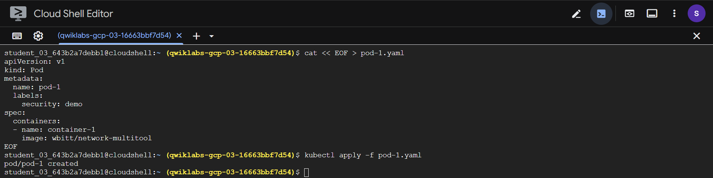

Pod 2
Create a manifest with Pod Anti Affinity:
```bash
cat << EOF > pod-2.yaml
apiVersion: v1
kind: Pod
metadata:
  name: pod-2
spec:
  affinity:
    podAntiAffinity:
      requiredDuringSchedulingIgnoredDuringExecution:
      - labelSelector:
          matchExpressions:
          - key: security
            operator: In
            values:
            - demo
        topologyKey: "kubernetes.io/hostname"
  containers:
  - name: container-2
    image: us-docker.pkg.dev/google-samples/containers/gke/hello-app:1.0
EOF
```

### Create the pod:
```bash
kubectl apply -f pod-2.yaml
```
> The Anti Affinity ensures pod-2 is not scheduled on the same node as pod-1.
> Pod Affinity is used to ensure pods are scheduled together, Pod Anti Affinity does the opposite.

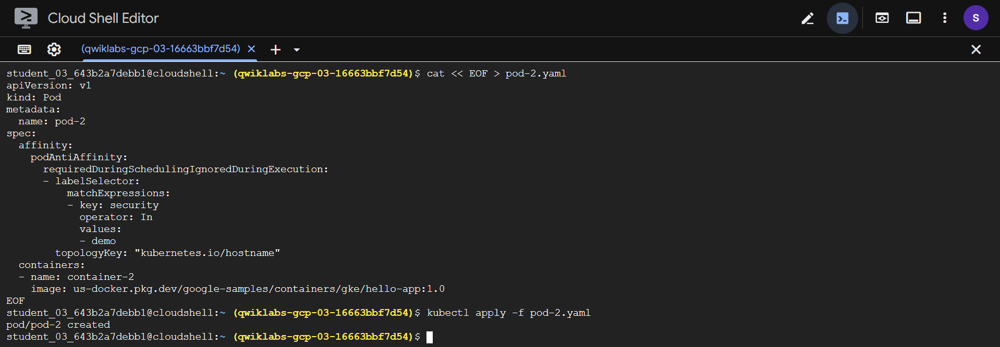

### View pods:
```bash
kubectl get pod pod-1 pod-2 --output wide
```
> Both pods should be Running with internal IPs assigned.

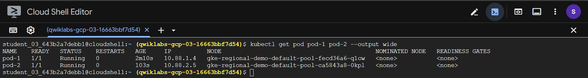

## 🖧 Simulate Traffic

Get a shell to pod-1:
```bash
kubectl exec -it pod-1 -- sh
```

Ping pod-2 (replace [POD-2-IP] with pod-2’s internal IP):
```bash
ping [POD-2-IP]
```
> Take note of the average latency.

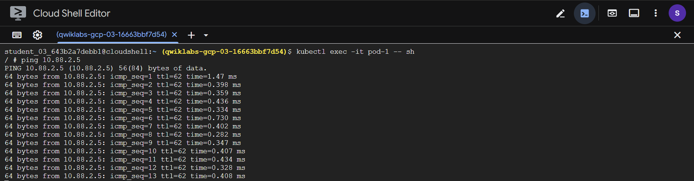

---

### 📈 Examine Flow Logs

1. Enable Network Management API under VPC Network → VPC Flow Logs.

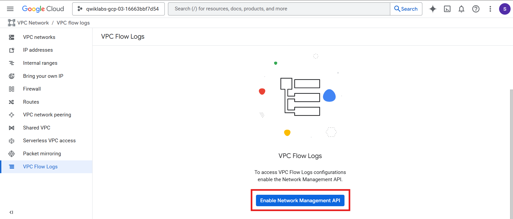

2. Add a VPC flow logs configuration for your subnet.

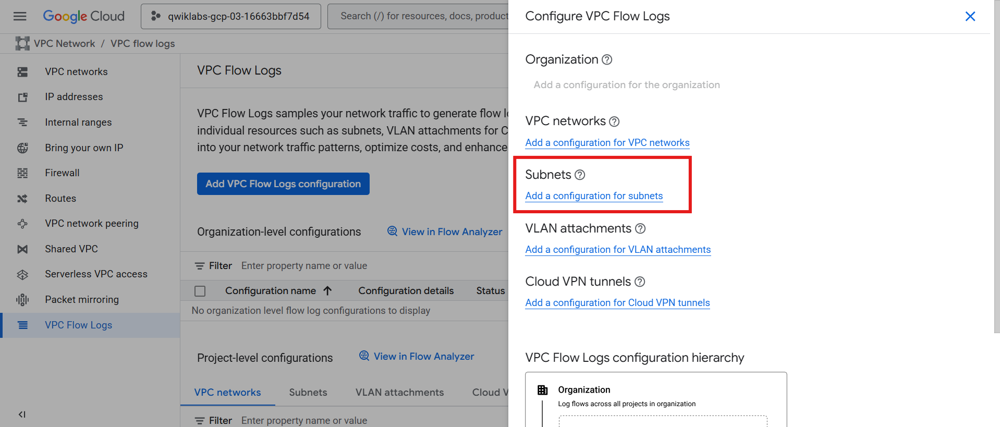
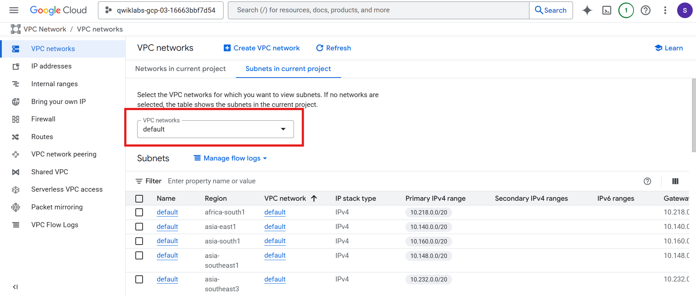
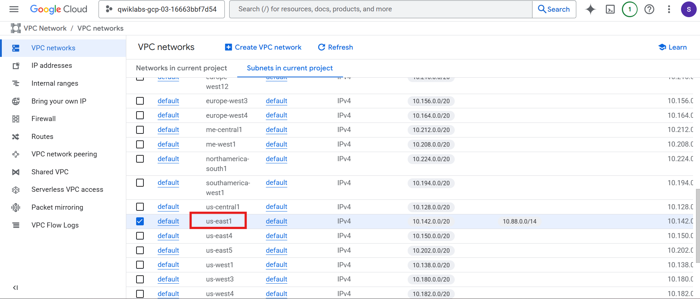
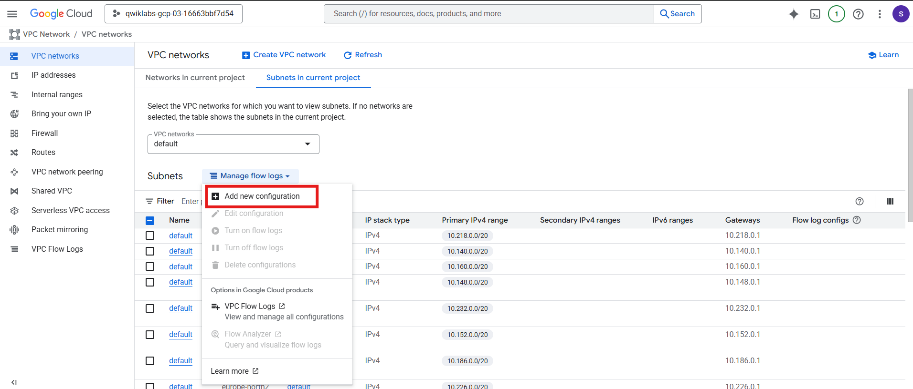
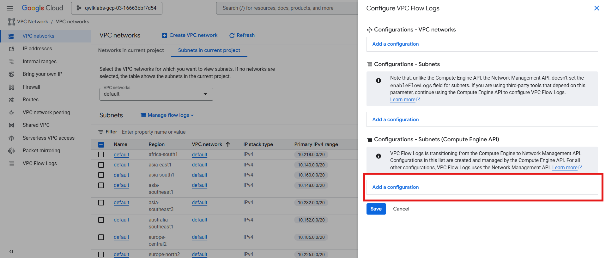

3. Open Cloud Logs Explorer, select vpc_flows, click Apply.

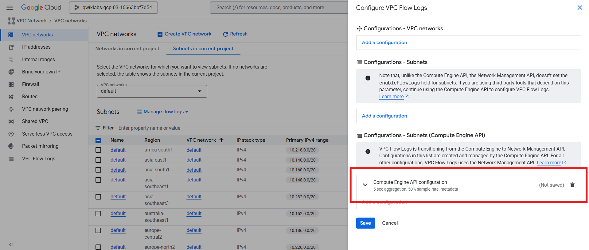


> Logs show traffic sent/received by instances. If logs are missing, replace / with %2F.

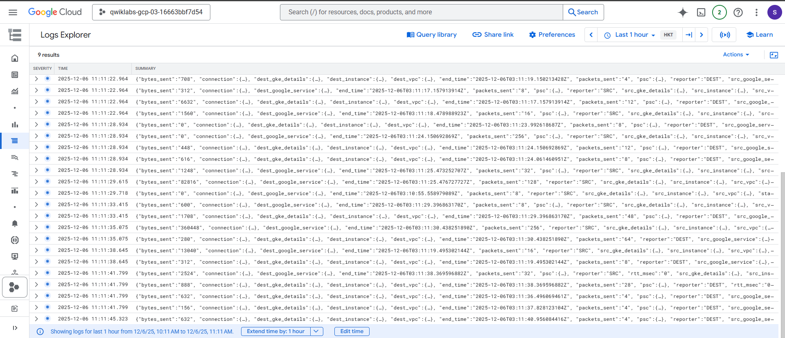

Export Logs to BigQuery
1. Click Actions → Create Sink

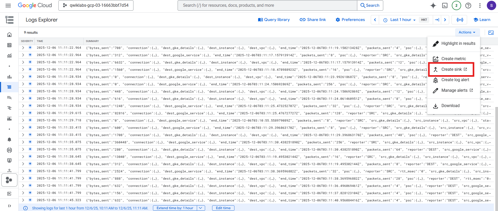

2. Name: FlowLogsSample
3. Sink Service: BigQuery Dataset
4. Dataset: Create new us_flow_logs

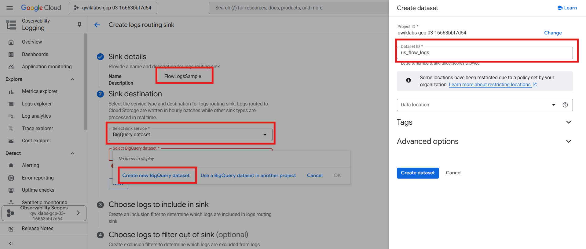

5. Click Create Sink

Inspect dataset:
- Navigation Menu → Analytics → BigQuery
- Select us_flow_logs → table compute_googleapis_com_vpc_flows_xxx
- Query:
```sql
SELECT
  jsonPayload.src_instance.zone AS src_zone,
  jsonPayload.src_instance.vm_name AS src_vm,
  jsonPayload.dest_instance.zone AS dest_zone,
  jsonPayload.dest_instance.vm_name
FROM `us_flow_logs.compute_googleapis_com_vpc_flows_xxx`
```
> Observe traffic between different zones in your regional-demo cluster.

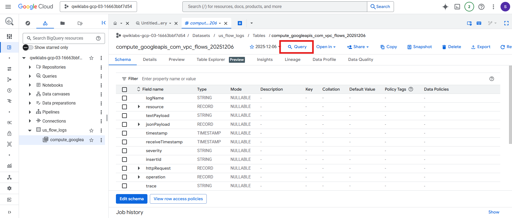
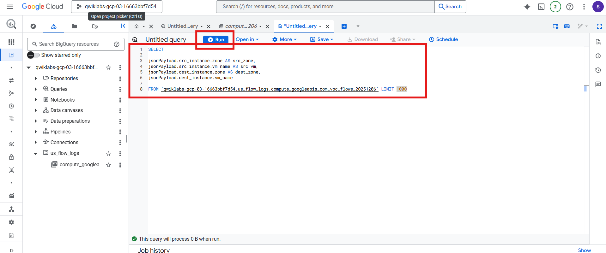
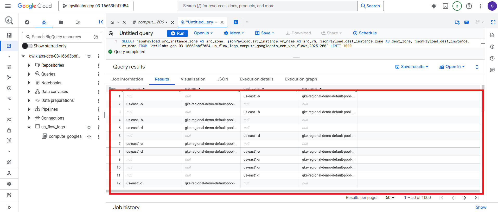

## 🔄 Move a Chatty Pod to Minimize Cross-Zonal Traffic
1. Cancel ping in pod-1 shell: Ctrl + C
2. Exit pod-1 shell:
```bash
exit
```
3. Edit pod-2 manifest to use Pod Affinity:
```bash
sed -i 's/podAntiAffinity/podAffinity/g' pod-2.yaml
```
4. Delete current pod-2:
```bash
kubectl delete pod pod-2
```
5. Recreate pod-2:
```bash
kubectl create -f pod-2.yaml
```

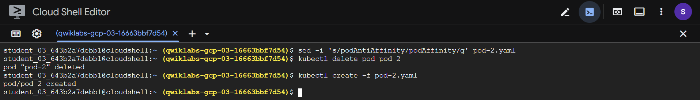

6. Verify pods:
```bash
kubectl get pod pod-1 pod-2 --output wide
````
> Pod-1 and Pod-2 should now run on the same node.

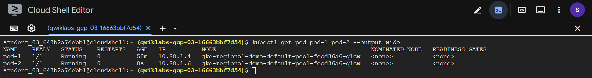

---

### Simulate Traffic Again

Get shell to pod-1:
```bash
kubectl exec -it pod-1 -- sh
```

Ping pod-2:
```bash
ping [POD-2-IP]
```
> Average ping time should be faster now.
> Check BigQuery flow logs → verify no undesired inter-zonal traffic.

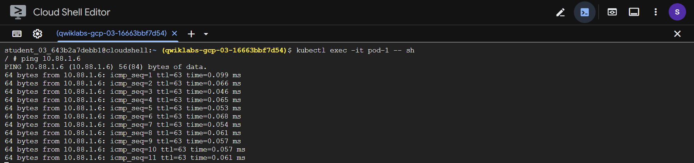

---

##💲 Cost Analysis
- VM-VM egress pricing: $0–$0.01 per GB
- Traffic between pods in different zones: $0.01/GB
- Traffic within the same zone: free
> Moving pods to the same zone reduces inter-zonal traffic costs.

---

