# Cloud IAM: Qwik Start ☁️🔐  

## Overview 📘
Google Cloud's Identity and Access Management (IAM) service lets you create and manage permissions for Google Cloud resources. Cloud IAM unifies access control for Google Cloud services into a single system and provides a consistent set of operations.

In this lab, you sign in with 2 different sets of credentials to experience how granting and revoking permissions works from Google Cloud Project **Owner** and **Viewer** roles.

---

## What you'll learn 🎯
- Assign a role to a second user  
- Remove assigned roles associated with Cloud IAM

---

## Prerequisites 📝
This is an introductory level lab. Little to no prior knowledge of Cloud IAM is expected. Experience with Cloud Storage is helpful but not required.  
Make sure you have a **.txt** or **.html** file available.

For more advanced IAM practice, see the **IAM Custom Roles** lab.

Once you're ready, scroll down and follow the steps to set up your lab environment.

---

## Setup and requirements ⚙️
This lab provides **two sets of credentials** to illustrate IAM policies and the permissions tied to specific roles.

In the **Lab Connection** panel (left side), you will see credentials similar to:

- **Username 1**
- **Username 2**

These represent Cloud IAM identities with different permissions. Their roles define what they can or cannot do in the allocated Google Cloud project.

---

## Sign in to Cloud Console as the first user 👤 (User 1)
1. Click **Open Google Console**. A new tab opens.  
   If asked to *Choose an account*, click **Use another account**.
2. At the Google sign-in page, copy the **Username 1** credential (e.g., `googlexxxxxx_student@qwiklabs.net`) and paste it into **Email or phone** → **Next**.
3. Copy and paste the password from the Lab Connection panel.
4. Click **Next**, then accept the terms of service.  
5. The Cloud Console opens—agree and continue.

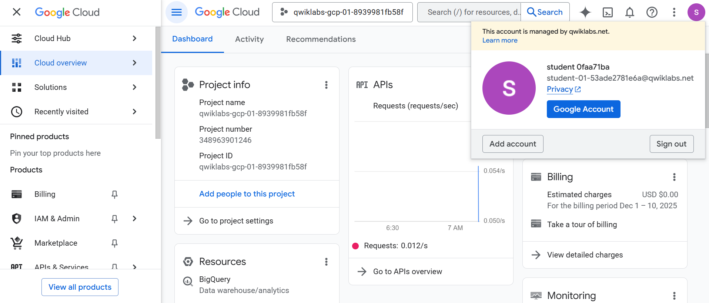

---

## Sign in to Cloud Console as the second user 👤 (User 2)
1. Click **Open Google Console** again. A new tab opens.  
   If prompted to *Choose an account*, click **Use another account**.
2. Copy the **Username 2** credential and paste into **Email or phone** → **Next**.
3. Copy and paste the password from the Lab Connection panel.
4. Click **Next**, then accept the terms.  
5. The Cloud Console opens—agree and continue.

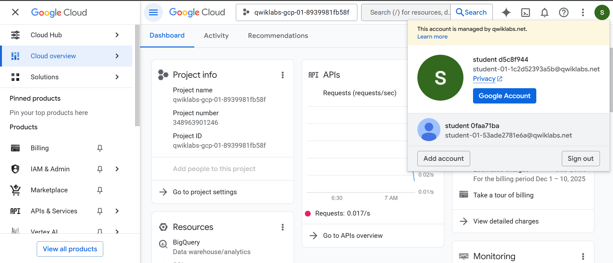

You should now have **two Cloud Console tabs** open—one for each user.

---

## View or reset the user in a browser tab 🔄
Sometimes the active user in a tab may get mixed up or overwritten.

### ✔️ To view which user is signed in:
Hover over your **Avatar** in the top-right corner to see the active username.

### ✔️ To reset the user in a browser tab:
1. Click your **Avatar** → **Sign out**.  
2. In the Lab Connection panel, click **Open Google Console** and sign in again using the correct credentials.

---

# Task 1. Explore the IAM console and project level roles 🔍🔐

## Explore IAM as **Username 1**
1. Return to the **Username 1** Cloud Console page.
2. Go to **Navigation menu > IAM & Admin > IAM**.  
   You are now in the **IAM & Admin** console.
3. Click **+ GRANT ACCESS** at the top of the page.

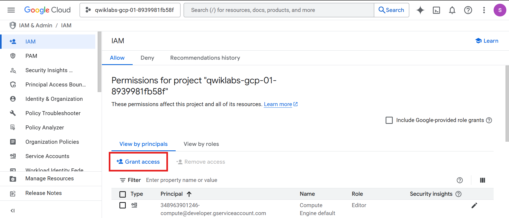

4. Scroll down to **Basic** in the *Select a role* section and mouse over it.

There are three roles:
- **Editor**
- **Owner**
- **Viewer**

These are **primitive roles** in Google Cloud. They set **project-level permissions** and, unless otherwise specified, control access and management to *all* Google Cloud services.

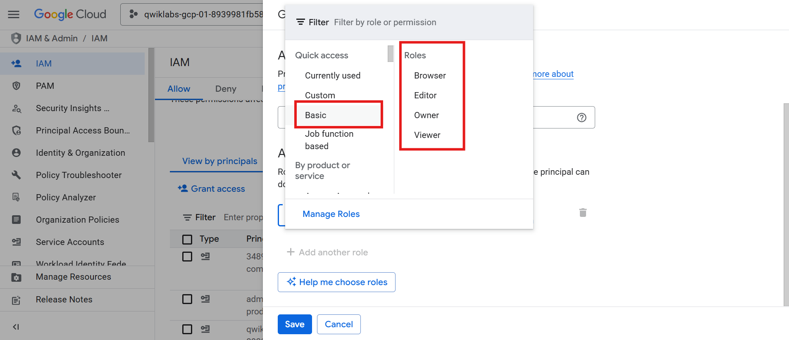

---

## Primitive Role Definitions 📘

The following table summarizes definitions from the Google Cloud IAM documentation (Basic roles):

| **Role Name**     | **Permissions** |
|-------------------|------------------|
| **roles/viewer**  | Permissions for read-only actions that do not affect state, such as viewing (but not modifying) existing resources or data. |
| **roles/editor**  | All viewer permissions, plus permissions for actions that modify state, such as changing existing resources. |
| **roles/owner**   | All editor permissions **plus** abilities to: <br>• Manage roles and permissions for a project and all resources within the project. <br>• Set up billing for a project. |

Since you are able to manage roles and permissions for this project, **Username 1 has Project Owner permissions**.

Click **CANCEL** to exit the *Add principal* panel.

---

## Explore the Editor Role (as **Username 2**) 👤🔍

1. Switch to the **Username 2** Cloud Console.
2. Navigate to **Navigation menu > IAM & Admin > IAM**.
3. Search the table to find **Username 1** and **Username 2** and review their assigned roles.

You should observe:
- **Username 2** has the **Viewer** role.
- The **+ GRANT ACCESS** button is *grayed out*.  
  Attempting to click it displays:  
  **"You need permissions for this action. Required permission(s): resource manager.projects.setIamPolicy".**

This illustrates how IAM roles determine what actions you can or cannot perform.

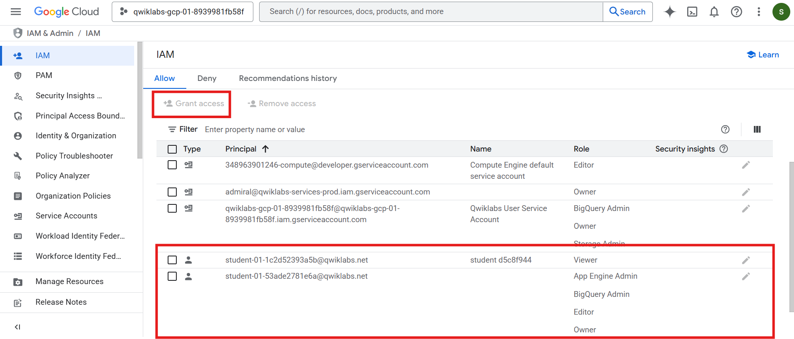

---

Switch back to the **Username 1** console for the next step.

---

# Task 2. Prepare a Cloud Storage bucket for access testing ☁️📦

## Ensure you're using the **Username 1** Cloud Console

---

## Create a bucket 🪣
1. In the Cloud Console, go to **Navigation menu > Cloud Storage > Buckets**.
2. Click **+ CREATE**.

> **Note:** If you get a permissions error, sign out and sign back in using **Username 1** credentials.


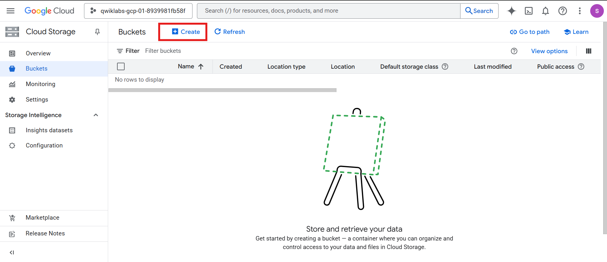


3. Update the following fields (leave all others as default):

| **Property** | **Value** |
|--------------|-----------|
| **Name** | A **globally unique name** (create your own!) → click **CONTINUE** |
| **Location Type** | **Multi-Region** |

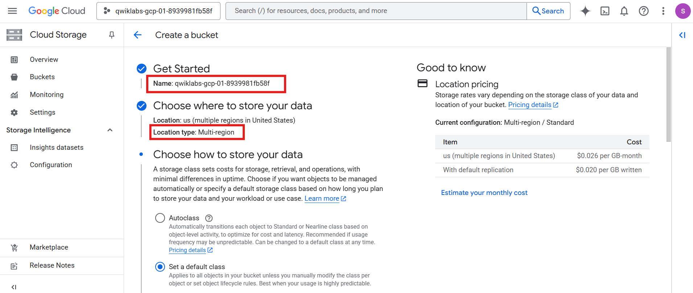

4. Note your bucket name for later steps.
5. Click **CREATE**.
6. If prompted with **Public access will be prevented**, click **Confirm**.

> **Note:** If you get a permissions error, sign out and sign in again using **Username 1**.

---

## Upload a sample file 📄⬆️
1. On the **Bucket Details** page, click **UPLOAD FILES**.

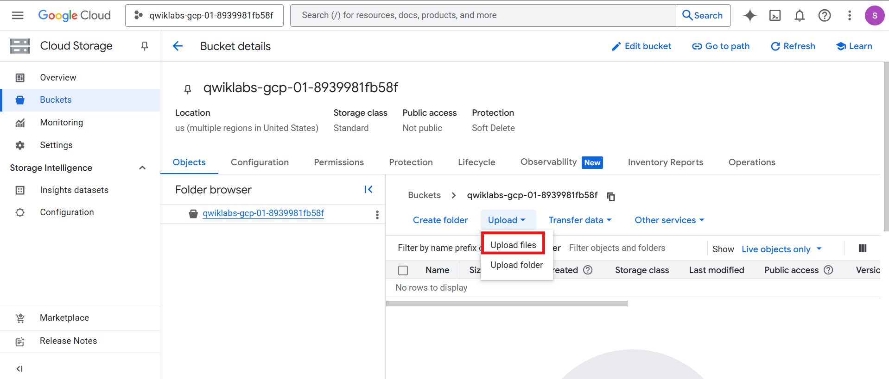

2. Select any **text (.txt)** or **HTML (.html)** file from your computer.
3. Click the **three dots** next to the uploaded file → **Rename**.
4. Rename the file to **sample.txt**.
5. Click **RENAME**.

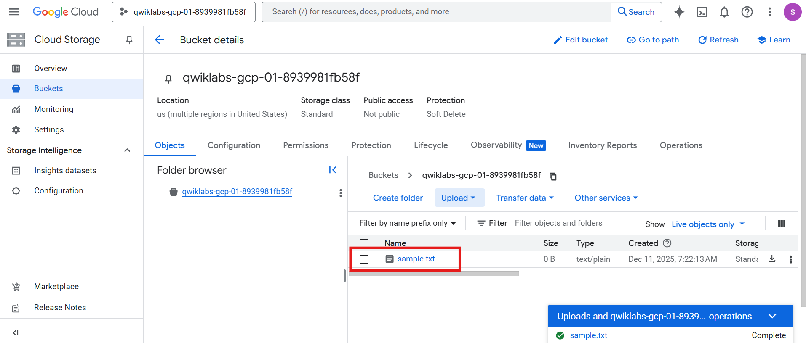

---

## Verify project viewer access (as **Username 2**) 👤🔍
1. Switch to the **Username 2** console.
2. Go to **Navigation menu > Cloud Storage > Buckets**.
3. Verify that this user can **see the bucket**.

Because **Username 2** has the **Viewer** role, they have *read-only* access.  
They can view Cloud Storage buckets and files within the project, but cannot modify them.

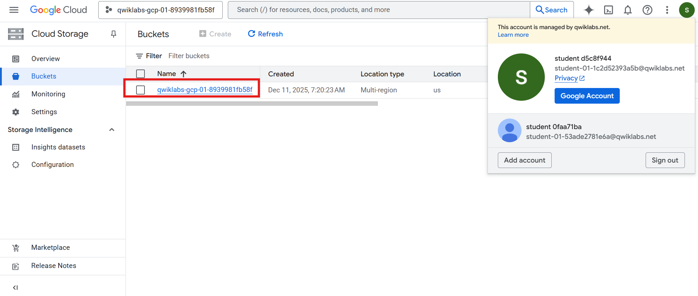

---

# Task 3. Remove project access 🚫🔐

## Remove Project Viewer from **Username 2**
1. Switch to the **Username 1** console.
2. Go to **Navigation menu > IAM & Admin > IAM**.
3. Click the **pencil icon** to the right of **Username 2**.  
   > *You may need to widen your browser window to see the icon.*

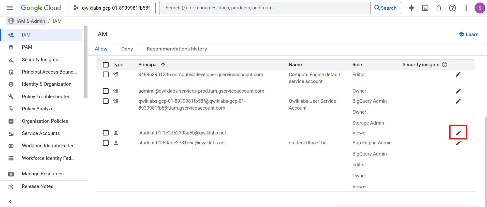

4. Remove the **Project Viewer** role by clicking the **trashcan icon** next to the role.

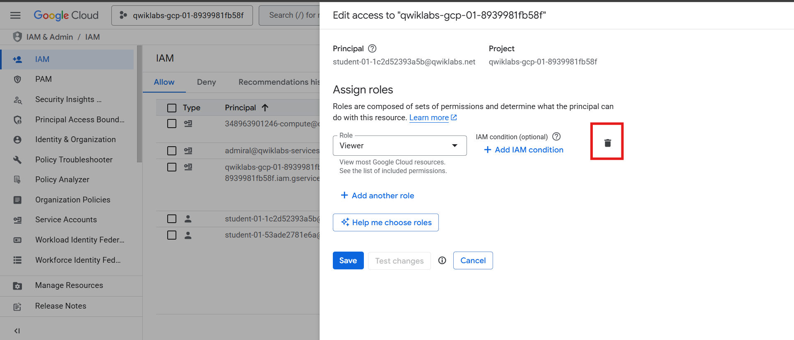

5. Click **SAVE**.

You will notice that **Username 2 disappears from the Members list**, meaning the user now has **no access**.

> ⏱️ **Note:** Permission changes can take up to **80 seconds** to propagate.

---

## Verify that Username 2 has lost access ❌👤
1. Switch to the **Username 2** Cloud Console.  
   Ensure you're still signed in. If you were logged out due to revocation, sign back in with the Username 2 credentials.
2. Navigate to **Navigation menu > Cloud Storage > Buckets**.

You should now see a **permission error**.

> ⏱️ If you don’t see the error yet, wait about **2 minutes** and refresh—permission revocation may take time to propagate.


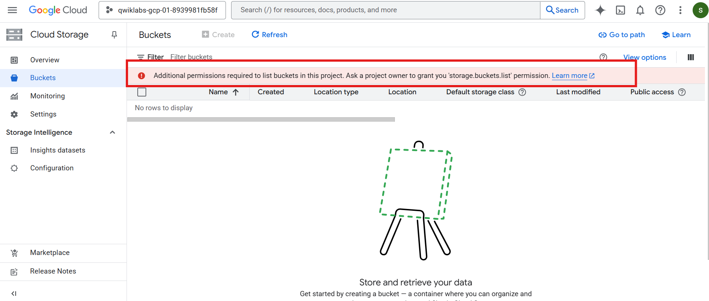

---

# Task 4. Add Cloud Storage permissions 📦🔐

## Grant Cloud Storage access to **Username 2**
1. Copy **Username 2** from the Lab Connection panel.
2. Switch to the **Username 1** console.  
   Ensure you are signed in with Username 1 credentials. If not, sign back in.
3. Navigate to **Navigation menu > IAM & Admin > IAM**.
4. Click **+ GRANT ACCESS**.
5. Paste **Username 2** into the **New principals** field.
6. In **Select a role**, choose:  
   **Cloud Storage > Storage Object Viewer**.
7. Click **SAVE**.

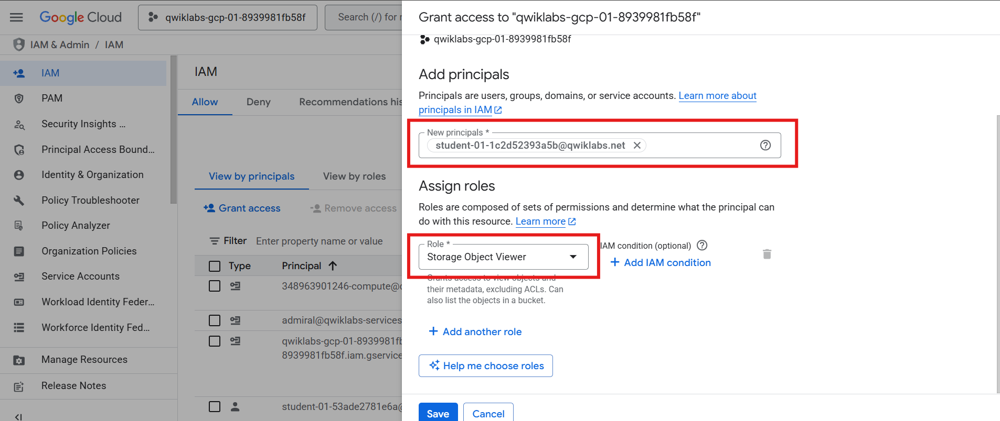

---

## Verify access (as **Username 2**) 👤📄
1. Switch to the **Username 2** console.  
   You should still be on the Storage page.
2. Username 2 **does not** have the Project Viewer role, so they can’t see the project or its resources in the Console UI.  
   But they *do* have the **Storage Object Viewer** role, which grants Cloud Storage–specific access.
3. Click **Activate Cloud Shell** to open the Cloud Shell terminal.  
   If prompted, click **Continue**.
4. Run the following command (replace `[YOUR_BUCKET_NAME]` with your bucket’s name):
```bash
gsutil ls gs://[YOUR_BUCKET_NAME]
```

You should see output similar to:
```ini
gs://[YOUR_BUCKET_NAME]/sample.txt
```
> **Note:** If you see `AccessDeniedException`, wait a minute and retry. IAM changes may take time to propagate.

This confirms that **Username 2 now has view access to the Cloud Storage bucket**. ✔️


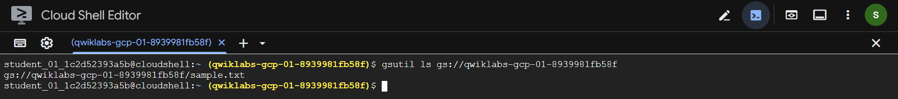

---

# 🎉 Task Completed

In this lab, you practiced **granting and revoking Cloud IAM roles** for a user, explored how permissions affect access to Google Cloud resources, and tested role-specific behavior using Cloud Storage.
