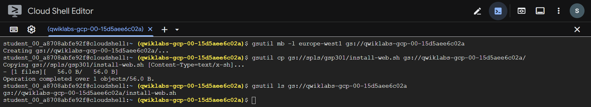
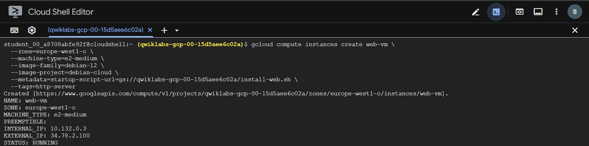
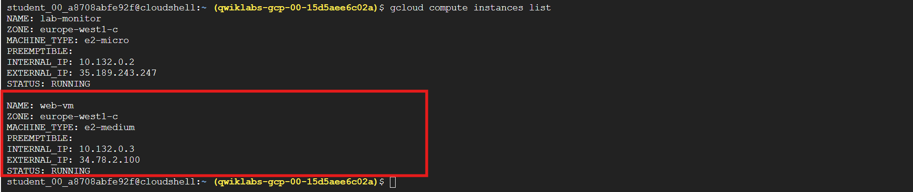
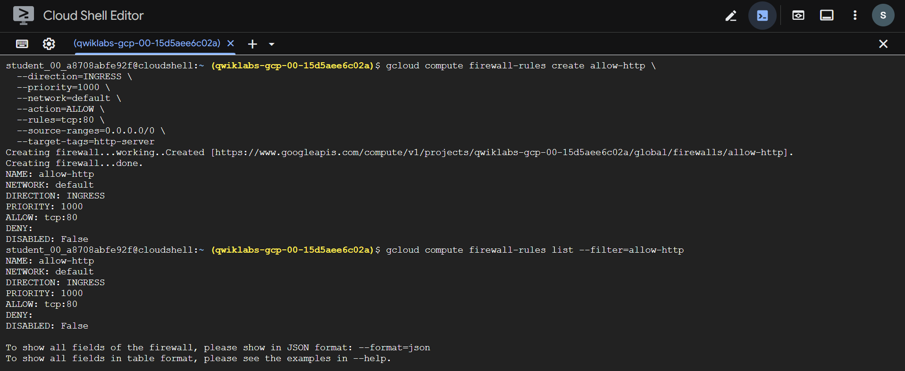
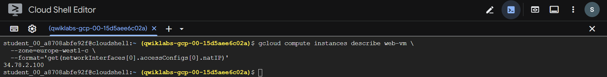
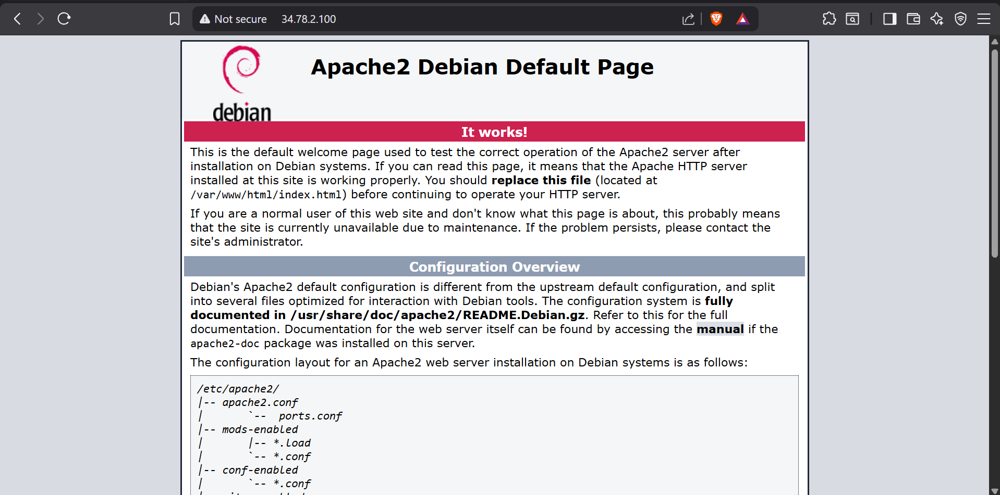

# 🖥️ Deploy a Compute Instance with a Remote Startup Script: Challenge Lab

## 📘 Overview

In a **challenge lab**, you are provided with a real-world scenario and a list of tasks—but **no step-by-step instructions**. You must rely on the skills you’ve already learned to determine how to complete each task.

An **automated scoring system** will validate whether your solution meets the requirements.

⚠️ **Key reminders:**
- No new Google Cloud concepts are taught in challenge labs.
- You are expected to troubleshoot independently.
- Reading error messages and adjusting configurations is part of the challenge.
- To score **100%**, all tasks must be completed **within the time limit**.

🎯 This lab is recommended for learners pursuing:
- **Cloud Architecture: Design, Implement, and Manage** skill badge  
- **Google Cloud Certified Professional Cloud Architect** exam preparation  

Are you ready to take on the challenge? 💪

---

## 🧩 Challenge Scenario

You are responsible for managing how your organization configures its **Google Cloud virtual machines**.

To improve flexibility and maintainability, you decide to **store startup scripts in a Cloud Storage bucket** instead of embedding them directly in instance metadata. This allows startup scripts to be updated centrally without recreating instances.

A sample startup script named **`install-web.sh`** is provided. This script installs the **Apache web server** on a Linux VM.

📦 You can find the script:
- In **Student Resources** on the lab page  
- In a public Cloud Storage bucket:  
```bash
gs://spls/gsp301/install-web.sh
```


---

## 🎯 Your Challenge

Configure a **Linux Compute Engine instance** that:

- Uses a **remote startup script** stored in Cloud Storage
- Automatically installs the **Apache web server**
- Is accessible via **HTTP from the public internet**
- Is created in the specified **ZONE**

🌐 Accessing the instance over HTTP confirms that Apache installed successfully.

---

## ⚠️ Important Notes

- 🚫 **Do NOT modify** any pre-created lab resources  
- Especially the `lab-monitor` Compute Engine instance
- 🔍 Modifying existing resources may cause the lab to **fail validation**
- ⏱️ The lab is **timed** and **cannot be paused**

---

💡 **Lab Outcome:**  
By completing this challenge, you will demonstrate your ability to:
- Use **remote startup scripts**
- Integrate **Cloud Storage** with Compute Engine
- Deploy and expose a web service using **Apache**
- Apply best practices for **VM configuration management**

--- 

## 🪣 Task 1: Create a Storage Bucket

### 🎯 Objective
Create a **Cloud Storage bucket** that will store the **remote startup script** used by the Compute Engine VM.

---

### 🧭 How to Do It (CLI Method)

> 💡 Bucket names must be **globally unique**  
> 💡 Replace `BUCKET_NAME` and `REGION` as required by the lab

For my lab:
-> BUCKET_NAME = Project ID (Which is unique always in Google Skills Labs)
-> REGION = europe-west1 (given by this lab)
-> ZONE = europe-west1-c (given by this lab)

```bash
gsutil mb -l REGION gs://BUCKET_NAME
```

->

```bash
gsutil mb -l europe-west1 gs://qwiklabs-gcp-00-15d5aee6c02a
```

### 2️⃣ Copy the Startup Script into the Bucket

Use the provided public script:
```bash
gsutil cp gs://spls/gsp301/install-web.sh gs://BUCKET_NAME/
```

->

```bash
gsutil cp gs://spls/gsp301/install-web.sh gs://qwiklabs-gcp-00-15d5aee6c02a/
```

### 🔍 Verification
```bash
gsutil ls gs://BUCKET_NAME
```

->

```bash
gsutil ls gs://qwiklabs-gcp-00-15d5aee6c02a
```

You should see:
```ini
install-web.sh
```



---

### ✅ Expected Result
- ✅ Cloud Storage bucket created
- ✅ install-web.sh successfully uploaded

---

## 🖥️ Task 2: Create a VM Instance with a Remote Startup Script
🎯 Objective

Create a Linux VM that runs a remote startup script from Cloud Storage to install Apache.

---

### 🧭 How to Do It (CLI Method)

### 💡 Replace ZONE and BUCKET_NAME accordingly
```bash
gcloud compute instances create web-vm \
  --zone=ZONE \
  --machine-type=e2-medium \
  --image-family=debian-12 \
  --image-project=debian-cloud \
  --metadata=startup-script-url=gs://BUCKET_NAME/install-web.sh \
  --tags=http-server
```

->

```bash
gcloud compute instances create web-vm \
  --zone=europe-west1-c \
  --machine-type=e2-medium \
  --image-family=debian-12 \
  --image-project=debian-cloud \
  --metadata=startup-script-url=gs://qwiklabs-gcp-00-15d5aee6c02a/install-web.sh \
  --tags=http-server
```



---

#### 🔍 Verification

Check VM status:
```bash
gcloud compute instances list
```
> Ensure web-vm is RUNNING.



---

#### ✅ Expected Result

- ✅ VM instance created successfully
- ✅ Startup script executed automatically
- ✅ Apache installed during VM startup

---

## 🔓 Task 3: Create a Firewall Rule to Allow HTTP Traffic (80/tcp)
🎯 Objective

Allow HTTP traffic (port 80) from the internet to the VM.

---

### 🧭 How to Do It (CLI Method)
```bash
gcloud compute firewall-rules create allow-http \
  --direction=INGRESS \
  --priority=1000 \
  --network=default \
  --action=ALLOW \
  --rules=tcp:80 \
  --source-ranges=0.0.0.0/0 \
  --target-tags=http-server
```

---

### 🔍 Verification
```bash
gcloud compute firewall-rules list --filter=allow-http
```



---

### ✅ Expected Result
- ✅ Firewall rule allows inbound HTTP traffic
- ✅ Traffic correctly targets the VM via network tag

---

## 🌍 Task 4: Test That the VM Is Serving Web Content
🎯 Objective

Confirm that Apache is running and serving content over HTTP.

### 🧭 How to Do It
1️⃣ Get the External IP Address
```bash
gcloud compute instances describe web-vm \
  --zone=ZONE \
  --format='get(networkInterfaces[0].accessConfigs[0].natIP)'
```

->

```bash
gcloud compute instances describe web-vm \
  --zone=europe-west1-c \
  --format='get(networkInterfaces[0].accessConfigs[0].natIP)'
```



---

2️⃣ Test via Browser

Open a browser and visit:
```bash
http://EXTERNAL_IP
```



---

### ✅ Expected Result
- ✅ Apache default page is displayed
- ✅ VM is accessible via HTTP from the internet
- ✅ Remote startup script executed successfully

---

## # 🎉 Task Completed

Successfully completed the **Deploy a Compute Instance with a Remote Startup Script: Challenge Lab**! 🚀

### ✅ Accomplished

- 🖥️ **Configured a Linux Compute Engine instance**
- 📦 **Used a remote startup script** stored in Cloud Storage
- 🌐 **Installed the Apache web server automatically** during VM startup
- 🔓 **Enabled HTTP access** so the instance is reachable from the internet
- ✅ **Verified web content delivery**, confirming Apache was installed correctly
