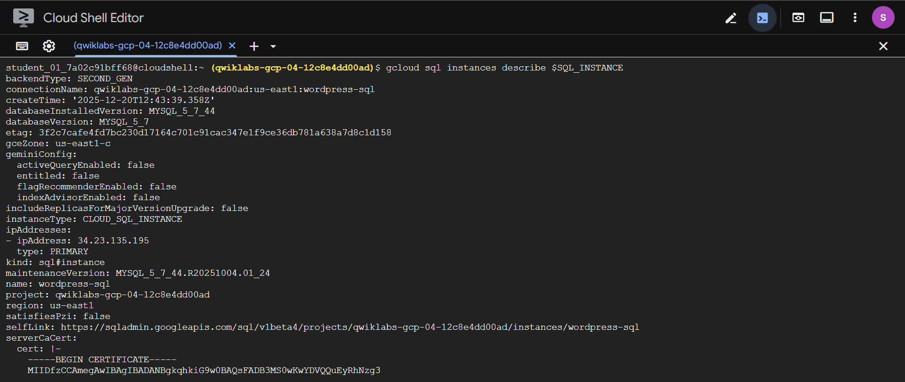
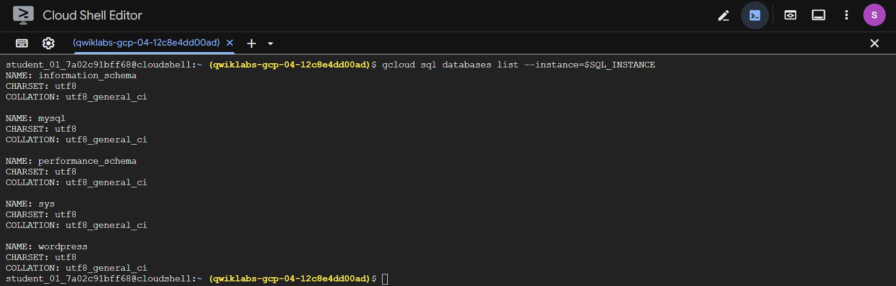
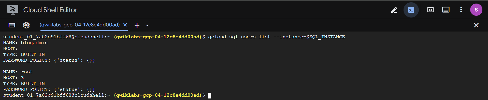
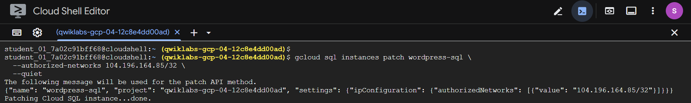
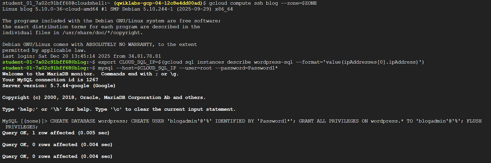
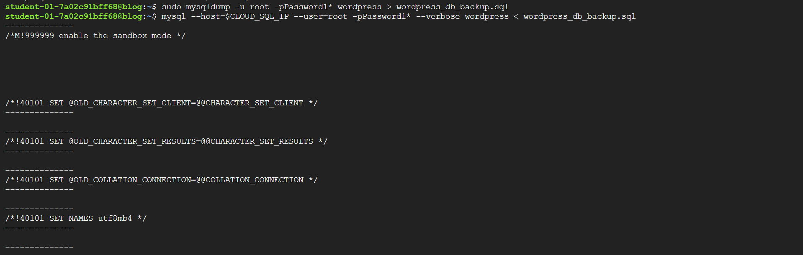
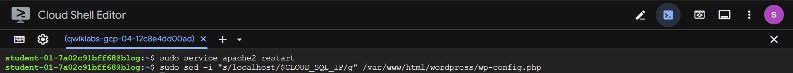
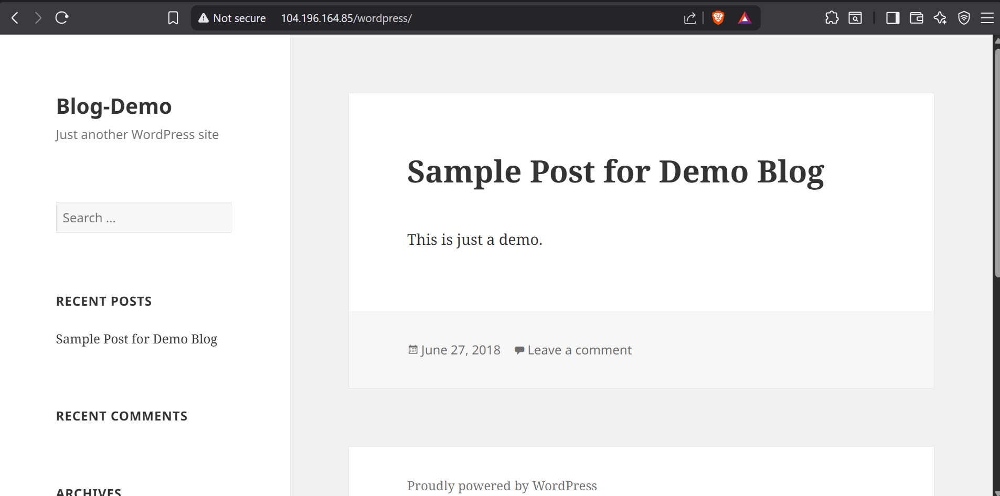

# 🛠️ Migrate a MySQL Database to Google Cloud SQL — Challenge Lab

## 📘 Overview

This is a **challenge lab**, meaning you are given a scenario and required tasks **without step-by-step instructions**. You are expected to apply and extend the skills learned from prior labs.

An **automated scoring system** will validate whether each task is completed correctly.

### Key Expectations
- No new Google Cloud concepts are taught.
- You must troubleshoot issues independently (e.g., error messages, configuration changes).
- To score **100%**, all tasks must be completed within the time limit.

This lab is recommended for learners preparing for the **Google Cloud Certified Professional Cloud Architect** exam.

---

## ⚙️ Setup Instructions

### Before Starting the Lab
- Labs are **timed** and **cannot be paused**.
- The timer starts when you click **Start Lab**.
- Temporary Google Cloud credentials are provided for the duration of the lab.

### Requirements
- A standard web browser (**Chrome recommended**)
- Use an **Incognito or private window** to avoid account conflicts
- Enough uninterrupted time to finish the lab
- **Use only the provided student account** to avoid unexpected charges

---

## 🧩 Challenge Scenario

Your **WordPress blog** is currently running on a server that is no longer suitable. As part of a broader migration effort, you must migrate the blog’s **locally hosted MySQL database** to **:contentReference[oaicite:0]{index=0}**.

### Existing Environment
- **Compute Engine instance:** `blog` (already running)
- **WordPress directory:**  
  `/var/www/html/wordpress`
- **Access:**  
  Via the external IP address of the `blog` instance
- **Current database:**
  - Database name: `wordpress`
  - User: `blogadmin`
  - Password: `Password1*`
  - Database engine: MySQL (local to the instance)

---

## 🎯 Your Challenge

You are required to:

1. Create a new **Cloud SQL** instance to host the migrated database.
2. Create a **database dump** from the existing local MySQL database.
3. Import the dump into the Cloud SQL database.
4. Reconfigure the application to use the new Cloud SQL database instead of the local MySQL server.

### WordPress Configuration File
- Location:  
  `/var/www/html/wordpress/wp-config.php`

---

## ✅ Success Criteria

- After migration, the WordPress blog must continue running correctly.
- The application must rely **only on Cloud SQL**, not the local MySQL database.

### Scoring Notes
- You start with **20 points** because the blog is initially running.
- If the blog continues to run correctly using Cloud SQL, those points remain.
- If the database migration is incorrect, the blog test fails and **20 points are deducted**.

---

## 🌍 Location Requirements

Use the following values **where applicable**:
- **Zone:** `us-east4-b`
- **Region:** `us-east4`

---

## 💡 Tips & References

- **Google Cloud SQL How-To Guides**  
  Official documentation for creating instances, databases, and connecting applications.

- **WordPress Installation and Migration**  
  WordPress Codex documentation on installing, configuring, and migrating WordPress sites, including database preparation.

---

## ✅ Task 1: Create a New Cloud SQL Instance (CLI)

### 🎯 Goal
Create a **MySQL Cloud SQL** instance using the **Google Cloud CLI**, deployed in the required **Region: `us-east4`**, suitable for hosting a WordPress database.

---

### 📌 Assumptions
- You are logged in using the **student account**
- The correct project is already set
- Required APIs are enabled (Cloud SQL Admin API)

---

### 🔹 Step 1: Set Environment Variables
Use variables to avoid mistakes and keep commands reusable.

```bash
export REGION=us-east4
export ZONE=us-east4-b
export SQL_INSTANCE=wordpress-sql
export ROOT_PASSWORD=Password1*
```

---

### 🔹 Step 2: Create the Cloud SQL MySQL Instance

Create a MySQL instance compatible with WordPress.

```bash
gcloud sql instances create $SQL_INSTANCE \
  --database-version=MYSQL_5_7 \
  --region=$REGION \
  --tier=db-f1-micro \
  --root-password=$ROOT_PASSWORD \
  --storage-type=SSD \
  --storage-size=10GB
```


---

🔹 Step 3: Verify the Instance Creation

Confirm that the instance is running and located in the correct region.

```bash
gcloud sql instances describe $SQL_INSTANCE
```
Verify:

- State: RUNNABLE
- Region: REGION
- Database Version: MySQL 5.7

  

---

### 📝 Notes

- MySQL 5.7 is fully compatible with WordPress
- The db-f1-micro tier is sufficient for lab workloads
- Cloud SQL instances are regional, not zonal—ZONE will be used later for Compute Engine resources

---

## ✅ Task 2: Configure the New Database (CLI)

### 🎯 Goal
Configure the Cloud SQL instance by creating the WordPress database and user so it is ready to receive the migrated data.

---

### 🔹 Step 1: Define Task-Specific Variables
(Only variables **not** defined in Task 1)

```bash
export DB_NAME=wordpress
export DB_USER=blogadmin
export DB_PASSWORD=Password1*
```

---

### 🔹 Step 2: Create the WordPress Database

```bash
gcloud sql databases create $DB_NAME \
  --instance=$SQL_INSTANCE
```

---

### 🔹 Step 3: Create the WordPress Database User

```bash
gcloud sql users create $DB_USER \
  --instance=$SQL_INSTANCE \
  --password=$DB_PASSWORD
```


---

### 🔹 Step 4: Verify Database and User

```bash
gcloud sql databases list --instance=$SQL_INSTANCE
```



```bash
gcloud sql users list --instance=$SQL_INSTANCE
```

                                                                                                                                                                                                                                                                                                                                                                                                                            

---

## ✅ Task 3: Perform Database Dump and Import (CLI)

### 🎯 Goal
Export the local WordPress MySQL database from the **blog VM** and import it into the **Cloud SQL instance**.

---

### 🔹 Step 1: Define Task-Specific Variables
(Only variables not defined in previous tasks)

```bash
export BLOG_VM_EXTERNAL_IP=104.196.164.85
```
> `104.196.164.85` is the external IP address of the blog VM provided by the lab.

---

### 🔹 Step 2: Authorize blog VM to your cloudSQL instance

```bash
gcloud sql instances patch wordpress --authorized-networks $BLOG_VM_EXTERNAL_IP/32 --quiet
```

or

```bash
gcloud sql instances patch wordpress --authorized-networks 104.196.164.85/32 --quiet
```
> This allows the blog VM to connect to the Cloud SQL instance using its public IP.



---

### 🔹 Step 3: Connect to blog VM using SSH

Run this on the blog VM.
```bash
gcloud compute ssh blog --zone=$ZONE
```
When prompted:
- Type `Y` to continue
- Press Enter to accept the default SSH key settings

---

### 🔹 Step 4: Storing CloudSQL instance IP into a variable

```bash
export CLOUD_SQL_IP=$(gcloud sql instances describe wordpress-sql --format='value(ipAddresses[0].ipAddress)')
```
> This retrieves the public IP address of the Cloud SQL instance for later use.

---

### 🔹 Step 5: Connect to the Cloud SQL Instance

```bash
mysql --host=$CLOUD_SQL_IP --user=root --password=Password1*
```
> This verifies that the Cloud SQL instance is reachable from the blog VM.

---

### 🔹 Step 6: Creating Database & User for your Cloud SQL Database

```bash
CREATE DATABASE wordpress;
CREATE USER 'blogadmin'@'%' IDENTIFIED BY 'Password1*';
GRANT ALL PRIVILEGES ON wordpress.* TO 'blogadmin'@'%';
FLUSH PRIVILEGES;
```

Then exit

```sql
exit
```




---
### 🔹 Step 7: Create a Backup of the WordPress MySQL database and Restore to Cloud SQL instance

```bash
mysql --host=$CLOUD_SQL_IP --user=root -pPassword1* --verbose wordpress < wordpress_db_backup.sql\
```
> 📄 A file named wordpress_db_backup.sql is created.
This file can later be restored into another MySQL server or database.

then restore:

```bash
mysql --host=$CLOUD_SQL_IP --user=root -pPassword1* --verbose wordpress < wordpress_db_backup.sql
```
> 📥 The contents of wordpress_db_backup.sql are loaded into the wordpress database on the Cloud SQL server.




---

## 📝 Notes (Task 3)
- Public IP authorization is required for VM-to-Cloud-SQL connectivity
- The SQL dump file contains both schema and data
- Database and user must exist before restoring data
- Importing with --verbose helps confirm successful execution

---

### ✅ Task 4: Reconfigure the WordPress Installation (CLI)

### 🎯 Goal
Update the WordPress configuration so the application uses the **Cloud SQL** database instead of the local MySQL server.

---

### 🔹 Step 1: Restart the Apache Webserver Service

```bash
sudo service apache2 restart
```
> This ensures the web server is running before applying configuration changes.

---

### 🔹 Step 2: Replace the Database IP configuration from localhost to our cloudSQL instance IP

```bash
sudo sed -i "s/localhost/$CLOUD_SQL_IP/g" /var/www/html/wordpress/wp-config.php
```
> This replaces the local database host (localhost) with the Cloud SQL instance IP.



---

## 📝 Notes (Task 4)

- WordPress database settings are read from wp-config.php
- sed -i modifies the file directly without creating a copy
- Updating DB_HOST is required after migrating the database
- Apache restart ensures PHP reloads the updated configuration

---

## ✅ Task 5: Validate and Troubleshoot (CLI)

### 🎯 Goal
Ensure that the WordPress blog works correctly with the Cloud SQL database and fix any issues that arise.



---

### 🔹 Step 1: Verify Database Connection
Check connectivity from the VM to the Cloud SQL instance.

```bash
mysql -h $CLOUDSQL_IP -u $DB_USER -p $DB_NAME
```
- Enter Password1* when prompted.
- Successful login confirms Cloud SQL is reachable and credentials are correct.

---

### 🔹 Step 2: Test the WordPress Site

Open the WordPress site in a browser using the external IP of the blog instance.
Check for:
- Pages loading correctly
- Admin dashboard access
- Existing content (posts, pages, media) is intact

---

### 🔹 Step 3: Check Web Server Logs for Errors

Inspect logs for database or PHP errors.

```bash
sudo tail -f /var/log/apache2/error.log
```
- Look for lines mentioning DB_HOST, mysqli_connect, or WordPress.
- Errors usually indicate incorrect credentials, IP, or database name.


---

### 🔹 Step 4: Troubleshoot Common Issues

| Issue                           | CLI Check / Fix                                                                                                            |
| ------------------------------- | -------------------------------------------------------------------------------------------------------------------------- |
| Cannot connect to Cloud SQL     | Confirm `CLOUDSQL_IP` is correct, check user/password, ensure Cloud SQL **public IP** is enabled and authorized for the VM |
| WordPress shows database errors | Check `wp-config.php` for correct DB_NAME, DB_USER, DB_PASSWORD, DB_HOST                                                   |
| Missing content                 | Verify the import completed successfully using `mysql -h $CLOUDSQL_IP -u $DB_USER -p $DB_NAME -e "SHOW TABLES;"`           |

---

# 🎉 Task Completed

Here’s what I accomplished:

- Migrated the **WordPress MySQL database** to **Google Cloud SQL**
- Configured the Cloud SQL instance with the appropriate **database and user**
- Performed a **database dump** from the local MySQL server and imported it into Cloud SQL
- **Reconfigured WordPress** to connect to the new Cloud SQL database
- **Validated** the site functionality and **troubleshot** any issues

WordPress blog is now fully operational using a managed Cloud SQL backend. ✅

---

💡 **Key Takeaways:**
- Cloud SQL provides a **reliable, managed database** for web applications
- Proper configuration of users, database names, and permissions is crucial
- Verification and troubleshooting are essential to ensure a successful migration
